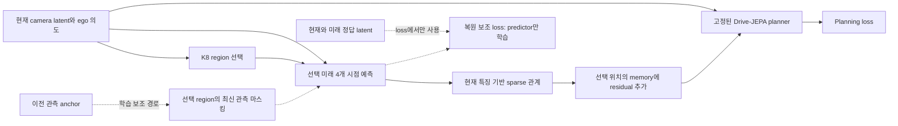

# SPARTAN / C-JEPA / IA-JEPA 착안 통제 실험

## 결과 확인 전 등록 — 2026-10-03

사용자 승인: 세 방법을 우선순위에 따라 적용하고 planning 성능 개선을 확인한다.
하위 질문: 같은 K8 예산에서 위치에 연결된 미래 정보, 희소 의존 관계, 관측 이력 마스킹,
움직임 기반 선택이 planning과 학습형 선택의 효용을 개선하는가?
기준 코드 `5cac8aa`; 설정 `configs/drive_jepa_selective_future/region_research_v1.json`.

## 적용의 범위

1. [SPARTAN v3](https://arxiv.org/html/2411.06890v3): 선택된 미래 메시지를 해당 128개
   planner 공간 cell에 scatter한다. 선택된 8 region 사이에 현재 특징으로 결정하는 한 층의
   directed attention을 두고 dense와 hard sparse를 비교한다. 자기 연결은 유지한다.
   Sigmoid threshold + straight-through와 고정 1e-4 sparsity penalty를 사용한다.
   논문의 Gumbel sampling / 제약식 Lagrangian / 여러 층 경로 regularizer를 재현하지 않는다.
   희소화 대상은 미래 정보를 planner에 전달하는 연결이며 기존 predictor의 context는 dense다.
2. [C-JEPA v2](https://arxiv.org/html/2602.11389v2): 선택 8개 중 무작위 4 region의 최신
   관측 latent를 가리고 이전 2-frame anchor로 대체한다. 선택 shortcut와 decoder context 양쪽에
   같은 개입을 한다. 해당 현재 latent와 전체 선택 미래 latent를 복원한다.
   같은 query/target/학습량의 관측을 가리지 않은 대조군을 둔다. 추론에는 완전한 현재 관측을 쓴다.
3. [IA-JEPA](https://arxiv.org/html/2605.15466v1): 관측된 4 RGB frame의 absolute change를
   다시 차분하고 평균해 8×16 region별 움직임 점수를 만든다. 상위 8개를 선택한다.
   미래 영상·collision annotation·future valid mask는 선택에 사용하지 않는다.
   카메라 운동 보정은 이번 비교에 포함하지 않는다.

모두 **논문에서 착안한 현재 구조의 변형**이다. Region은 객체 slot이 아니고, encoder 특징은
이미 전역 맥락을 포함하므로 정보 차단/인과 발견을 주장할 수 없다. C-JEPA earliest anchor도
고정 공간 위치의 과거 특징이며 움직이는 객체의 identity anchor와 다르다.

## 사전 고정한 실험

| 순서 | 조건 | 분리할 효과 |
|---|---|---|
| 1 | located dense learned / random | 위치에 연결된 미래 전달, 선택 효용 |
| 2 | located sparse learned / random | 같은 위치 전달 구조의 희소 연결 |
| 3 | located sparse current only | 미래 없이 추가 adapter만 쓴 대조군 |
| 4 | sparse history unmasked / masked | 관측 마스킹 자체의 효과 |
| 5 | sparse history masked random / motion | 마스킹 구조에서 학습형·무작위·움직임 선택 |

9조건 × 3 seed(29/47/83) × 800 update. 원본 frozen planner와 기존 공통 100-step
predictor warmup을 재사용한다. Train512/dev192 window, recording64/24, batch8,
같은 batch schedule, LR2e-5/selector4e-6, future loss0.01, current reconstruction0.01.
K8/2×2 native-cell region/4 future tubelet, 32 future output query로 고정한다.
마스킹 조건은 학습 보조 경로에서 현재 복원 query8개를 추가하므로 전체 훈련 계산량은 다르다.
현재 특징 대조군은 predictor를 호출하지 않으므로 더 싸다. 비용을 따로 보고한다.

새 과거 영상 cache는 기존 동일 704 window의 관측 frame0–3만 읽어 workspace에 쓴다.
사전 파일 검사에서 704개 모두 관측 영상 4장이 존재했다. 원본 cache와 데이터는 보존한다.
공용 GPU0/1 중 여유 확인한 한 장만 사용: 입장16GiB / reserve6GiB / 자체 allocated8GiB,
조건20분 / 전체3시간 상한. 실패나 음성 결과 뒤의 자동 sweep는 하지 않는다.

## 판단 기준

- 평가 checkpoint는 마지막800으로 고정. Update0는 원본 동일성 검사다.
- 모든 조건을 보고하며 dev 결과로 다음 조건의 구조·hyperparameter를 변경하지 않는다.
- ADE와 공식 IL loss를 계산하고 3 seed 대응 차이 및 recording 단위 bootstrap 95% CI를 보고한다.
  CI는 seed 평균 후 recording resampling이며 seed 불확실성/다중 비교를 모두 보장하지 않는다.
- 명령·현재 속도 계층으로 분해한다. 원본 점수로 난이도를 나누지 않는다.
- 기존 global K8 learned/random 결과를 보존된 비교 대상으로 쓴다. 같은 초기화·batch hash 확인.
- 같은 dev192 window의 공식 PDM scorer 평가도 준비한다. 새 cache는 workspace에서 공식 processor로
  만들고 현재 frame token / 5초 state 범위를 확인한다. Navtest/held-out은 사용하지 않는다.
- 원본보다 개선과 같은 예산 random보다 개선을 구분한다. 개발셋의 예비 결과이며 독립 test의
  개선이나 최종 논문 기여를 확정하지 않는다.

## 구현·검증

그림의 Predictor는 online planning forward와 분리된 auxiliary forward에서 같은 가중치를 공유한다.
마스킹은 auxiliary 입력에만 적용하며 실제 planner의 현재 memory는 그대로 유지한다.

- `models/region_future_research.py`: 위치 연결 bridge, 희소 연결, history mask loss, motion 점수.
- `scripts/train_drive_jepa_region_research.py`: 관측 cache / 대응 실험 / 보존 checkpoint.
- `tests/test_region_future_research.py`: 원본 동일성, 위치 scatter, slot 교란, 희소 edge,
  관측 마스킹 범위, 미래 label gradient 차단, 움직임 국소화, selection detach.

결과는 실행 완료 후 아래에 덧붙인다.

### 평가 실행 메모 (완료 결과 전)

- 전체 CPU162검사통과. 학습 PID3270611 / GPU1.
- 상황별 속도 정의는 현재 관측속도 기준 ≤0.5 / 0.5–5 / >5 m/s 및 ≤1 / 1–8 / >8 m/s 두 가지로 고정한다. 결과 점수로 계층을 정하지 않는다.
- 공식 PDM save_buffer가 sandbox에서 10초 probe timeout, 같은 함수가 밖에서는 즉시 SAVE_OK. 정체된 우리 CPU PID3276645만 종료했고 PID3289792로 밖에서 재개했다. 0-byte 미완성 cache는 별도 이름으로 보존하고 다시 계산한다. 공식 계산/scorer/source는 변경하지 않았다.

- 기존 global K8 learned/random 6개 preserved checkpoint의 개발 trajectory가 저장돼 있지 않아 읽기 전용 추론/PDM 평가를 추가했다. 학습 종료 PID3270611 exit 후 대기 PID3381536이 실행한다. 같은192window/원본 module hash/저장 ADE 허용오차1e-6을 검사하며 optimizer step은0이다. 이는 사전 등록한 위치 연결 vs 기존 global 비교의 PDM 지표 보완이다.
- 위치 bridge는 선택된8개 memory cell에만 residual을 쓰고 시간 축을 학습된 가중 평균으로 합친다. 기존 global bridge와의 차이는 위치뿐 아니라 residual 분포·시간 요약·모듈 parameterization도 포함한다. 위치 가설 단독 인과 검정으로 해석하지 않는다. Dense vs sparse는 같은 새 bridge 안에서 비교한다.

- 개발192window는182scene_token/24recording에 해당한다. 주 ADE는 window평균이 아니라 scene macro(원본0.352209811m)이며, 원본window평균0.353071478m과 혼동하지 않는다. PDM은 같은192window 평균, 두 지표 모두recording bootstrap을 사용한다. 각 선택 조건의 미래MSE는 대상 난이도도 달라지므로 조건 간 MSE 순위를 planning 효용으로 해석하지 않는다.

- 부가적인 **사후 탐색 분석**으로 (새 위치 연결 learned−random)−(기존global learned−random)의 ADE 차이를 계산한다. 선택 효용 변화와 절대 planning 성능을 구분하기 위한 분석이며 사전 등록 primary 비교로 승격하지 않는다. 결과에 따라 추가 학습/조건을 바꾸지 않는다.

## 완료 결과 — 2026-10-03

**세 기법의 추가 planning 이득은 이번 통제 실험에서 확인하지 못했다. 기존 global 연결 방식을 대체하지 않는다.**
9조건×3seed×800update=21,600 신규 update를 모두 완료했다. 원본 encoder/planner는 고정했다.
아래 ADE는 개발192window의182scene macro이며 작을수록 좋다. PDM은 같은192window의 공식 scorer 점수(%)로 클수록 좋다.
각 확장 모델 수치는3seed 평균이다. 원본 점수는 이 개발 subset의 재평가이며 과거 전체navtest89.224320과 다른 모집단이다.

| 조건 | 개발 ADE(m) ↓ | 개발 PDM(%) ↑ |
|---|---:|---:|
| 원본 frozen Drive-JEPA | 0.352210 | 87.119134 |
| 기존 global / learned | 0.347129 | 88.826031 |
| 기존 global / random | 0.347460 | 88.841331 |
| 위치 연결 dense / learned | 0.349222 | 87.640696 |
| 위치 연결 dense / random | 0.350430 | 87.322718 |
| SPARTAN 착안 sparse / learned | 0.349238 | 87.742199 |
| SPARTAN 착안 sparse / random | 0.350402 | 87.324878 |
| Sparse / 현재 특징만 사용 | 0.349207 | 87.742499 |
| Sparse / 복원 목표·마스킹 없음 | 0.349226 | 87.742247 |
| Sparse + C-JEPA 관측 마스킹 / learned | 0.349230 | 87.742244 |
| Sparse + 관측 마스킹 / random | 0.350345 | 87.325524 |
| Sparse + 관측 마스킹 + IA-JEPA 움직임 선택 | 0.348680 | 87.691769 |

### 대응 비교

차이는 앞 조건−뒤 조건이다. ADE 차이(mm)는 음수, PDM 차이(%p)는 양수가 개선이다.
95% CI는 seed 평균 후 recording 24개를 resampling한 구간이다. Seed 불확실성과 다중 비교를 전부 반영한 확증 검정이 아니다.

| 비교 | ΔADE mm [95% CI] | ΔPDM %p [95% CI] |
|---|---:|---:|
| 새 위치 dense − 기존 global | +2.093078 [-3.095112, +7.246263] | -1.185335 [-3.039737, +0.056843] |
| Sparse − dense | +0.015907 [-0.117882, +0.166369] | +0.101503 [-0.000541, +0.304566] |
| 미래 예측 − 현재 특징만 | +0.031809 [-0.020971, +0.085839] | -0.000300 [-0.000650, +0.000026] |
| 관측 마스킹 − 동일 복원 대조군 | +0.004838 [-0.018011, +0.031192] | -0.000003 [-0.000172, +0.000129] |
| 움직임 선택 − learned | -0.550661 [-2.454720, +1.297041] | -0.050475 [-0.960344, +1.222561] |
| 마스킹 learned − random | -1.114269 [-5.228955, +2.894995] | +0.416720 [-0.663042, +1.497221] |

### 해석

- **SPARTAN 착안:** 연결 비율은 dense 100%에서 평균 19.63%(자기 연결 포함)로 줄었다. Sparse−dense는 ADE+0.016mm/PDM+0.102%p이며 두 CI 모두 0을 포함한다. Dense tensor로 계산하므로 실제 FLOPs/속도 감소를 주장하지 않는다.
- **C-JEPA 착안:** 동일 복원 목표의 unmasked 대조군 대비 ADE+0.00484mm, PDM−0.00000250%p로 차이가 거의 없다. 단순히 보조 loss를 추가한 효과와 마스킹 효과를 분리했으며 추가 이득은 미확인이다.
- **IA-JEPA 착안:** learned보다 ADE 평균0.551mm가 낮지만 PDM은0.0505%p 낮다. 두 CI 모두 0을 포함한다. 기존 global learned의 ADE/PDM 평균도 넘지 못했다.
- **가장 중요한 대조:** 미래 예측과 현재 특징만 사용하는 조건의 PDM 차이는−0.000300%p다. 현재 구조의 성능 변화는 추가 정보 연결/보정으로도 설명할 수 있으며, 미래 예측이 필요했다는 증거가 없다.
- 원본 대비 learned 조건의 ADE 감소 약 3mm는 일부 bootstrap CI에서 0을 제외한다. 하지만 current-only도 같은 감소를 보이고 PDM 원본 대비 CI는0을 포함한다. **원본 대비 작은 ADE 변화와 세 기법의 추가 이득을 구분한다.**
- 학습형 선택의 random 우월성, 위치 연결로 선택 효용이 커진다는 사후 difference-in-differences 모두 CI가 0을 포함한다. 핵심 선택 명제의 검증 성공으로 해석하지 않는다.
- 미래 latent MSE는 각 조건 자체의 persistence보다 대략4–5% 낮다. 이 예측 오차 감소가 planning의 추가 이득으로 이어지지는 않았다. 선택한 target 자체가 달라지므로 서로 다른 선택 방법의 MSE 순위는 효용 순위가 아니다.

### 상황별·PDM 구성 요소

집계뿐 아니라 command raw ID와 두 현재속도 구간 정의를 함께 저장했다. 명령 ID에 검증하지 않은 좌/직/우 이름을 붙이지 않았다.
마스킹 learned의 원본 대비 window ADE 변화는 command0(46개)−4.66mm, command1(121개)−3.43mm, command2(25개)+2.60mm다.
움직임 선택은 같은 순서로−4.30/−4.05/−0.62mm다. 상황에 따라 차이가 달라지지만 작은 탐색 표본이며 특정 상황에서의 우월성을 확정하지 않는다.
속도 cutoff0.5/5m/s와1/8m/s를 모두 제공하며 baseline 점수에 따른 난이도 구분은 하지 않았다. 전체 분해는 summary.json의 context_breakdown / pdm_context_breakdown에 있다.

| 조건 | NC(%) | DAC(%) | EP(%) | TTC(%) | Comfort(%) |
|---|---:|---:|---:|---:|---:|
| 원본 | 100.0000 | 93.2292 | 79.6068 | 97.9167 | 100.0000 |
| 기존 global learned | 99.4792 | 95.6597 | 81.0297 | 98.4375 | 100.0000 |
| Sparse learned | 99.6528 | 94.4444 | 80.4077 | 97.5694 | 100.0000 |
| 현재 특징만 | 99.6528 | 94.4444 | 80.4084 | 97.5694 | 100.0000 |
| C-JEPA 마스킹 | 99.6528 | 94.4444 | 80.4078 | 97.5694 | 100.0000 |
| IA-JEPA 움직임 | 100.0000 | 93.9236 | 80.1825 | 97.9167 | 100.0000 |

PDM 전체 점수의 증가가 모든 구성 요소의 증가를 뜻하지 않는다. 일부 새 조건의 NC/TTC 평균은 원본보다 낮았다.

### 비용·검증·보존

- 전체 새 학습·관측 cache 준비 56.39분, GPU1 단일 process, 27run 모두 완료. 최대 학습 allocated 1.719GiB. 추가 sweep/기존 모델 재학습 없음.
- 개발PDM: 27새모델+6보존모델+원본=34개 예측 조건×192window=6,528개 score. 누락/실패 없이 완료. 소수 smoke3개는 별도 기능 검사다.
- 기존 global 6개 모델의 module hash와 저장 ADE를 대조했다(허용오차1e-6). 기존학습/CSV/공식전체navtest/WA중단상태는 보존했다.
- CPU162검사통과, 실제 GPU 초기 branch 원본 동일성, 최종 원본 parameter hash 불변,27run 공통 초기화/batch hash 대응, 미래·현재 복원 target의 selector/bridge gradient 차단 확인.
- Train64/dev24 recording의 교집합0, navtest current token 교집합0. 관측4frame704/704존재, IA선택에미래영상/충돌annotation/미래validmask사용없음.
- 원본 모델·encoder·공용 원본 데이터를 수정하지 않았다. 공식코드는 기존strict-loading패치만 있는 상태 그대로다.

### 다음 판단

이번 변형을 성능 개선 방법으로 채택하거나 추가 sweep를 자동 시작하지 않는다. 기존 global 모델을 비교 기준으로 유지한다.
다음에는 planning이 읽는 미래 표현에서 현재 특징의 단순 전달과 미래 변화 정보의 기여를 분리하는 것이 우선이다.
예를 들어 predicted_future−selected_current 경로와 현재 정보 대조군을 통해 미래 정보의 필요성을 검증할 수 있다.
이는 후속 제안이며 이번에 구현/학습한 결과가 아니다. Predictor MSE만 더 낮추는 작업을 선행 필수 목표로 삼지 않는다.

### 산출물·재현

- [전체 수치와 대응 CI](../results/drive_jepa_region_research_v1/summary.json)
- [전체 9조건 비교 CSV](../results/drive_jepa_region_research_v1/comparison.csv)
- [Planning 비교 그림](../results/drive_jepa_region_research_v1/planning_comparison.png)
- [검증·source·gradient 기록](../results/drive_jepa_region_research_v1/validation.json)
- [192window PDM 원시 점수](../results/drive_jepa_region_research_v1/development_pdm_results.json)
- 학습: `scripts/train_drive_jepa_region_research.py`, 설정 `configs/drive_jepa_selective_future/region_research_v1.json`.
- 평가: `scripts/evaluate_drive_jepa_region_research_pdm.py`, `scripts/evaluate_preserved_region_research_controls.py`.
- 집계: `scripts/report_drive_jepa_region_research.py`. 세 완료 디렉터리를 인자로 주고 새 share-directory에 재생성할 수 있다. 완료 학습은 반복하지 않는다.

공개 결과는 개발셋의 반복 탐색 결과다. Full paper reproduction, 독립test 일반화, object causal discovery, 동적K/horizon 개선의 증거가 아니다.
