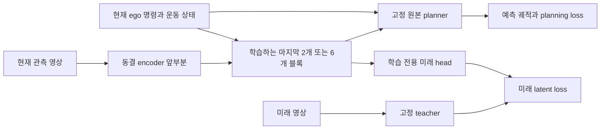
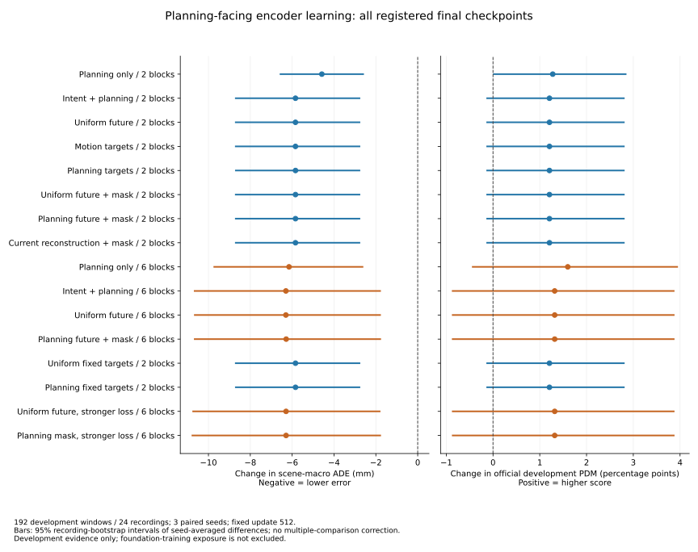

# Encoder 미래 표현 학습과 planning 평가 결과

2026년 10월 3일, **16조건 × 3 seed × 512 update의 학습 48회와 개발 평가를 완료했다.**
이번 질문은 planning에 사용되는 encoder를 직접 갱신하고 ego intent와 미래 감독을 추가했을 때,
planning-only encoder 학습보다 미래 정보와 계획 성능이 좋아지는가였다.

**마지막 두 블록만 학습해도 ADE 변화는 확인할 수 있었다.** 그러나 여섯 블록 학습,
encoder 내부 intent, 선택적 미래 감독, 입력 마스킹, 10배 강한 미래 loss를 비교해도
미래 감독의 실질적인 추가 planning 이득은 확인하지 못했다.
같은 영상에서 intent에 따라 encoder 출력이 바뀌는 것은 검증됐지만 그 변화가 성능 개선을 보장하지는 않았다.
이 결과는 작은 개발 표본에서의 부분 encoder 적응에 한정한다. 전체 encoder 사전학습의 가능성을 기각하지 않는다.

## 학습한 모델과 평가 범위

공식 Drive-JEPA PF ViT-L planning checkpoint에서 시작했다. LoRA를 사용하지 않고
마지막 2개 또는 6개 transformer block과 마지막 normalization의 원래 가중치를 모두 학습했다.
앞부분 encoder, 미래 target을 만드는 원본 teacher, 기존 planning decoder는 고정했다.
학습 가능한 encoder 파라미터는 intent 없이 약 2,519만 / 7,558만,
intent FiLM을 포함하면 약 2,572만 / 7,717만이다.



현재 ego 입력은 명령 4차원, 속도 2차원, 가속도 2차원이며, FiLM을 각 학습 블록 내부에 적용했다.
추론은 현재 영상 → encoder → 원본 planner 경로다. 기존 selector와 future-memory bridge는 제거했다.
미래 head는 학습에만 사용하고 ego 입력을 별도로 받지 않는다. 미래 영상은 teacher의 감독 target에만 사용한다.

학습 loss는 원본의 길이 정규화 trajectory L1과 정규화 future latent MSE의 합이다.
Encoder / FiLM / head 학습률은 각각 2e-6 / 1e-5 / 1e-4, batch 8, AdamW,
미래 loss 가중치는 기본 0.05이며 두 6블록 조건에서 0.5도 비교했다.
모든 조건은 대응 seed 29·47·83의 동일한 batch 순서와 마지막 512 update checkpoint를 사용했다.
최고 개발 점수의 중간 checkpoint를 고르지 않았다.

| 항목 | 학습 | 개발 |
|---|---:|---:|
| Window | 512 | 192 |
| Recording | 64 | 24 |
| 고유 scene | 497 | 182 |
| 좌회전 / 직진 / 우회전 명령 | 100 / 348 / 64 | 46 / 121 / 25 |
| 미래 1 / 2 / 3 / 4초 tubelet 유효 window | 388 / 314 / 244 / 206 | 150 / 117 / 86 / 75 |

미래 tubelet은 각 시점까지의 2프레임 구간이며 미래 유효성은 보조 loss와 probe에만 적용했다.
Planning과 PDM은 개발 192개 모두 평가했다. 학습과 개발 recording은 분리했지만,
기반 checkpoint의 사전학습 노출을 배제할 수 없고 이전 개발 실험에도 사용한 표본이므로 **독립 test 결과가 아니다.**

미래 target은 128개 고정 camera region 중 32개, 시간 범위는 4개 tubelet로 고정했다.
움직임 또는 planner 민감도 상위 16개와 나머지 중 무작위 16개를 조합했다.
Planner 민감도는 현재 궤적 출력의 Jacobian에서 얻은 휴리스틱이다. 실제 미래 중요도 정답이 아니다.
입력 마스킹 조건은 선택된 region에 해당하는 128개 patch를 첫 attention block 이전에 제거했다.
Dense stream은 planning에, masked stream은 같은 encoder의 미래 보조 학습에 사용했다.

## 전체 조건 비교

ADE는 scene별 XY 평균 거리 오차를 scene 간 평균한 값이고 작을수록 좋다.
PDM은 공식 scorer로 계산한 window 평균이며 클수록 좋다. ±는 3개 seed의 표본 표준편차다.
Future probe는 모든 encoder에 같은 용량의 선형 readout을 학습한 미래 특징 변화 MSE다.
원본을 제외한 미래·현재 재구성 조건에는 모두 encoder 내부 intent가 있다.

| 조건 | ADE m | PDM % | Future probe MSE |
|---|---:|---:|---:|
| 원본 동결 | 0.352210 ± 0.000000 | 87.119134 ± 0.000000 | 0.151157547 |
| Planning only · 2블록 | 0.347629 ± 0.000373 | 88.396320 ± 0.003150 | 0.151040450 |
| Intent + planning · 2블록 | 0.346368 ± 0.000383 | 88.326125 ± 0.123085 | 0.151054253 |
| 균등 미래 · 2블록 | 0.346368 ± 0.000384 | 88.326220 ± 0.122962 | 0.151054308 |
| 움직임 미래 · 2블록 | 0.346368 ± 0.000384 | 88.326215 ± 0.122954 | 0.151054335 |
| Planner 민감도 미래 · 2블록 | 0.346370 ± 0.000384 | 88.326170 ± 0.123027 | 0.151054337 |
| 균등 미래 + 입력 마스킹 · 2블록 | 0.346368 ± 0.000383 | 88.326204 ± 0.123002 | 0.151054232 |
| Planner 미래 + 입력 마스킹 · 2블록 | 0.346368 ± 0.000384 | 88.326203 ± 0.122987 | 0.151054520 |
| 현재 재구성 + 입력 마스킹 · 2블록 | 0.346368 ± 0.000383 | 88.326198 ± 0.123013 | 0.151054256 |
| Planning only · 6블록 | 0.346061 ± 0.000365 | 88.718100 ± 0.177853 | 0.150948659 |
| Intent + planning · 6블록 | 0.345911 ± 0.000525 | 88.437488 ± 0.419603 | 0.150741347 |
| 균등 미래 · 6블록 | 0.345910 ± 0.000513 | 88.438069 ± 0.418963 | 0.150742583 |
| Planner 미래 + 입력 마스킹 · 6블록 | 0.345925 ± 0.000525 | 88.437785 ± 0.418918 | 0.150741388 |
| 균등 미래 고정 target · 2블록 | 0.346368 ± 0.000384 | 88.326218 ± 0.122962 | 0.151054285 |
| Planner 미래 고정 target · 2블록 | 0.346369 ± 0.000383 | 88.326165 ± 0.123023 | 0.151054383 |
| 균등 미래 λ0.5 · 6블록 | 0.345918 ± 0.000511 | 88.438153 ± 0.419905 | 0.150730104 |
| Planner 미래 + 마스킹 λ0.5 · 6블록 | 0.345919 ± 0.000477 | 88.438106 ± 0.420913 | 0.150730542 |

전체 수치와 condition 이름의 대응은 [통합 CSV](../results/encoder_future_learning_v1/combined_comparison.csv),
seed별 결과와 모든 비교는 [통합 JSON](../results/encoder_future_learning_v1/combined_summary.json)에 있다.
아래 그림은 원본 대비 변화이며 미래 감독의 독립적인 추가 효과는 다음 표에서 비교한다.



## 마지막 두 블록으로 확인한 효과와 여섯 블록 비교

Recording 24개를 2,000회 bootstrap한 95% 구간이다. 대응 seed 차이를 먼저 평균하므로
**이 구간에 seed 불확실성이 통합된 것은 아니다.** 다중 비교 보정도 하지 않은 탐색 결과다.
ADE 변화는 mm, PDM 변화는 percentage point이며 모두 앞 조건에서 뒤 조건을 뺀 값이다.

| 비교 | ADE 변화 mm와 95% CI | PDM 변화 pp와 95% CI |
|---|---:|---:|
| Planning 2블록 − 원본 | -4.581091 [-6.595189, -2.570006] | +1.277186 [-0.000234, +2.854237] |
| Planning 6블록 − 원본 | -6.148404 [-9.759916, -2.599582] | +1.598966 [-0.450830, +3.955575] |
| Planning 6블록 − 2블록 | -1.567312 [-4.528845, +1.265899] | +0.321779 [-0.773769, +1.510148] |
| Intent 2블록 − intent 없는 2블록 | -1.260253 [-2.378036, +0.042907] | -0.070195 [-0.434219, +0.218002] |
| Intent 6블록 − intent 없는 6블록 | -0.150475 [-1.361385, +1.108088] | -0.280612 [-0.721809, -0.004010] |

두 블록에서도 ADE가 약 4.58 mm 감소했고 해당 구간은 0을 포함하지 않는다.
PDM 평균은 약 1.28 pp 높아졌지만 구간은 0을 포함한다.
여섯 블록은 두 블록보다 평균 ADE가 약 1.57 mm, PDM이 약 0.32 pp 좋았으나
대응 비교 구간은 모두 0을 포함한다. **여섯 블록의 우월성은 확정되지 않았다.**

앞 블록이 고정돼도 뒤 블록의 attention과 MLP가 관측 특징을 재조합하므로
encoder 최종 표현을 바꿀 수 있다. 실제 가중치 갱신과 모든 학습 블록의 gradient를 확인했다.
다만 앞 블록에서 버린 정보까지 회복하거나 전체 사전학습의 효과를 대변하는 검증은 아니다.

## 미래 감독과 입력 마스킹의 추가 효과

| 비교 | ADE 변화 mm와 95% CI | PDM 변화 pp와 95% CI |
|---|---:|---:|
| 균등 미래 2블록 − intent planning | -0.000073 [-0.005887, +0.005306] | +0.000094 [+0.000055, +0.000134] |
| 움직임 target − 균등 target | +0.000103 [-0.000395, +0.000584] | -0.000004 [-0.000008, -0.000001] |
| Planner target − 균등 target | +0.001563 [-0.001368, +0.004311] | -0.000050 [-0.000064, -0.000037] |
| Masked 미래 − masked 현재 재구성 | +0.000005 [-0.001938, +0.002308] | +0.000004 [-0.000005, +0.000013] |
| 균등 미래 6블록 − intent planning 6블록 | -0.001135 [-0.012255, +0.009678] | +0.000581 [+0.000320, +0.001016] |
| 균등 마스킹 − 동일 고정 target 무마스킹 | -0.000251 [-0.002277, +0.001416] | -0.000014 [-0.000020, -0.000008] |
| Planner 마스킹 − 동일 고정 target 무마스킹 | -0.001289 [-0.003643, +0.001210] | +0.000038 [+0.000026, +0.000051] |
| 균등 미래 6블록 λ0.5 − λ0.05 | +0.008088 [-0.182061, +0.177978] | +0.000084 [-0.000564, +0.000756] |
| Planner 마스킹 6블록 λ0.5 − λ0.05 | -0.006340 [-0.235360, +0.213191] | +0.000320 [-0.000483, +0.001097] |

기본 미래 loss가 더한 PDM 변화는 2블록에서 +0.000094 pp, 6블록에서 +0.000581 pp다.
일부 아주 작은 차이의 bootstrap 구간은 0을 포함하지 않지만,
이 크기를 실질적인 planning 개선이나 논문 기여로 해석할 근거는 부족하다.
현재 재구성과 미래 예측의 차이도 거의 없다.

Train 초기 gradient 검사에서 가중된 미래 gradient norm이 planning의 약 1.2–2.6%여서
개발 결과를 읽기 전에 가중치를 10배 높이는 추가 대조군을 등록했다.
그 조건도 planning 수치는 거의 같았다. 초기 norm 비율이 학습 전체의 비율이나
Adam 파라미터 갱신 기여도를 뜻하는 것은 아니다.

입력 마스킹은 원래 두 개의 고정 target view를 사용하고 무마스킹은 매 update target을 재표집했다.
코드 감사에서 이 혼입을 발견해 결과를 읽기 전에 동일 target ID의 무마스킹 대조군을 추가했다.
위 표의 마스킹 단독 비교는 그 대조군을 사용한다. 기존 masked 대 재표집 비교는
마스킹과 target 다양성이 함께 달라지는 비교로 보존했다.

미래 loss가 구현에서 무시된 것은 아니다. 모든 해당 encoder block에 gradient가 도달했고,
seed 29의 미래 감독 encoder는 planning-only encoder와 가중치가 달랐다.
예를 들어 6블록 균등 미래 조건의 파라미터 RMS 차이는 1.52e-6,
최대 차이는 1.40e-4였다. [별도 가중치 비교](../results/encoder_future_learning_v1/objective_parameter_differences.json).

## Intent에 따른 encoder 표현 변화

모든 학습 모델을 raw 현재 영상에서 다시 실행했다. 평가값과 무관하게 고른
좌회전·직진·우회전 명령별 1개씩 총 3개 window에서 이미지와 **planner의 ego 입력을 고정**하고,
encoder에 주는 명령만 0·1·2로 바꿨다.

Intent가 없는 6개 모델의 encoder 출력은 바뀌지 않았다. Intent를 넣은 42개 모델은 모두 바뀌었다.
Seed 29의 planning-only intent 조건에서 명령 변경에 따른 feature RMS 차이는
2블록 0.0128–0.0276, 6블록 0.0233–0.0449였다.
대응 궤적 평균 XY 차이는 각각 2.87–26.89 mm, 7.06–31.84 mm였다.

이는 **ego intent가 encoder 표현과 planner에 실제 영향을 준다는 연결 검증**이다.
명령을 바꾼 장면의 올바른 미래 정답이 없으므로 반사실적 예측의 정확도를 검증하지는 않는다.
실제 PDM은 intent 없는 6블록보다 intent 있는 6블록에서 0.281 pp 낮았고,
보정하지 않은 대응 구간도 음수였다. 표현이 변한다는 사실과 표현의 유용성을 구분해야 한다.

## Encoder가 보존한 미래 정보의 공통 probe

모든 encoder 출력을 고정 random projection과 동일 공간 pooling으로 512차원으로 줄이고,
현재 ego 8차원을 원본과 모든 조건에 동일하게 붙였다. Train에서만 표준화하고
고정 ridge α10의 520차원 선형 readout을 horizon별로 학습했다.
Target은 동결 teacher의 정규화 특징이 현재에서 미래로 얼마나 달라지는가다.
물리적 객체 위치·속도 예측이나 모든 미래 정보의 보존을 측정하는 지표는 아니다.

원본의 horizon별 결과는 다음과 같다. Persistence는 미래 특징 변화가 0이라고 예측한다.

| Tubelet 종료 시점 | 유효 개발 window | 원본 probe MSE | Persistence MSE |
|---|---:|---:|---:|
| 1초 | 150 | 0.103683 | 0.076534 |
| 2초 | 117 | 0.148275 | 0.135857 |
| 3초 | 86 | 0.185137 | 0.204324 |
| 4초 | 75 | 0.211641 | 0.281671 |

유효 horizon 수로 가중한 MSE는 원본 0.151158, intent planning 6블록 0.150741,
미래 λ0.05 조건 0.150743, 미래 λ0.5 조건 0.150730이다.
강한 미래 loss의 추가 감소는 intent planning 대비 약 0.000011로 매우 작다.
Probe 용량·target을 고정한 단일 진단이며 이 값만으로 미래 이해 향상을 확정할 수 없다.
원본조차 가까운 1·2초 horizon에서는 persistence보다 나빴다.

## 상황별 결과와 PDM 구성 지표

조건별 평균만 보면 놓치는 악화가 있었다. 다음은 원본 대비 PDM 변화다.
명령은 현재 route-derived 명령이며 실제 미래 회전 발생의 라벨은 아니다.
상황별 표는 표본 수가 작고 탐색적인 기술 통계다.

| 현재 명령 | Window | Planning 6블록 Δpp | Intent planning 6블록 Δpp | 균등 미래 λ0.5 6블록 Δpp |
|---|---:|---:|---:|---:|
| 좌회전 | 46 | +2.1568 | +2.1469 | +2.1483 |
| 직진 | 121 | +2.2265 | +1.9499 | +1.9495 |
| 우회전 | 25 | -2.4648 | -3.2627 | -3.2582 |

속도 구간을 두 가지로 바꿔도 정지에 가까운 구간의 평균 PDM 악화는 유지됐다.

| 속도 경계 m/s | 구간 | Window | Planning 6블록 Δpp | 균등 미래 λ0.5 6블록 Δpp |
|---|---|---:|---:|---:|
| 0.5 / 5 | 정지 근처 | 38 | -0.1729 | -0.2166 |
| 0.5 / 5 | 저속 | 73 | +1.6884 | +1.4191 |
| 0.5 / 5 | 더 빠름 | 81 | +2.3496 | +1.9492 |
| 1 / 8 | 정지 근처 | 51 | -0.1309 | -0.1657 |
| 1 / 8 | 저속 | 102 | +2.1505 | +1.9617 |
| 1 / 8 | 더 빠름 | 39 | +2.4187 | +1.5798 |

PDM 구성 점수도 함께 확인했다. 모두 % 단위다.

| 구성 점수 | 원본 | Planning 2블록 | Planning 6블록 | Intent planning 6블록 | 미래 λ0.5 6블록 |
|---|---:|---:|---:|---:|---:|
| 귀책 충돌 없음 | 100.0000 | 100.0000 | 99.8264 | 99.6528 | 99.6528 |
| 주행 가능 영역 준수 | 93.2292 | 94.7917 | 95.3125 | 95.1389 | 95.1389 |
| 진행도 | 79.6068 | 81.0053 | 81.1179 | 80.7569 | 80.7585 |
| TTC | 97.9167 | 97.9167 | 97.9167 | 97.9167 | 97.9167 |
| 편안함 | 100.0000 | 100.0000 | 100.0000 | 100.0000 | 100.0000 |
| 방향 준수 | 98.6979 | 98.7847 | 98.9583 | 98.9583 | 98.9583 |

최고 평균 PDM인 intent 없는 6블록에서도 귀책 충돌 없음 점수가 100에서 99.8264로 낮아졌다.
평균 진행도와 주행 가능 영역 점수 상승을 모든 상황의 안전성 개선으로 해석하면 안 된다.
전체 조건의 ADE·PDM 상황별 값은 통합 JSON에 보존했다.

## 선행연구에서 가져온 부분

[Drive-JEPA](https://arxiv.org/html/2601.22032v2)의 예측 표현 학습을 출발점으로 삼고,
[FiLM](https://arxiv.org/abs/1709.07871)의 특징별 affine 변환으로 encoder 내부에 intent를 주입했다.
[SALT](https://arxiv.org/abs/2509.24317)의 고정 teacher 관점을 참고했지만
여기서는 기존 Drive-JEPA teacher를 사용했고 SALT의 teacher를 재현하지 않았다.

[IA-JEPA](https://arxiv.org/html/2605.15466v1)의 움직임 기반 target 선택 아이디어를
현재까지 관측된 영상의 변화량으로 적용했다.
[C-JEPA](https://arxiv.org/html/2602.11389v2)의 구조적 마스킹은 참고했으나,
본 실험은 object-slot 개입 대신 camera region을 사용하며 encoder를 갱신한다.
각 논문의 충실한 재현이나 성능 순위 비교가 아니다.
이전 SPARTAN 방식의 sparse future 연결은 이번 encoder 검증의 추론 경로에 사용하지 않았다.

## 검증과 계산 비용

- CPU pytest 167개 통과. PyTorch 2.1의 mmap 파일명 호환성을 평가 helper에서 수정했다.
- 704개 window의 동결 prefix와 원본 feature 차이는 최대 0이었다.
- 제거한 patch의 실제 픽셀을 바꿔도 masked prefix가 bitwise 동일했고 공식 masked encoder와 차이가 0이었다.
- 학습 48회 모두 encoder 가중치 변경, 대응 batch 순서 일치, 원본 model hash 보존을 통과했다.
- 48개 encoder의 raw 영상 추론을 모델당 3개 window에서 복원했다. 최대 trajectory 성분 차이는 1.145e-5이며 future head를 만들지 않았다.
- 공식 PDM은 9,600 model-window score를 계산했다. 두 단계에서 원본을 각각 한 번 평가했으므로 고유 조합은 9,408개다. 원본의 두 평가값은 window별로 정확히 같았다.
- 전체 24,576 update의 학습 process 시간 합은 5,711.11초, 약 95.19분이다. 두 GPU의 합산 process 시간이며 전용 GPU 이용 시간이나 순수 FLOPs가 아니다.
- 두 단계 학습 worker의 가장 긴 시간은 각각 42.93분과 17.17분이었다. Prefix 준비 552.29초, CPU PDM 계산은 330.04초와 123.93초였다.
- 최대 training allocated GPU memory는 5.641 GiB, prefix cache는 약 13.67 GB였다. GPU 0·1만 사용했고 우리 학습·평가는 종료했다.

Masking은 보조 encoder 경로를 추가하고 여섯 블록 학습은 비용이 더 크다.
Update·입력·target 예산은 맞췄지만 FLOPs를 맞춘 비교는 아니다. 공유 GPU의 시간 변동이 있다.

추가 평가의 PDM과 probe 계산 후 validation 저장에서 공용 입력 마스크 검사 경로 오류가 났다.
`prepared_cache_directory`에서 읽도록 고치고 저장된 prediction hash를 대조해 보고서만 복구했다.
학습이나 PDM을 다시 실행하지 않았다. 원래 로그와 점수는 보존했다.
등록 config의 설명 필드에 남아 있는 “all24”는 이전 설명의 잔여 문구다.
실제 조건 목록과 실행 수는 본 실험 36개, 추가 12개이며 과거 config hash는 변경하지 않았다.

[통합 검증 JSON](../results/encoder_future_learning_v1/combined_validation.json)에
검증 결과, 원본 보존, 단계별 집계와 복구 사유가 있다.

## 연구 판단과 다음 우선순위

1. **두 블록은 효과를 탐색할 수 있는 출발점이다.** 이번 데이터에서는 encoder 학습에 따른 ADE 감소가 관측됐다.
   다만 작은 데이터, 512 update, 고정 앞 블록이라는 범위가 있어 부정적 결과로 전체 사전학습을 기각할 수 없다.
2. **Ego intent가 encoder 출력에 영향을 주는 구조는 구현됐다.** 미래 정보가 더 유용해졌다는 증거는 아직 부족하다.
3. **이번 미래 target 선택과 마스킹을 성능 개선 방법으로 채택할 근거는 부족하다.**
   가중치 10배·6블록 대조도 이를 바꾸지 못했고, 최고 평균 PDM 조건에도 상황별 악화가 있다.
4. 다음 설계의 우선순위는 **planning-only를 강한 기준선으로 두고 미래 변화 정보를 encoder에 남기는 목적 자체를 다시 검증하는 것**이다.
   후보는 낮은 용량의 미래 readout으로도 접근 가능한 표현을 요구하거나, 현재 상태 복원과 구분되는
   미래 변화·상호작용 target을 사용하는 방식이다. 이는 이번 결과에서 도출한 후속 가설이며 검증된 개선책은 아니다.
   그 신호를 확인한 뒤 학습 recording·update와 encoder 갱신 범위를 확대하는 순서가 합리적이다.

Future head가 예측 부담을 흡수했는지, 고정 teacher가 planning에 필요한 정보를 충분히 담았는지,
현재 planner의 민감도가 실제 미래 중요도와 맞는지는 이번 비교로 원인을 확정할 수 없다.
현재 설정은 고정 camera region·고정 시간 범위·고정 target 수이므로
원래 연구의 객체별·상황별 예측 범위와 양을 학습하는 전체 명제는 남아 있다.
등록한 이번 실험은 모두 완료했으며 추가 sweep은 실행하지 않았다.

## 코드와 재현 자료

| 역할 | 진입점 |
|---|---|
| Intent를 받는 encoder와 raw 추론 | [intent_conditioned_encoder.py](../src/planning_aware_future_prediction/models/intent_conditioned_encoder.py) |
| Target 구성과 encoder 학습 | [run_encoder_future_learning.py](../scripts/run_encoder_future_learning.py) |
| PDM과 공통 future probe | [evaluate_encoder_future_learning.py](../scripts/evaluate_encoder_future_learning.py) |
| 저장 encoder의 실제 영상 검증 | [verify_trained_encoder_inference.py](../scripts/verify_trained_encoder_inference.py) |
| 원본 36회와 추가 12회 통합 | [merge_encoder_future_learning_controls.py](../scripts/merge_encoder_future_learning_controls.py) |
| 등록 설계와 변경 근거 | [설계 문서](encoder_future_learning.md) |
| 전체 수치 | [CSV](../results/encoder_future_learning_v1/combined_comparison.csv), [JSON](../results/encoder_future_learning_v1/combined_summary.json) |
| 공유 가능한 그림 | [PDF](../results/encoder_future_learning_v1/paired_planning_comparison.pdf), [SVG](../results/encoder_future_learning_v1/paired_planning_comparison.svg) |

본 학습 source commit은 `ae5c2da`, 추가 대조군은 `e7d57b1`이다.
가중치·optimizer·RNG·학습 곡선·저장 궤적은 로컬
`outputs/encoder_future_learning_v1/`와 `outputs/encoder_future_additional_controls_v1/`에 있다.
공용 데이터와 공식 원본 checkpoint는 수정하지 않았다.

이미 완료된 GPU 작업을 재시작할 필요는 없다. 저장 평가의 통합과 그림만 다시 생성하려면 다음을 사용한다.

```bash
env CUDA_VISIBLE_DEVICES='' OMP_NUM_THREADS=2 MKL_NUM_THREADS=2 PYTHONPATH=src \
  /rhome/junseong/envs/kjs-drive-jepa-extension/bin/python scripts/merge_encoder_future_learning_controls.py
env CUDA_VISIBLE_DEVICES='' OMP_NUM_THREADS=2 MKL_NUM_THREADS=2 \
  /rhome/junseong/envs/kjs-drive-jepa-extension/bin/python scripts/plot_encoder_future_learning.py
```
