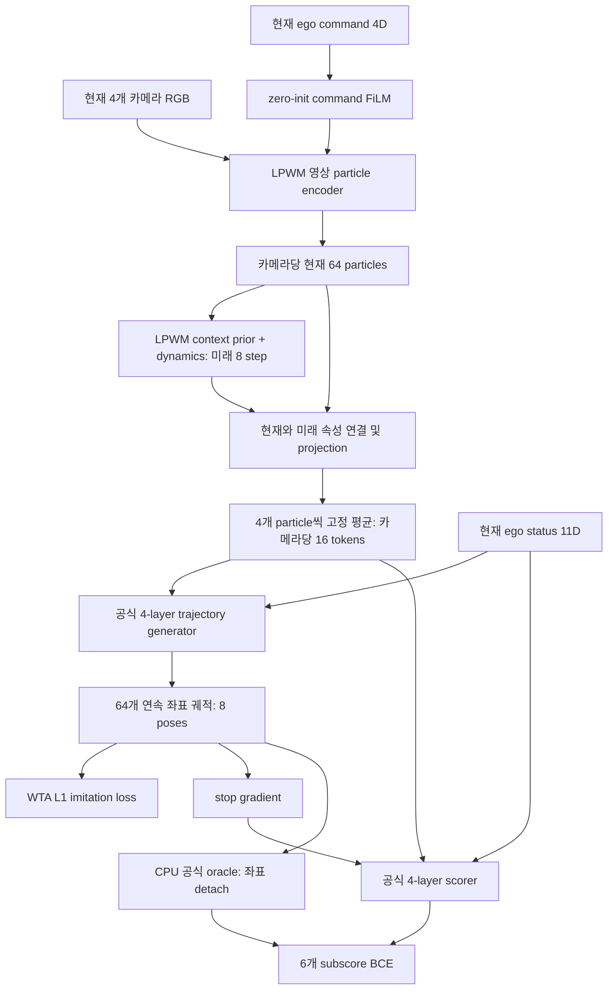

# Public LPWM + official DrivoR planner joint training

## 현재 상태와 승인

2026-10-05 23:56 KST, GPU 0·1에서 NAVSIM v1 본 학습을 시작했다.
사용자의 최신 요청은 공개 LPWM에서 시작해 planner와 한 번의 E2E 학습을 하고,
DrivoR의 generator/scorer/loss 및 공식 벤치마크 조건을 사용하라는 것이다.
이 요청이 과거의 DrivoR 실행·추가 epoch·navtest 보류를 해당 범위에서 갱신한다.
기존 Stage1/Stage2 실험, 원본 가중치, 완료 점수는 보존한다.

검증할 하위 질문: **동일한 DrivoR planning backend에 연결한 구조화된 particle의
현재·미래 표현을 planning 목적에 맞춰 갱신하면 주행에 유용한 정보를 학습하는가?**
현재는 LPWM 조건을 실행하며, DrivoR register 대조군의 새 학습은 아직 실행하지 않았다.

진입점:

- `configs/lpwm_drivor_joint/navsim_v1.json`, `navsim_v2.json`
- `scripts/train_lpwm_drivor_joint.py`, `scripts/queue_lpwm_drivor_joint.py`
- `src/planning_aware_future_prediction/object_centric/lpwm_drivor_joint.py`
- 상태: `outputs/lpwm_drivor_joint_v1/navsim_v1/progress.json`
- 학습 로그: 같은 폴더의 `training.log`, `rank0_training.jsonl`, `rank1_training.jsonl`
- `outputs/lpwm_drivor_joint_v1/registration.json`: 본 학습 source/config 등록. 실행 중 수정 금지.

## 참고한 공식 구현

[DrivoR repository](https://github.com/valeoai/DrivoR), commit
`fc6e5aa144bbcb5a046e22c18f1bd5cf3af8634a`, [paper v2](https://arxiv.org/html/2601.05083v2).
코드와 PDF는 `reference_repositories/DrivoR`, `reference_repositories/DrivoR_paper_v2.pdf`에 있다.
Backend는 원본 `drivor_model.py`의 forward를 그대로 호출한다.
Loss는 원본 `layers/losses/drivor_loss.py`를 직접 사용한다.
후보별 training label은 원본 `score_module/compute_navsim_score.py`로 매번 계산한다.
과거 512개 고정 vocabulary의 score lookup은 사용하지 않는다.

DrivoR는 완전한 scratch 학습이 아니다. 공개 DINOv2 ViT-S/14 reg4
`vit_small_patch14_reg4_dinov2.lvd142m`을 `pretrained=True`로 로드한다.
기본 RGB 구성은 원래 ViT 가중치를 고정하고 모든 block의 Q/V LoRA(rank32)를 학습한다.
새 주행용 scene/register 토큰, neck, ego projection, generator/scorer는 함께 학습한다.
LPWM 조건은 공개 Sketchy checkpoint로 초기화하고 NAVSIM Stage1 checkpoint를 사용하지 않는다.

## 실제 계산 그래프

현재 관측은 F0/B0/L0/R0의 **한 시점**, 이미지 128×128, 현재 ego status 11D이다.
미래 RGB, 객체 정답, 미래 ego command는 forward에 전달하지 않는다.
LPWM prior가 0.5초 간격의 목표 horizon 4초에 해당하는 8개 상태를 생성한다.
현재 단일 프레임에서 posterior context를 구성하지 않고 causal prior를 사용한다.
Planning만으로 학습한 뒤에도 각 latent step이 물리적 미래 시점을 정확히 나타내는지는 별도 검증 대상이다.

64개 native particle 각각의 현재+8개 미래, 14개 속성을 연결하여 256D로 투영한다.
고정 particle index 네 개씩 평균해 16 tokens/camera, 총 64 tokens를 만든다.
모든 particle에 gradient 경로가 있으며, top-presence hard selection은 없다.
이 pooling은 객체 tracking/importance selector가 아니다. 원래 patch ID를 객체 ID로 해석하지 않는다.

## Loss와 학습 범위

`L = L_WTA + L_DAC + L_TTC + L_NC + L_EP + L_DDC + L_comfort`.
각 후보의 시간 평균 L1 중 최소 후보를 imitation 대상으로 삼는다.
v1에서는 공식 추가 2 poses의 CubicSpline longer-trajectory WTA를 더한다.
v2는 longer target을 사용하지 않는다. Diversity 및 intermediate proposal loss 가중치는 0이다.
Scorer label은 현재 생성된 64개 후보를 official simulator/scorer로 평가해 생성한다.
TTC=2 sentinel masking, NC/DDC 0.5→0 처리는 원본 loss를 유지한다.

| 영역 | 업데이트 | Gradient 출처 |
|---|---|---|
| 영상 encoder, 위치·크기·presence head | 원래 가중치 학습 | imitation + score BCE |
| 활성 context prior, dynamics | 원래 가중치 학습 | imitation + score BCE |
| encoder command FiLM, temporal projection, camera embedding | 학습 | imitation + score BCE |
| trajectory generator | 학습 | imitation |
| scorer | 학습 | score BCE |
| RGB decoder | 고정, 호출하지 않음 | 없음 |
| 사용하지 않는 posterior 경로 | forward 미사용 | 없음 |
| oracle/GT | CPU, detach | 없음 |

**Scorer BCE가 generator의 궤적 좌표를 충돌 회피 방향으로 직접 미는 구조는 아니다.**
이는 이번에 그대로 가져온 DrivoR의 proposal detach와 일치한다.
BCE는 scorer 및 공유 LPWM representation을 학습하고, 선택 시 안전한 후보에 높은 점수를 주도록 한다.
Reconstruction/SSL 보조 loss는 0이다. 직접 bbox/detection 보조 loss도 0이다.
다만 oracle label 계산에는 학습 장면의 GT 객체/지도 정보가 사용된다.
따라서 학습 전체를 무라벨 SSL이라고 부르지 않는다.

## 데이터·optimizer·평가

| 조건 | 학습 | Epoch / update | 최종 평가 |
|---|---|---|---|
| NAVSIM v1 | 공식 navtrain 85,109 + navval 18,179 | 25 / 40,350 | 전체 navtest 12,146 PDMS |
| NAVSIM v2 | 공식 navtrain 85,109 | 10 / 13,300 | warmup_two_stage 220, navhard_two_stage 5,912 EPDMS |

v2는 별도 public initialization으로 학습하며 v1 trainval weights를 넘기지 않는다.
v1의 navval은 학습 데이터에 포함되므로 validation set으로 보고하지 않는다.
본 학습 checkpoint는 최종 epoch로 고정하고 test 점수로 checkpoint를 고르지 않는다.
v2 warmup 결과로 inference weight를 튜닝하지 않으며 공식 DrivoR의 v2 weights를 고정한다.
Queue: v1 학습 → full navtest 검증 → v2 신규 학습 → warmup → navhard.
각 단계의 완료·finite·coverage 검증 실패 시 다음 단계로 진행하지 않는다.
낮은 성능 자체를 오류와 혼동하여 선택적으로 결과를 버리지 않는다.

- GPU 0·1, GPU당 microbatch8 × accumulation4 × GPU2 = effective64.
- 마지막 update만 남은 실제 장면 수로 가중 평균하며 버리지 않는다.
- seed2, AdamW weight_decay0.01, planner/new layers LR2e-4, LPWM 원래 가중치 LR2e-5.
- 공식 LinearLR(10%, start_factor1e-6) → cosine, gradient clipping0.
- 공식 코드의 `scheduler.dataset_size=85000` 관례를 유지한다. v1 실제103288과 다르므로
  cosine 예정 종료 이후 LR이 다시 상승할 수 있다. 향후 동일 backend 비교군에도 같은 convention을 적용한다.
- BF16 mixed precision, LPWM attribute encoder의 scatter 연산은 FP32, 카메라별 activation checkpoint.
- rank당 loader2 / CPU oracle4. 모든 후보를 온라인 재평가한다.
- 다른 작업을 포함한 카드당 48 decimal GB, allocator에 비PyTorch 여유를 둔다.
  매 update 후 총 사용량 확인, 초과/중단 요청은 checkpoint 저장 후 중단한다.
- 100 updates마다 model/AdamW/scheduler/각 rank RNG/epoch cursor 저장, epoch별 모델 별도 보존.
- 현재 실측 약33~56초/update, 1epoch 약15~25시간, v1 25epoch 약15~26일 범위.
  공유 GPU와 cold metric cache 영향이 있어 초반 ETA를 확정 완료시각으로 보지 않는다.

평가 코드는 official v1 PDM 및 공식 NAVSIM v2.2 commit
`359c7f72304bfa8273e754224a213d3751bd2340`의 reactive two-stage 집계를 사용한다.
v1 PDMS를 EPDMS로 재명명하지 않는다. v2 캐시는 해당 버전으로 새로 생성한다.
GPU에서 sensor-only trajectory를 먼저 봉인한 뒤 CPU official agent는 scene token으로만 조회한다.
Scene에 GT가 있어도 model inference에는 들어가지 않는다.

## 완료한 연결 검사

- 공개 LPWM strict loading, 1 current + 8 prior 상태 shape [1,9,64,14], finite 통과.
- 배치8 실제 2 updates: 모든 활성 모듈 gradient와 parameter delta 확인, 결과 가중치 폐기.
- imitation과 BCE를 따로 backward: 각각 위치/scale/presence/encoder/context/dynamics까지 gradient 확인.
  BCE→proposal 좌표 및 generator는 막혀 있고, imitation→scorer도 없음.
- GPU0·1 DDP + 누적 + model/optimizer checkpoint 저장 2 updates 통과; 본 학습에 가중치 전이 없음.
- 두 실제 장면의 GT/longer target 공식 builder와 최대 오차 <3.1e-7.
- 같은 장면·다양한 후보에서 기존 cache 변환 vs fresh 공식 train cache의 7개 subscore 차이0.
  `test=True`로 불필요한 객체 보조 출력을 생략해도 subscore 차이0.
- batch8 DDP 카드 총 메모리 약45.26GB. 실제 본 학습에서도 양 GPU 업데이트 확인.
- 학습 전 particle 그림/속성 및 매 epoch 같은 장면의 그림/속성을 저장한다.
  LPWM native y,x 순서를 display x,y로 바꾼다. 점 크기는 presence이며 의미적 객체 확률이 아니다.
- Official NAVSIM v2.2 warmup 220개 캐시와 reactive two-stage 집계까지 연결 검사 통과.
  이 검사는 고정 0 궤적을 사용한 engineering 검사로, LPWM 모델 성능 결과가 아니다.

## 비교 해석과 남은 위험

1. **동일한 것은 planning backend/공식 loss/기본 데이터·epoch 프로토콜이다.**
   Perception은 DrivoR의 pretrained DINOv2+LoRA와 공개 LPWM의 활성 원래 가중치 갱신으로 다르다.
2. DrivoR RGB 672×1148 대비 LPWM128×128, DINO 이미지 정규화/GridMask 대비 LPWM 입력 처리,
   사전학습 데이터·학습 가능 parameter 수·LR·미래 계산량도 다르다.
   최종 공식 벤치마크 점수는 보고할 수 있지만, 순수 register-vs-particle 인과 주장은
   해상도/적응 예산을 통제한 별도 baseline 실험이 필요하다.
3. Sky/road에 점이 많다는 사실만으로 planning gradient 부재나 객체 정보 손실을 단정하지 않는다.
   위치 변화, feature probe, particle 개입, 미래 상태 활용의 ablation이 필요하다.
4. 현재 learning signal이 연결됐다는 검사와 planning 성능 향상은 다르다.
   이전 내부1021개 PDMS82.52 등과 이번 공식 full-navtest를 직접 차이 점수로 비교하지 않는다.
5. 본 학습은 진행 중이다. 아직 새 모델의 PDMS/EPDMS 또는 register 대비 향상 결과는 없다.

## 네트워크·데이터 보호

샌드박스 DNS에서 pip/GitHub 접속이 실패했지만 외부 권한 재시도로 성공했다.
전용 venv `runtime/environments/kjs-lpwm-drivor-joint`에 timm1.0.15/piqa1.3.2를 설치했다.
기존 base/이전 실행 환경은 변경하지 않았다. DrivoR/LPWM/official NAVSIM source를 보존한다.
공용 원본은 읽기만 한다. 지도는 약1.4GB를 output에 사본으로 두어 nuPlan lock/cache가
공용 지도 디렉토리에 기록되지 않도록 한다. Training cache의 직렬화만 atomic local I/O로
연결하고 공식 simulator/scorer 계산은 바꾸지 않는다.
