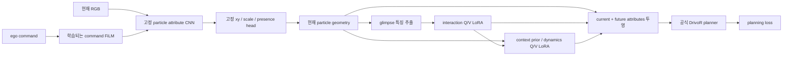

# 현재 particle 위치가 거의 변하지 않는 이유

## 결론

LoRA 학습은 실제로 진행되지만, 현재 LoRA 대상에는 **관측 영상에서 현재 particle 위치를 생성하는 경로가 빠져 있다**.
현재 Q/V LoRA는 좌표를 생성한 뒤의 interaction 및 context prior/dynamics attention에 있다.
현재 좌표는 고정 CNN/head와 새 command FiLM으로 결정된다. 따라서 현재 공간 재배치를 기대하면서
‘LoRA를 붙였으니 충분하다’고 설명한 것은 불충분했다. 학습 초기라는 설명만으로 처리할 문제가 아니다.

이 결론은 source inspection, 실제100update 체크포인트 개입, autograd 연결성 검사 및 본학습 gradient 로그를 결합한 것이다.
기존 본학습/monitor/queue/source/config는 변경하지 않았다. 진단 optimizer update는0이다.

## 실제 계산 경로

그림은 의존성을 요약한 것이며 모든 내부 입력을 표시하지 않는다. 현재 좌표에 대한 Q/V LoRA 파라미터 미분은
구조상 연결되지 않는다. Planning loss는 LoRA 및 FiLM을 갱신하지만, 고정된 원래 CNN/head 가중치는 갱신하지 않는다.
고정된 head 앞에 학습 가능한 모듈이 있으면 출력은 변할 수 있다. 현재 위치 경로에서는 그 역할을 FiLM만 수행한다.
이 FiLM은 command4D에서 채널별 scale/shift를 만들어 CNN 중간 출력에 적용하며, 위치별 이동량을 직접 예측하는 모듈은 아니다.

근거:

- `src/planning_aware_future_prediction/object_centric/lpwm_drivor_lora.py`: LoRA 대상은 particle_interaction/context_prior/particle_dynamics.
- `src/planning_aware_future_prediction/object_centric/lpwm_drivor_joint.py`: attribute CNN conv_in에 command FiLM 적용.
- `reference_repositories/LPWM/modules/modules.py`: ParticleAttributeEncoder의 xy_head가 현재 위치 offset을 생성.
- 같은 파일의 `encode_all`: 현재 z를 particle_enc에서 받은 뒤 interaction은 feature 등의 값을 교체하며 현재 z를 교체하지 않음.

## 검증 결과

공개 초기값과100update 체크포인트를 동일 모델·eval 조건으로 비교했다.
기존 고정 패널에서 직진·좌회전·우회전 각1장면, 각4카메라를 사용했다. 작은 연결성 검사이며 독립 성능 평가가 아니다.

### 실제 가중치 및 본학습 gradient

| 영역 | 바뀐 LoRA 텐서 | 초기값 대비 parameter L2 | update100 본학습 gradient L2 |
|---|---:|---:|---:|
| Particle interaction | 4/4 | 0.038063 | 0.038952 |
| Context prior | 32/32 | 0.152441 | 0.046682 |
| Particle dynamics | 48/48 | 0.269519 | 0.060415 |

두 DDP rank의 gradient norm은 같았다. FiLM4개 텐서도 모두 변경(parameter L2 0.003110)됐고,
본학습 gradient L2는0.144397이다. 그룹 크기가 다르므로 norm 크기를 직접 비교해 중요도나 학습 효율을 판단하지 않는다.
원래 LPWM 가중치·buffer SHA는 공개 초기값과 동일했다. LoRA는 원래 가중치를 보존하고 별도 저랭크 보정을 학습하는 방식이므로 예상된 결과다.

### 같은 체크포인트에서 경로를 끄는 검사

| 비교 | 현재 좌표 | 다른 표현 |
|---|---|---|
| 학습 모델 vs LoRA 전부 OFF | **bitwise 동일**, 이동0px | 현재 외형 feature와 미래 상태는 변함 |
| 공개 초기값 vs FiLM OFF, LoRA ON | **bitwise 동일** | LoRA에 의한 feature·미래 변화는 남음 |
| 공개 초기값 vs LoRA·FiLM 모두 OFF | **bitwise 동일** | 전체 current+future attributes도 bitwise 동일 |

학습 모델에서 LoRA OFF 시 미래 xy의 성분별 RMS 변화는0.492px(128px 영상 좌표 기준)였다.
이는 미래 계산이 LoRA의 영향을 받는다는 증거이며, 미래 예측 정확도가 좋아졌다는 뜻은 아니다.
이번3장면의 초기→학습 현재 중심 이동은평균0.00238px였다. 이전96장면 전체값0.00305px와표본범위가다르다.

### Autograd 연결성

현재 z의 결정적 좌표 projection을 미분한 결과:

- Interaction/context/dynamics LoRA의84개 텐서: 모두 `grad is None`, 현재 좌표의 upstream이 아님.
- Command FiLM4개 텐서: 모두 연결됨, gradient L2 0.809238.

이 projection은 planning loss가 아닌 **좌표 계산 그래프 검사**다. 실제 planning 학습 gradient는 위의 main log로 별도 확인했다.
검사는 optimizer 없이 수행했고 peak GPU reserved0.736GB, 관측 카드총30.683GB로48GB 제한 안이었다.

## 연구 목적에 맞는 수정 방향

현재 설정은 **고정된 공간 배치를 거의 유지하며 feature·미래 계산을 planning에 적응시키는 조건**으로 해석해야 한다.
현재 particle 재배치를 직접 학습시키려면, 위치를 만드는 경로에도 학습 가능한 보정이 필요하다.

우선 수정 후보는 `particle_attribute_enc.xy_head`의 Linear에 LoRA를 적용하는 것이다.
Scale/presence까지 적응시키려면 `scale_xy_head`와 `obj_on_head`도 포함한다. 마지막 출력 차원이 작으므로
모든 Linear에 rank32를 그대로 쓰지 말고 입력·출력 차원에 맞는 rank를 사전 정의해야 한다.
고정 CNN feature의 한계가 남으면 해당 CNN 후반 Conv2d에도 저랭크 보정을 추가하는 별도 조건을 고려한다.
이는 현재 source에 적용한 변경이 아니라 수정 설계다. 단순히 context/dynamics LoRA rank를 늘려도 현재좌표 upstream은 생기지 않는다.

검증은 먼저 current xy에 대한 해당 adapter 연결성·planning gradient·실제 좌표 변화를 확인하고,
이후 동일 planner/초기값/학습량에서 기존 attention-only 조건과 비교한다. 현재 학습 중인 조건의 설정을
중간에 바꾸면 비교 의미가 달라지므로 그 실험 및 checkpoint는 보존해야 한다.

위치가 움직이는 것 자체도 성공 기준은 아니다. Planning loss는 feature·후보생성·채점의 개선만으로도 감소할 수 있고,
위치가 움직여도 차량/보행자에 대한 유용성이 향상되지 않을 수 있다. 기존 readout·개입·독립 PDMS/EPDMS 검증을 유지한다.

## 재현 자산

- 진단: `scripts/audit_lpwm_drivor_lora_geometry.py`.
- 수치·checkpoint/source SHA: `results/lpwm_drivor_lora_geometry_audit_v1/report.json`.
- 사용한100update SHA: `64e304f04f8c0794ccb6033188bbc7e58557da13eb3fdfb355a501ec8ef5d22e`.
- 성공 결과를 덮어쓰지 않으며 main checkpoint와 native freeze SHA 불변을 검사한다.
