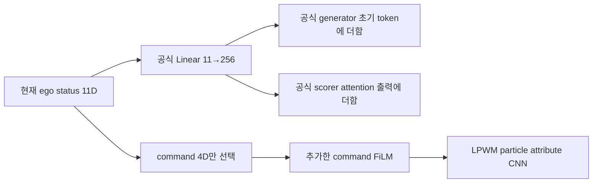

# LPWM + DrivoR: LoRA 공동 학습과 ego 입력 점검

**2026-10-06 후속 점검:** [학습 중 표현 검증·공정 비교](lpwm_drivor_representation_and_fair_comparison.md).
Rank32가 같아도 적응 파라미터는 DrivoR589,824 대 LPWM1,343,488로 다르다.
정밀도(FP16/BF16), drop_last, planner 초기화 순서 차이도 추가 확인했다.
아래 동일 protocol 설명은 공식 split·epoch·유효batch·기본 optimizer 수준이며 완전한 DrivoR 재현을 뜻하지 않는다.

## 사용자 요청과 연구 질문

2026-10-06 사용자가 DrivoR의 perception 적응처럼 LoRA로 변경하도록 요청했다.
원래 LPWM 가중치를 직접 갱신하던 실행은 update 35에서 모델·AdamW·scheduler·RNG를 저장하고 중단했다.
기존 `outputs/lpwm_drivor_joint_v1/`의 결과와 등록 소스는 보존한다.
새 조건은 공개 Sketchy LPWM과 동일 seed 2의 새 planner에서 시작하며, 기존 NAVSIM Stage1 및
35 update의 native fine-tuning 가중치를 초기화에 사용하지 않는다.

검증할 하위 질문은 **planning gradient로 적응한 particle의 현재·미래 표현이 공식 DrivoR
backend에서 유용한 주행 정보를 제공하는가**이다. Register 대조군의 실제 재학습은 아직 미실행이다.

## LoRA 적용 범위

공식 DrivoR의 `dinov2_lora.py`와 동일하게 attention Q/V, rank 32,
scale 1, A Kaiming/B zero 초기화를 사용한다. LPWM은 CNN과 particle Transformer의 조합이므로
동일한 ViT block을 공유한다는 의미는 아니다.

| 모듈 | 적용 및 학습 범위 |
|---|---|
| LPWM particle interaction | Q/V LoRA 2개 |
| LPWM context prior | Q/V LoRA 16개 |
| LPWM particle dynamics | Q/V LoRA 24개 |
| 기존 CNN, xy/scale/presence head, attention/MLP/normalization | 원래 가중치 고정 |
| 기존 BatchNorm running statistics | 고정 |
| RGB decoder | 고정, planning forward에서 미사용 |
| 새 encoder command FiLM, particle projection, camera embedding | 전체 학습 |
| 공식 ego projection, trajectory generator, scorer | 전체 학습 |

LoRA는 총 42개, 학습 파라미터 1,343,488개다. 전체 trainable은 18,413,566개,
고정된 원래 LPWM은 109,545,263개다. LoRA와 planner의 base LR은 모두 2e-4이며
기존 공식 scheduler·warmup, WTA L1 및 6개 score BCE, proposal stop-gradient를 유지한다.
추가 reconstruction SSL 및 직접 객체 bbox loss는 없다.

**현재 particle 위치 head 자체는 고정된다.** 위치는 학습 가능한 command FiLM이 입력 feature를
바꾸어 달라질 수 있지만 Q/V LoRA가 위치 CNN의 원래 가중치를 직접 갱신하지는 않는다.
미래 particle 상태 및 feature 변화와 현재 particle 점 이동을 구분해서 분석해야 한다.

## Ego status는 DrivoR와 동일한가?

**공식 planner 주입 경로는 동일하고 LPWM 내부 명령 조건화가 추가된다.**

공식 feature 순서는 현재 pose 3 + velocity 2 + acceleration 2 + driving command 4 = 11차원이다.
기본 `full_history_status=false`이므로 마지막 관측 하나를 사용한다. 현재 ego 기준 pose는 0이다.
우리 학습 cache의 16장면(navtrain 8/navval 8)을 실제 `DrivoRFeatureBuilder.compute_features`와
비교한 결과, 11개 값의 최대 절대 오차가 모두 0이었다. RGB 처리만 이 검사에서 생략했다.

공식 `DrivoRModel.forward`를 직접 호출하므로 다음 두 경로도 그대로다.

1. `Linear(11, 256)`으로 ego token을 만들고 64개 learned trajectory token에 더한다.
2. Scorer의 trajectory–scene attention 출력에 같은 ego token을 더한다.

원본 DrivoR는 DINO 이미지 backbone과 register seed에 ego status를 직접 주입하지 않는다.
우리 모델은 여기에 command 4차원만 `Linear(4,64) → SiLU → Linear(64,64)`로 처리하고,
particle attribute CNN의 `conv_in` 출력에 `feature * (1 + 0.1*tanh(scale)) + 0.1*tanh(shift)`를 적용한다.
속도·가속도까지 encoder FiLM에 직접 넣지는 않는다. FiLM 마지막 층은 zero initialization이다.

FiLM은 앞서 승인된 의도별 표현 학습을 유지하기 위한 추가 경로다. 따라서 전체 모델의 ego 주입까지
DrivoR와 같다고 표현하면 부정확하다. 순수 Register–Particle 효과를 분리하려면 향후 FiLM on/off 또는
두 perception에 대칭적인 명령 조건화를 별도 통제해야 한다. 이 점검으로 새 ablation을 등록하지는 않았다.

근거: `results/lpwm_drivor_lora_v1/ego_status_audit.json`,
`scripts/audit_lpwm_drivor_ego_status.py`, 공식 `drivor_model.py:109–179`, `drivor_features.py:50–63`,
우리 `lpwm_drivor_joint.py:61–81,148`.

## 실행 및 검증

초기 LoRA 출력과 LoRA 미적용 출력의 bitwise 동일성, 기존 공식 planner 초기값 동일성을 확인했다.
실제 이미지·온라인 oracle·backward/AdamW 2회에서 모든 LoRA 영역/FiLM/planner gradient와 가중치 변경이
확인됐고, 원래 LPWM 가중치 및 buffer의 SHA는 완전히 동일했다.
GPU 0·1, microbatch 8, 누적 4, 유효 batch 64의 DDP 2 update도 통과했다.
이 진단에서 학습한 가중치는 본 학습에 사용하지 않았다.

본 학습은 새 LoRA 조건으로 1 update 수행 후, 사용자의 GPU 여유 활용 요청에 따라
모델·optimizer·scheduler·RNG를 저장하고 실행 조건만 실측했다. 유효 batch 64와 학습량은 유지한다.
현재 배치 16으로 update 2부터 재개했고 update 3까지 실제 완료를 확인했다.
AdamW 334개 state의 step 1 및 scheduler/RNG를 복구했으며 profile 가중치를 넘기지 않았다.

학습·평가 순서:

1. NAVSIM v1 공식 navtrain 85,109 + navval 18,179 = 103,288장면, 25 epoch/40,350 update.
2. 마지막 epoch로 full navtest 12,146장면 PDMS 평가.
3. 공개 LPWM에서 독립 초기화한 NAVSIM v2 navtrain 85,109장면, 10 epoch 학습.
4. 공식 warmup/navhard two-stage EPDMS 평가.

각 단계의 정상 완료와 전체 coverage를 검사한 뒤 다음 단계로 넘어간다. Test 점수로 epoch를 선택하지 않는다.
현재 모델의 공식 PDMS/EPDMS 결과는 아직 없다. 원래 [joint 학습 설계](lpwm_drivor_joint_training.md)의
해상도(128×128 대 672×1148), perception 구조·사전학습 및 계산량 차이는 계속 적용된다.

## 실행 설정 변경

GPU 0·1, 카드 전체 48 decimal GB 제한 안에서 다음 설정을 비교했다.
속도는 첫 update를 제외한 양쪽 rank 중 느린 쪽 기준이며, 아래는 작은 engineering 장면에서의 측정이다.

| GPU당 최대 microbatch | 실제 누적 분할/GPU | Loader/oracle workers per rank | 카드 최대 GB | 초/update |
|---|---|---|---:|---:|
| 8 | 8+8+8+8 | 2 / 4 | 16.30 | 31.56 |
| **16 (채택)** | **16+16** | **2 / 4** | **29.59** | **18.29** |
| 24 | 24+8 | 4 / 8 | 43.00 | 19.35 |
| 16 | 16+16 | 4 / 8 | 29.59 | 19.93 |

앞의 세 조건은 steady update 한 번, 마지막은 세 번 평균이다. 순차 실행·공유 자원·cache 차이가 있으므로
18.29초나 1.73배를 전체 학습에서 보장되는 속도로 해석하지 않는다. 실제 본 학습 재개 후
두 번째 update는 23.07초였고, oracle 6.79초/forward 4.72초/backward 10.88초였다.
데이터 로딩은 독립 CPU 실측에서 loader2/4/8 각각 평균 58/17/25ms였다. Prefetch가 있는 실제
학습에서 워커 증설의 이득은 뚜렷하지 않았고, end-to-end 실측상 2/4를 유지했다.

배치 32는 8→16의 메모리 증가량으로 예측하면 48GB를 넘으므로 실행하지 않았다.
배치를 늘려도 activation/backward 비용이 남으며, LoRA 파라미터 감소가 같은 비율의 속도 향상을 보장하지 않는다.
Microbatch 분할 변경은 dropout 난수 소비를 바꾸므로 batch8 실행과 bitwise 동일한 학습을 주장하지 않는다.

현재 진입점:

- Base: `configs/lpwm_drivor_lora/navsim_v1.json`, `navsim_v2.json`.
- 실행 override: `configs/lpwm_drivor_lora/execution_batch16_loader2_oracle4.json`.
- Trainer: `scripts/train_lpwm_drivor_lora_parallel.py --config ... --execution ...`.
- Queue: `scripts/queue_lpwm_drivor_lora_parallel.py`.
- 상태: `outputs/lpwm_drivor_lora_v1/navsim_v1/active_execution.json`, `progress.json`, root `queue_status.json`.
- 본 학습 PID 2994997, queue 2994998. 이후 v2에도 동일 override가 적용된다.

Base config의 batch8은 변경 전 등록 이력이다. 실제 실행은 `active_execution.json`을 함께 읽어야 한다.
기존 등록 source/config는 수정하지 않았고 새 실행 source/선택은 `parallelism_registration.json`으로 등록했다.
원래 native update35 및 LoRA update1 checkpoint·중단 기록은 모두 보존했다.
검사·실측·실행 선택 근거는 `results/lpwm_drivor_lora_v1/`에 있다.
