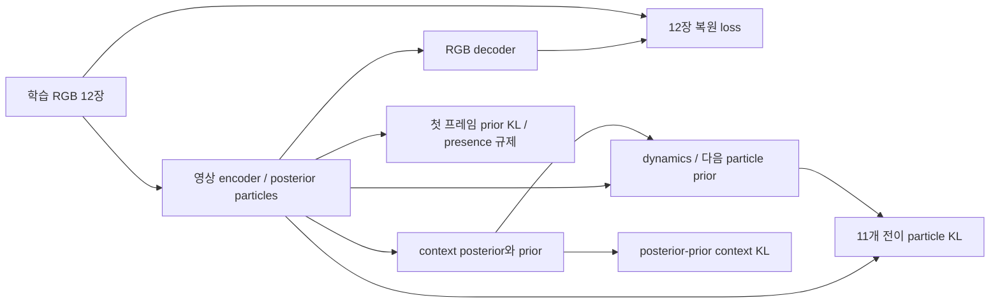

# LPWM 표현 학습과 플래너의 개발 PDMS 비교

## 2026-10-03 Stage1 실제 목적함수·gradient·단계별 원인 진단

이 절은 실행 중인 `full_posttraining_v2.json` 및 `execution/batch4_accumulation2_workers0.json`,
공식 LPWM commit `4cf53c4`의 실제 forward/loss를 읽어 정리했다. 설명을 위해 실행 중인
Stage1 source·학습 목적·optimizer·가중치를 변경하지 않았다. 수치 원본은
`results/lpwm_navsim_full_posttraining_v2/stage1_diagnostic_snapshot_20261003.json`이다.

### 데이터와 학습 대상

- 공개 Sketchy checkpoint에서 영상 encoder 6.035M, context 39.389M, dynamics 59.869M,
  RGB decoder 4.251M, 합계 109.545M을 모두 직접 갱신한다. LoRA나 일부 block만의 학습이 아니다.
- 공식 navtrain log와 token 필터를 함께 적용하고 recording 단위로 train23,126 clip/122 recording,
  development7,745 clip/40 recording을 분리한다. 연속 RGB 12장, 전방128×128, 0.5초 간격이다.
- **학습은 12프레임 전체 posterior 복원과 11개 전이의 latent KL이다.** `4 observed + 8 future`는
  과거만 사용하는 평가/planner의 구분이다. 현재 목적에 8-step 자율 rollout RGB loss는 없다.
- Stage1 입력/감독에는 ego command, 행동, 경로 GT, 객체 class/box GT가 없다. 객체 주석은 평가용이다.
  카메라 움직임 분리·안정화 모듈도 추가하지 않았다. Stage2에서 command FiLM과 planning 감독을 추가한다.
- GPU당4 clip × 누적2 × GPU2 = 유효16. Adam LR8e-5, betas(0.9,0.999), eps1e-6,
  weight decay0, FP32, global gradient clip100, warmup0,20epoch/28,920update다.

### 실제 forward와 학습·추론 차이

각 영상의 posterior particle은 위치·scale·presence·compositing depth·appearance 및 배경을 담는다.
Context는 관측 전이를 설명하는 posterior latent와 과거만으로 다음 latent를 예측하는 prior를 만든다.
Dynamics는 particle 이력과 context로 다음 particle 분포를 출력한다.

훈련 시 dynamics에는 정답 영상에서 추론한 이전 particle과 다음 전이의 posterior context를 준다.
다음 particle posterior도 정답 영상에서 얻지만 고정 teacher/EMA target이 아니며 함께 학습된다.
반면 실제 미래 생성은 **과거4장만** `sample_from_x(...,num_steps=8,cond_steps=4,
use_all_ctx=False,deterministic=True,n_pred_eq_gt=False)`에 넣어 context prior와 dynamics를 반복한다.
미래 context posterior를 사용할 수 없고, 이전 예측 오차가 다음 예측으로 누적된다.
따라서 학습 loss 감소만으로 4초 미래 예측 성공을 판정할 수 없다.

### Loss의 정확한 구성

현재 설정의 최종 scalar는 다음과 같다. 각 항은 batch 평균을 포함하며 정규화 전 값을 로그에 쓴다.

\[
\mathcal L_{stage1}=\frac{0.01}{12}
\left[L_{rec}+0.08L_{static}+0.2L_{dyn}+0.2L_{context}+0.08L_{presence}\right].
\]

1. **복원**: 각 프레임의 `MSE + 0.1 × VGG-LPIPS`에 `3×128×128`을 곱하고 12프레임을 합한다.
   LPIPS network는 고정이며 생성 영상으로의 gradient는 유지된다. `beta_dyn_rec=1`과 시간 discount1을
   사용하지만 코드의 `loss_rec_future`도 **미래 정답 영상의 posterior 복원**이다.
2. **초기 particle prior KL**: `num_static=1`인 첫 프레임 위치·scale·presence·depth KL의 합에
   `0.01 × appearance/background KL`을 더한다. 위치에는 공식 Chamfer KL을 사용한다.
   여기서 `kl_balance=0.01`은 이 appearance 항의 가중치이며 stop-gradient 균형 계수가 아니다.
3. **Dynamics KL**: 나머지11프레임에서 영상 encoder posterior와 dynamics가 내놓은 다음 particle prior의
   분포 차이를 줄인다. 위치·scale·presence·depth·appearance·배경을 포함하고 appearance 가중치는1이다.
   활성도 mask를 일부 attribute KL에 적용한다. 정답 위치 L2만의 동역학 학습이 아니다.
4. **Context KL**: 다음 전이를 보고 추론한 posterior context와 과거에서 예측한 prior context를 맞춘다.
   현재 Gaussian KL의 gradient balance는 default0.5로 양쪽에 gradient가 흐른다.
5. **Presence 규제**: 첫 프레임 particle 활성도의 합을 제곱하여 평균한다.
   불필요한 particle 사용을 줄이는 규제이며 객체 수·class 정답은 아니다.

공식 코드의 `n_particles` 변수는 이 최종 loss 정규화에 실제 사용되지 않는다. 65로 나눈다고
해석하지 않는다. 원시 `loss_rec` 수만 단위와 전체 loss 수십 단위를 직접 비교하지 않는다.

2026-10-03 22:56KST/update2704의 가중치·정규화 적용 후 기여는 복원21.4026,
static KL0.05745, dynamics KL0.64128, context KL0.11839, presence0.08615였다.
복원이 scalar 합의 약95.95%였지만 **이 비율이 모듈별 gradient 지배 비율을 의미하지는 않는다**.
현재는 모듈별 총 gradient norm을 기록하며 loss별 gradient norm/방향 충돌은 별도 계측하지 않는다.

### Gradient 경로와 optimizer update

| Loss | 영상 encoder | Context | Dynamics | RGB decoder |
|---|---|---|---|---|
| Posterior RGB 복원 | 갱신 | 직접 경로 없음 | 직접 경로 없음 | 갱신 |
| 첫 프레임 KL / presence 규제 | 갱신 | 직접 경로 없음 | 직접 경로 없음 | 직접 경로 없음 |
| 다음 particle KL | posterior 및 예측 입력 경로로 갱신 | posterior context 경로로 갱신 | 갱신 | 직접 경로 없음 |
| Context KL | particle 입력 경로로 갱신 | posterior/prior 경로로 갱신 | 직접 경로 없음 | 직접 경로 없음 |

`decode_with_ctx=False`이므로 RGB 복원에서 context/dynamics까지 직접 gradient가 가는 구조가 아니다.
`detach_dyn_inputs=False`, context의 주요 particle attribute 입력도 연결돼 있다.
일부 보조 분산/score 입력의 공식 detach와 주 경로의 gradient 연결은 구분한다.
한 optimizer update에서 rank마다 microbatch2번의 `loss/2`를 backward하고, 마지막에 DDP로 두 rank의
gradient를 평균한다. 이후 global norm100 clipping과 Adam step을 수행한다.

최근 실제 감사 update2688의 norm은 encoder39.8964/context0.36360/dynamics0.88562/decoder12.9915다.
이는 연결·갱신이 존재한다는 증거이며 각 모듈이 올바른 정보를 학습했다는 증거는 아니다.
`parameters_with_nonzero_gradient`는 nonzero gradient가 있는 **tensor에 속한 parameter 수**이며
그 수만큼 모든 scalar gradient가 0이 아니라고 보장하지 않는다. 종료 시 weight 변화 검사는
parameter tensor의 앞16개 원소 sample로 하므로 전체 원소 비교가 아니다.

### Particle 시각화의 점·사각형·색상 의미

현재 `visualization/index.html`의 윗줄은 동일한 현재 영상에서 encoder가 추론한 particle이다.
`scripts/visualize_lpwm_posttraining_progress.py::draw_particles`와 저장된 그림을 대조했다.

| 표시 | 실제 의미 |
|---|---|
| 색깔 점64개 | 각 particle의 학습된2D 중심 `z`; 단순 점이 아니라 외형·scale·presence 등을 갖는 표현의 위치 |
| 점 주변 사각형16개 | presence 상위16 particle의 학습된 `z_scale`을 sigmoid한 폭/높이. 위치·크기로 decoder의 지역영상 배치를 나타냄 |
| 같은 점·테두리 색 | 같은 particle index/patch 기원. 객체 class·위험도·영속적 track ID가 아님 |
| 점의 크기와 투명도 | presence가 높을수록 점을 크고 진하게 그림. 점 크기는 실제 물체 크기를 뜻하지 않음 |
| `presence sum` |64개 연속 활성도의 합. 검출 객체 개수가 아님 |

사각형 중심은 점이고,128픽셀 영상에서 폭/높이는 `128 * sigmoid(z_scale)`이다.
이는 분산·신뢰구간을 표시한 uncertainty box나 attention heatmap, GT/검출기 객체 box가 아니다.
실제 decoder는 내부 alpha mask와 depth도 사용하므로 사각형 내부 전체가 동일하게 기여하지 않는다.
Presence 역시 정답 객체 존재에 대해 보정된 검출 확률이나 planning 중요도라고 보장하지 않는다.

사각형을16개만 그리는 것은 가독성을 위한 시각화 선택이며 모델이 나머지48개를 제거한다는 뜻이 아니다.
한 객체가 여러 particle로 표현되거나, particle이 도로·나무·건물 등 배경 일부를 담을 수 있다.
열/update와 GIF는 **같은 장면에서 학습 전후 가중치 변화**를 보여준다. 실제 시간이 흐르며 같은 객체를
추적하는 영상으로 해석하지 않는다. 가운데줄은 현재 복원, 아래줄은 과거4장만 사용한+4초 예측 RGB다.

### 배경 중심 particle과 Stage2에서의 재배치 가설

검증할 하위 질문: **planning 감독이 시각 복원에 유리한 particle 표현을, 해당 주행 판단에
필요한 객체·도로 구조 및 그 미래 정보를 보존하는 표현으로 바꾸는가?**

도로·나무·건물 쪽에 많은 particle이 보이는 것은 전역 RGB MSE/LPIPS, 화면 면적과 무늬,
patch 기원 proposal,128×128에서 작은 객체의 정보 손실로 설명 가능한 가설이다.
Stage1에는 차량/보행자/정지선의 중요도를 직접 높이는 supervision이 없다. 그러나 고정8장면의
점 분포만으로 reconstruction이 원인이라고 확정할 수는 없다. 도로와 배경도 주행 가능 영역,
자차 움직임, 도로 형태 추론에 유용할 수 있다. 대상 영역 면적과 장면 구성을 보정해 비교해야 한다.

현재 Stage2는 `particle_attributes`에 위치·sigmoid(scale)·presence·depth·외형·배경을
detach 없이 연결하고, 관측/예측 particle memory에서 planner loss를 역전파한다.
LPWM LR1e-6/새planner·command LR3e-4, 목적은 planning loss +0.02 world ELBO다.
따라서 위치·scale/활성도·특징을 바꿀 수 있는 구조지만, **중요 객체 쪽으로 중심이 이동하는 것을
직접 요구하는 loss는 없다**. Encoder의 aggregate planning gradient와 command에 따른
attribute 변화는 CPU 연결검사에서 확인했으나, 위치/scale/appearance별 실제 gradient 기여와
객체를 향한 의미 있는 이동까지 확인한 검사는 아니다.

- 차량/보행자: NC/TTC 및 경로 imitation을 통해 간접적으로 관련 정보를 학습할 수 있다.
- 도로/차선: DAC 등은 도로 영역과 주행 경로에 대한 간접 신호이며 차선 paint segmentation이 아니다.
- 정지선: 현재6개 candidate metric에 독립 정지선/신호등 준수 항은 없다. Human trajectory의
  간접 신호만으로 정지선에 particle이 모인다고 보장하지 않는다.
- Ego command FiLM은 같은 영상의 particle attribute를 바꿀 수 있지만, command별 올바른
  중요 대상 선택이 학습됐다는 증거는 별도로 필요하다.

중심 이동, scale/presence 변화, 외형·예측 특징 변화, planner의 기존 token 활용 변화는
서로 다른 결과다. 위치 이동만으로 성공/실패를 판단하지 않는다. 큰planner가고정표현만활용하거나
world loss/낮은LPWM LR 때문에 위치변화가 작을 수도 있으며, 이는 현재 미확정 가설이다.

이를 검증하려면 같은clip·같은command의 Stage1/Stage2 checkpoint를 비교하고,
객체/지도 투영 영역별 presence 및 중심·박스 coverage(면적/객체크기 보정), 외형/future probe,
matched control을 둔 particle 교체·제거 시 planner/PDMS 변화와 frozen-LPWM 대조를 함께 본다.
Attention이나 gradient 그림만으로 causal importance를 입증하지 않는다. 중요한 대상을
같은 class 전체로 묶지 않고 ego 경로/intent와 관련된 대상별로 나눠야 한다.
차선·정지선 투영을 쓰려면 지도-카메라 좌표·crop/resize·가시성을 먼저 검증해야 한다.

현재 자동 queue에는 world-retention 및 learned-future/persistence 비교가 있다.
**Stage2 객체 종류별 particle 재배치 시각화, 면적보정 점수, particle 개입, frozen-LPWM 대조는
아직 구현·등록되지 않은 추가 진단**이다. 기존 Stage1 gallery나 aggregate gradient 검사를
그 진단의 완료 증거로 사용하지 않는다. 이 해석을 이유로 실행 중 objective/source를 바꾸지 않았다.

### 현재 관측 결과와 검증 수준

| 고정 개발512개 clip | 학습 전 | 1epoch/update1446 |
|---|---:|---:|
| Temporal ELBO |64.8380|23.3991|
| 정규화 전 복원 loss |74927.44|26949.30|
| Dynamics KL |12153.41|4004.85|
| Context KL |1120.75|784.66|
| Posterior 복원 PSNR(dB) |13.1449|20.4611|

매 epoch의 위 지표는 고정512개 개발 표본의 stochastic posterior/teacher-forcing 평가다.
초기 동일값의 두 로그 행은 재개 과정에서 중복 기록됐으므로 두 독립 실험으로 집계하지 않는다.
별도 고정8장면 시각화의 과거만 사용하는 미래 MSE는0.053663→0.029535(1epoch),
같은 장면 last-frame persistence는0.040329다. 복원 MSE는0.044610→0.009260이다.
**8장면 기술 통계에는 CI가 없으며 전체 개발 적응 성공으로 일반화하지 않는다.**

학습 도중에는 finite loss/gradient·주기적 module gradient·checkpoint를 확인하고,
같은8장면의 64개 중심/top16 box/presence/복원/미래 예측을 update0/128/512 및
epoch1/5/10/15/20에 저장한다. `outputs/lpwm_navsim_full_posttraining_v2/visualization/index.html`을 본다.

완료 후 다음을 **전체7,745 clip/40 recording**에서 공개weight와 최종weight를 대응 비교한다.

- 복원 LPIPS: 공개weight보다 개선, recording bootstrap2000회/95% CI 상한<0.
- 과거4장→미래8장 LPIPS: 공개weight 및 last-frame persistence보다 각각 개선, CI 상한<0.
- 미래 객체 영역 MSE: persistence보다 개선, CI 상한<0.
- 현재 top16 particle box와 투영 객체 box의 recall(IoU≥0.1): 공개weight 대비 CI 하한≥-0.02.
- 위험층별 미래 LPIPS: 충분한5개 이상 recording에서 persistence 대비 열화 CI 상한이
  persistence 평균의10% 이내. 빠른자차/큰회전/작은객체/먼객체/큰영상변화/겹침·소실 proxy를 분해한다.
- 네 모듈 gradient와 weight 변화, 추가8장면 미래 교란 검사의 **모든** 장면 통과,
  particle feature 표준편차>1e-4 및 활성도합>1, 주요 scenario/risk coverage.

미래 LPIPS/MSE는0.5~4초 각 horizon도 저장한다. 작은/먼객체 ROI, 배경ROI,4초 particle-box 대응,
같은 patch ID 유지 proxy도 진단용으로 남긴다. **이들 모두가 별도의 통과 threshold를 갖는 것은 아니다.**
객체 box IoU0.1은 느슨한 대응 지표이고 겹침/소실은 실제 가림 GT가 아니다. Feature std 및 presence
검사만으로 모든 particle이 서로 다른 객체를 담거나 동일객체를 추적한다고 보장하지 않는다.
통과는 운영상 적응 기준이며 '완벽한 NAVSIM 이해' 또는 planning 유용성의 증명이 아니다.

### Stage1 / Stage2 실패 원인을 분리하는 순서

| 관측 | 우선 확인할 문제 | 진단/비교 |
|---|---|---|
| 복원부터 나쁨 | Stage1 영상 표현·decoder·해상도/도메인 적응 | 원본/적응 복원, 작은객체 ROI, particle 활성도와 배치 |
| 복원은 좋고 과거만의 미래는 나쁨 | Context prior / dynamics / teacher-forcing과 rollout의 차이 | 시간별 오차, persistence, posterior context를 쓰는 특권 상한 진단 |
| 전체영상은 좋지만 작은객체·회전·겹침이 나쁨 | Stage1 목적과 주행 중요 정보의 불일치 | 배경/객체 ROI 분리, 위험층별 지표; 전역 평균으로 통과 단정 금지 |
| Stage2 후 영상/미래 지표가 악화 | Planning 미세조정 중 표현 훼손 | Stage1 동일clip 기준 world-retention 및 module별 변화 |
| 후보 oracle PDMS부터 낮음 | 후보 사전/생성/보정의 한계 | 선택 network와 독립적으로 실제 후보 전체의 최선 score 확인 |
| 후보 oracle은 높고 선택 PDMS는 낮음 | 점수 예측·선택 또는 입력 표현의 정보 부족 | metric calibration, oracle 선택 gap, 고정표현 probe로 추가 분리 |
| 미래를 persistence로 바꿔도 PDMS 동일 | 미래 branch의 활용 약함 또는 잘못된 예측 | 현재 queue의 learned-future/persistence 대응 평가 |

현재 queue에는 Stage1 gate, teacher oracle coverage, 각 Stage2의 학습 전/후 PDMS·ADE·metric BCE,
Stage1 대비 world-retention, 예측future를 persistent particle로 바꾸는 검사가 구현돼 있다.
Gate 실패는 원인JSON을 남기고 다음 단계를 막는다. 낮은 성능을 이유로 문턱을 자동 완화하지 않는다.

**완전한 인과적 분리에 필요한 추가 통제는 현재 queue에 모두 들어 있지는 않다.**
문제가 나타나면 동일planner/학습량으로 (a) 공개LPWM 고정 vs 적응LPWM 고정,
(b) 적응LPWM 고정 vs 저LR 공동학습, (c) 예측future vs 평가전용 실제future posterior,
(d) loss별 module gradient/방향을 비교한다. (c)는 배포 입력이 될 수 없고 PDMS 본성능으로 보고하지 않는다.
고정표현 probe도 한 모델만으로 정보 부재를 증명하지 못하므로 optimization/용량 한계를 함께 점검한다.
현재3조건은 planner loss/보정 비교이며 위 모든 원인을 유일하게 식별하는 실험이라고 주장하지 않는다.

### 코드 진입점

- 설정: `configs/lpwm_navsim_adaptation/full_posttraining_v2.json`, execution override.
- 호출·실제평가: `scripts/run_lpwm_navsim_posttraining.py::official_loss/evaluate`.
- 누적/DDP/optimizer/epoch개발평가: `scripts/train_lpwm_navtrain_distributed.py::run`.
- 실제 ELBO: `reference_repositories/LPWM/models.py::DLP.calc_dyn_elbo`.
- Pixel/LPIPS: `reference_repositories/LPWM/utils/loss_functions.py::LossLPIPS`.
- 전체개발 gate: `scripts/summarize_lpwm_posttraining.py::summarize`.
- 추가 gate/Stage2 보존검사: `scripts/validate_lpwm_stage_transition.py`.

## 2026-10-03 최신: 미래 particle 기반 후보 평가·보정 planner

현재 설정은 `configs/lpwm_planning/metric_distillation_v2.json`이다. 아래 과거 소규모 및
encoder-only 실험과 구분한다. Stage1 본학습을 중단하지 않고 대기열을 새로 연결했다.
검증할 질문: **planning의 안전·진행·편안함 감독과 미래 particle 기반 후보 보정이,
LPWM 표현 자체와 실제 주행 성능을 개선하는가?** 객체별 선택 예산은 아직 학습하지 않는다.

### 참고한 연구와 적용 범위

| 근거 | 가져온 로직 | 이번 구현에서의 차이 |
|---|---|---|
| [DrivoR §3.3–3.5](https://arxiv.org/html/2601.05083v2) | scene token에 attention하는 경로/점수 decoder, oracle subscore BCE, 생성과 채점의 gradient 분리 | ViT/register 대신 LPWM particle memory, 초기에는 train-only 후보 사전 사용 |
| [Hydra-MDP](https://arxiv.org/html/2406.06978v3) | 후보 trajectory vocabulary, imitation+여러 simulator 지표 증류 | 512개 train-only 실제 궤적 medoid, 현재 NAVSIM-v1 scorer 기준; 논문 로직을 구현하며 공식 미공개 코드를 재사용했다고 하지 않음 |
| [DriveSuprim](https://arxiv.org/html/2506.06659v3) | 많은 후보를 먼저 평가하고 일부를 상세 평가하는 구조 | 우리 후단은 점수 평가뿐 아니라 실제 좌표를 보정; EMA soft-label/다중카메라 ego augmentation은 미적용 |
| [Drive-JEPA](https://arxiv.org/html/2601.22032v2) | video representation과 다중 경로 감독 연결 검토 | 현재 full MTD 구현·안전 pseudo-GT 경로 회귀를 그대로 이식하지 않음. 공식 PF full checkpoint 결과는 보존된 비교 기준 |
| 보존된 로컬 SafeDrive | trajectory-guided refinement, 안전 subscore, 시점별 DAC, 보정 후 경로의 live rollout 채점 | BEV·객체 ID 대신 LPWM token cross-attention. 객체별 NC는 대응 검증 전 제외 |

DrivoR source `fc6e5aa144bbcb5a046e22c18f1bd5cf3af8634a`, DriveSuprim
`80fe792d7654a596d92e20d030d1650f6f605c02`, 두 저장소 Apache-2.0 확인.
원본은 `reference_repositories/`에 보존한다. 기존 SafeDrive 학습은 재개하지 않는다.
**로컬 SafeDrive의 future BEV semantic head는 보조 감독이며 그 출력이 planner 입력이라는
주장은 하지 않는다.** 우리 구현은 예측 미래 particle을 refiner의 입력으로 직접 사용한다.

### 입력과 전체 경로

1. 과거/현재 전방 RGB 4장(0.5초 간격,128×128) + 현재 command/속도/가속도 8D.
2. 현재 command 4D를 particle attribute CNN 내부 bounded FiLM에 입력한다.
3. 공개 구조의 encoder/context/dynamics로 관측 particle 4×64와 과거만의 미래 prior 8×64를 만든다.
   LPWM은 action-conditioned counterfactual simulator가 아니다. 각 후보 행동별 세계를 별도 예측하지 않는다.
4. 위치·scale·presence·compositing depth·appearance·배경의 14D attribute를 256D로 변환,
   시간 및 particle 위치 embedding과 함께 총768개 memory token을 구성한다.
5. train75,297개 궤적만으로 만든512개 실제 trajectory medoid를 candidate query로 변환한다.
   두 층 decoder가 memory를 읽고 imitation logit과 NC/DAC/EP/TTC/comfort/DDC를 예측한다.
6. refinement 조건은 imitation 상위16 + 나머지 중 예측점수 상위16의 **서로 다른32개**를 고른다.
   GT 경로를 shortlist 선정에 사용하지 않는다. 2층 refiner는 미래8×64 particle memory를 읽는다.
7. offset은 waypoint별 XY 각각±3m, heading±0.3rad로 제한한다. 이후 실제 보정 좌표를 다시 embedding하여
   2층 decoder로6개 subscore와8시점×2개 prefix 안전확률을 예측한다.
8. 최종 선택은 예측 PDMS × imitation 확률^0.1이다. NAVSIM-v1은
   `NC × DAC × (5 EP + 5 TTC + 2 comfort)/12`; DDC는 감독하지만 해당 scorer 가중치는0이다.

Particle의 depth는 실제 m 단위 거리, particle 번호는 객체 track ID로 사용하지 않는다.
카메라 pixel 좌표에서 직접 ego 충돌거리를 계산하지 않는다. 3D 객체 대응·좌표 grounding을
검증한 뒤에야 객체별 collision supervision을 추가할 수 있다.

### Loss와 gradient

기본 조건: `L_coarse_imitation + L_coarse_metrics + 0.02 L_world`.
- `L_coarse_imitation`: 후보와 human GT의 평균 XY L1 차이로 만든 soft distribution의 CE, temperature0.5m.
- `L_coarse_metrics`:6개 공식 simulator subscore의 BCE 합. 미래 객체·지도·ego GT는 teacher 정답 생성 전용.
- `L_world`: 현재 Stage1과 같은 공식 temporal ELBO(영상 MSE/LPIPS, particle/context/dynamics KL, opacity regularization).

보정 조건은 다음을 추가한다.
- `L_refine_imitation`: 가장 가까운 보정 후보의 SmoothL1 XY +0.5 circular heading loss.
- `L_refined_metrics`: **이번 forward에서 실제 보정한32개 경로**를 CPU 공식 simulator/scorer로 재평가한6개 지표 BCE.
- `0.5 L_temporal_safety`:0.5~4.0초 각시점까지 책임 충돌이 없었는지, 도로를 벗어나지 않았는지의 prefix BCE 합.
  이 감독은 미래 particle memory와 그 encoder까지 전달되며 객체 ID 대응은 요구하지 않는다.
- `0.01 L_comfort_proxy`: 선택한 회귀 후보의 가속도4m/s²·jerk8m/s³ 초과 페널티.
  공식 comfort score 자체의 미분은 아니다. 공식 comfort BCE 및 최종 PDMS로 별도 확인한다.

PDM simulator는 미분하지 않는다. Pose를 detach하여 teacher를 호출하고, 생성된 정답으로 score head와
LPWM을 학습한다. 채점 입력의 보정 좌표도 detach하여 scorer가 회귀를 쉽게 하려고 경로를 바꾸는 것을
분리한다. Refiner는 경로 회귀와 미분 가능한 comfort 항으로 학습하고, safety score는 최종 후보 선택에 쓴다.
Planning gradient는 encoder/context/dynamics까지, world loss는 RGB decoder까지 전달한다.
미래 GT 영상은 planner forward 입력이 아니며 별도의 world objective에만 사용한다.

### 학습·검증·자동 대기열

- Stage1: train23,126/122recording, dev7,745/40recording, 공식109.55M 전체,20epoch/28,920update.
- Stage2: train75,297/dev27,076, 동일 recording 분리, 조건별20epoch/94,140update, seed47.
- LPWM LR1e-6, planner/command module LR3e-4, AdamW, clip5,1%warmup+cosine.
- 계획 batch4/GPU×누적2×GPU2=16, encoder FP32/dynamics·planner BF16, activation checkpointing.
  **Stage2 실제 GPU 메모리/속도는 아직 미측정**. 적응 gate 후 실제 누적조건3update profile을 먼저 한다.
- ①metric_plus_world →개발검증→②imitation_plus_world →개발검증→③metric_refinement_plus_world →개발검증.
  world-objective-off 비교는 최신 후보 보정 요청을 우선하여 후속으로 남겼다. 각조건은 같은Stage1 weight에서 시작한다.
- 모든 개발 gate 후 고정 최종weight의 full navtest12,146 평가. Test를 보고 loss/epoch를 선택하지 않는다.
- 각조건 개발집합에서 predicted-future→last-observed-particle persistence 개입을 비교한다.
  ADE뿐 아니라 PDMS, recording bootstrap CI, 위험별 분해를 보고한다.

Stage1 gate는 원래 등록된 전체 개발집합의 원본 대비 복원·미래 예측 개선, persistence 대비
미래 LPIPS/객체ROI 개선, 객체box대응 비열등성, 위험별 비열등성, 전체 모듈 update/gradient를 유지한다.
별도8장면 미래 GT 교란 **전부** 통과, 표현 비퇴화, 직진·회전·겹침 및 위험층의 recording coverage를 추가한다.
이는 운영상 적응 통과 기준이며 완벽한 적응·영속적 객체 identity·planning 향상 증명이 아니다.

Teacher gate: train/dev 각95% 이상5초 metric cache coverage, scorer parity, 후보oracle ADE≤1.5m,
p95≤4m, dev oracle PDMS≥85%. 미채점 장면도 imitation 학습에는 포함하고 metric loss만 mask한다.
실제 vocabulary dev oracle ADE0.34544m/p95 0.72152m; **학습된 planner 결과가 아니다**.
Stage2 gate: full epochs, 전체개발추론, 학습전 대비 PDMS·ADE의 paired recording CI 개선,
metric 조건의 calibration 개선, core gradient, world objective 유지조건의 복원·미래 LPIPS 열화상한10%.
Drive-JEPA를 이기는지는 통과 기준과 별개로 보고한다.

대기열: `scripts/queue_lpwm_validated_training.py`, 상태 `outputs/lpwm_metric_planning_v2/queue_state.json`.
기존 실행 중인 Stage1 supervisor는 그대로 둔다. 완료 후 기존 Stage2 호출은 `active_pipeline.json`에 따라
새 queue에 join하므로 과거 단일 궤적 planner가 중복 실행되지 않는다. Gate 실패 시 진단JSON과 실패 항목을
저장하고 후속단계 차단. 임의 gate 완화·무제한 재학습·실패 job 자동재시도 없음.
CPU teacher16worker(각1thread), host available64GiB reserve. 보정 중 oracle4worker/rank, 총8.
DDP 시작 전 GPU0·1 각각44GiB free 입장조건, 실행중6GiB reserve/allocated38GiB 상한.

### 구현·검증 상태

코드: `lpwm_candidate_planner.py`, `prepare_lpwm_candidate_teacher.py`, `lpwm_refinement_oracle.py`,
`train_lpwm_full_planning.py`, `validate_lpwm_stage_transition.py`, `queue_lpwm_validated_training.py`.
CPU6개 loss/gate 검사 통과, 공식512후보 vs 개별채점 오차≤2.14e-8 확인.
공개weight+실제navtrain 영상1개로 후보/보정 planner의 역전파·미래GT비의존·intent변화를 검사했다.
검사용1update weight는 폐기했고 본학습으로 집계하지 않는다. Stage2 GPU/DDP와 planning 성능은 아직 미검증이다.
연결 검사의 source hash·수치는 `results/lpwm_metric_planning_v2/implementation_readiness.json` 및 개별audit에 있다.

---

## 보존 이력: 이전 소규모 stage1 적응 및 통합stage2 초안

아래 encoder-only 실험은 완료7run만 보존하고 중단됐다. 새 현재 경로는
`configs/lpwm_navsim_adaptation/posttraining_v1.json` 및 `scripts/launch_lpwm_posttraining.py`다.

1. 공개 Sketchy LPWM에서 공식 전체 모델과 temporal ELBO로 NAVSIM post-training.
   학습8,192 clip/82 recording, 검증512 clip/40 recording, 12프레임, 4 epoch, 유효batch8.
   모든 입력은 RGB이고 경로/객체 GT 감독은 넣지 않는다. Decoder도 유지한다.
2. 미래 예측·객체 영역·표현 퇴화·주행 위험별 평가로 적응 gate를 확인한 후,
   **LPWM 낮은 학습률 미세조정 + planner 전체 학습**을 함께 진행한다.
   Planning gradient가 LPWM encoder/context/dynamics까지 전달되어 planning에 유용한 particle을 학습하는지가 핵심이다.
   복원·동역학 손실 유지 여부, particle 생성의 현재 주행 명령 입력 여부는 분리 비교한다.

이전 frozen-planner 단계와 별도stage3 제안은 사용자 지시로 통합됐다. 완전동결이 최종 학습 방식은 아니다.
현재는 stage1을 먼저 수행한다. Stage2 학습률·예산은 stage1 실측 후 고정하며 성능 향상을 미리 가정하지 않는다.
기존 LPWM도 미래 동역학을 학습한다. 추가하려는 것은 planning 목적 감독이다.

시각화는 고정8장면에서 update0/128/512/1024/2048/3072/4096의 64개 particle 중심,
활성도 상위16개 box, 복원, 과거4프레임만 이용한 미래8프레임 예측을 함께 보여준다.
`outputs/lpwm_navsim_posttraining_v1/visualization/index.html`, 장면별 PNG/GIF/원시NPZ를 저장한다.
Particle ID는 patch 기원이며 영속적인 객체 ID가 아니다. 겹침은 가림 proxy다.

## 아래는 중단·보존된 encoder-only 등록 설계

## 검증할 하위 질문

Ego intent를 encoder 내부에 넣고 planning과 관련 객체의 미래 위치를 공동 감독하면,
planning만으로 encoder를 학습할 때보다 유용한 미래 정보를 보존하고 PDMS가 개선되는가?

사용자의 2026-10-03 명시적 학습·플래너 연결·PDMS 평가 요청에 따른 새 실험이다.
완료된 LPWM 영상 복원 파일럿과 별개이며, 기존 WA/encoder 실험을 재개하지 않는다.

## 구현과 통제

- 시작점: 이전 raw seed29 LPWM checkpoint를 모든 조건/seed에 공통 사용한다.
- 입력: 현재와 0.5초 전 전방 RGB 두 장(128×128), 현재 command/속도/가속도 8차원.
- LPWM의 공식 particle encoder에서 64개 입자의 위치·크기·transparency·appearance·배경 정보를 추출한다.
- Ego FiLM을 encoder의 particle attribute CNN 내부에 삽입해 encoder 출력 자체가 조건화되도록 한다.
- 관측 입자 attention → 현재 객체 상태/4초 미래 위치 → trajectory decoder → 8개 ego waypoint.
- 기존 RGB decoder와 latent-action context/dynamics는 제거한다. 공식 LPWM 전체 알고리즘 재현이 아닌
  **LPWM 사전학습 encoder 기반 supervised task model**이다. 현재 입자 번호는 객체 track ID가 아니다.
- GT 투영 박스와 입자의 현재 geometry를 Hungarian 대응한다. 현재 geometry·metric 위치·class와
  동일 GT track의 미래 위치를 감독한다. 미래 위치는 현재 ego 좌표로 변환해 camera motion과 분리한다.
- 위험 가중치는 정답 ego 경로와 객체 미래 경로의 최소 거리로 정의한 bounded proxy다.
  학습 목표의 가중치에만 쓰며 실제 causal importance/safety 정답이라고 주장하지 않는다.
- GT 객체·track·미래 영상·미래 ego pose는 모델 입력에 없다. 미래 head 출력은 planner 입력에 있다.
- LoRA 없이 encoder 가중치를 직접 갱신한다. Planning loss와 객체 미래 loss의 encoder gradient를 검사한다.

| 조건 | LPWM encoder 갱신 | 내부 intent | 객체 미래 감독 |
|---|---|---|---|
| frozen_particles | 아니오 | 아니오 | 없음 |
| planning_joint | 예 | 예 | 없음 |
| object_future_uniform | 예 | 예 | 균일 |
| object_future_risk | 예 | 예 | 경로 근접도 가중 |
| object_future_risk_no_intent | 예 | 아니오 | 경로 근접도 가중 |
| ego_only | 사용하지 않음 | 해당 없음 | 없음 |

모든 LPWM 조건은 같은 planner/future head 구조이며, planning-only에서도 future head는 planning
gradient로 학습된다. Frozen과 joint 차이는 encoder 갱신과 내부 intent의 묶음 효과다.
위험 가중/균일 비교 및 내부 intent 유무 비교로 추가 효과를 분리한다.

## 사전 등록 범위

`configs/lpwm_planning/controlled_v1.json`: 6조건 ×3seed(29/47/71) ×1,000update, batch8.
512 train /192 development, recording 분리, 기존 공식 개발 metric cache 재사용.
모든 704개 window에서 두 관측 영상이 존재함을 확인했다. 미래 영상 가용성으로 표본을 고르지 않는다.
전체 train 22직진/65회전/390가림후보/35기타, 개발 12/25/147/8이다.
가림후보는 투영 겹침 proxy이고 motion 유형과 독립적인 label이 아니다.
Primary condition은 결과를 보기 전에 `object_future_risk`로 고정한다. 마지막 checkpoint만 평가한다.
개발 점수로 조건/학습량을 재선정하지 않으며 독립 test 결과로 부르지 않는다.

공식 Drive-JEPA는 같은192장면의 보존된 궤적/점수를 참조한다. 사전학습량/해상도가 다르므로
LPWM의 엄격한 matched baseline은 frozen/planning-only이며 Drive 비교로 architecture 우월성을 분리할 수 없다.

GPU0·1 한 worker씩, 여유6GiB/allocated20GiB/각run60분/worker6시간 상한.
학습 완료된 모델부터 별도 CPU 프로세스가 공식 PDM을 평가한다. 공용 원본은 읽기만 한다.

## 평가

PDMS와 collision/drivable/progress/TTC/comfort, ADE, 현재 객체 박스 대응, 미래 객체 위치 오차,
동일 선형 probe, scene/미래 branch 교란을 보고한다. Recording cluster bootstrap은 paired seed 평균 차이에
적용하며 전체 seed 불확실성/다중 비교를 해결하지 않는 탐색적 구간이다.
직진·회전·가림후보 외 command/현재 speed 분해도 보고해 단일 상황 정의에 의존하지 않는다.

## 근거와 범위

[LPWM](https://arxiv.org/html/2603.04553v1)은 particle 표현을 imitation learning에 연결하는 기반을 제공한다.
이번 구현은 사전학습된 encoder를 task supervision에 맞게 바꾸는 후속 변형이다.
[SAVi++](https://arxiv.org/abs/2206.07764)는 실제 주행 영상의 객체 표현 학습에서 감독 신호 설계의
필요성을 뒷받침하는 선행연구다. 기하/객체 감독 추가만으로 novelty를 주장하지 않는다.

## 2026-10-03 전체 navtrain 실행으로 갱신

**현재 진행: 전체 navtrain 가용 영상으로 공개 LPWM의 Stage 1 post-training.**
공식 encoder·context·dynamics·RGB decoder 전체 109.55M parameter와 temporal ELBO를 유지한다.
학습 23,126 clip/122 recording, development 7,745 clip/40 recording; 12프레임(4 observed+8 future).
20 epoch / 28,920 update. GPU0·1 DDP, GPU당 batch4×누적2, 유효batch16, FP32, 데이터 worker0.
실측 batch2 1.73s → batch4 1.61s/update; worker0·2·4·8은 1.61~1.63s로 추가 이득 미확인.
현재 `kjs-lpwm-stage1` 이름으로 본 학습 중; 추가 속도 실험을 위해 중단하지 않는다.
설정 `configs/lpwm_navsim_adaptation/full_posttraining_v2.json` + `execution/batch4_accumulation2_workers0.json`.
시각화 `outputs/lpwm_navsim_full_posttraining_v2/visualization/index.html` (같은 개발 장면 학습 전·중·후).
Stage1 적응 gate 통과 후 LPWM 낮은LR + planner 전체 학습의 통합Stage2, planning-only/영상목표유지 비교.
Stage2 train75,297/dev27,076; GPU 실행은 적응 gate 후. 현재 성능 개선이나 학습 완료를 주장하지 않는다.
이전 cap8,192/4epoch 실행안은 대체됐고, v1 파일과 과거 결과는 그대로 보존한다.

Stage2 진입점은 `scripts/launch_lpwm_full_planning.py`, 저LR full-LPWM+planner 두조건 설정은 `configs/lpwm_planning/full_joint_training_v1.json`이다. CPU planning-gradient/intent/미래교란 audit은 통과했다. Stage2 GPU/DDP 검증과 공식 PDM 실행은 Stage1 적응 gate 이후이며 아직 결과가 없다.
