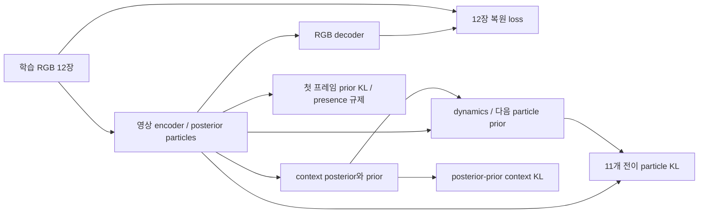

# LPWM 표현 학습과 플래너의 개발 PDMS 비교

## 2026-10-05: LPWM 적응과 planner 학습 효과를 구분하는 대조 설계(제안)

사용자는 현재 PDMS 상승에서 LPWM 미세조정과 planner 학습의 효과를 어떻게 구분하는지 질문했다.
현재 initial 대비 trained 평가는 LPWM과 미학습planner가 함께 변하므로 두효과를분리하지못한다.
기존 네방법queue에는 별도학습 frozen-LPWM대조군이 없다. 이번에는 설명과설계기록만수행하며
GPU추가실행/queue변경/새실험등록은하지않았다.

코드상 command_feature_modulation(FiLM)은 optimizer의planner_and_command_input 그룹에속하지만
LPWM image encoder의particle 속성CNN에개입하며SSL과planning gradient를받는다. 따라서 native
LPWM가중치만고정하고FiLM을학습하는조건을엄밀한고정표현/순수planner학습으로부르면안된다.

| 제안 조건 | 원래LPWM가중치 | ego-intent FiLM | planner |
|---|---|---|---|
| A: 고정표현대조 | Stage1상태고정 | 초기identity상태고정 | 새로학습 |
| B: native LPWM고정대조 | Stage1상태고정 | 학습 | 새로학습 |
| C: 현재부분적응 | 지정native출력계층학습 | 학습 | 새로학습 |

B-A는고정native LPWM에서명령조건화학습을허용한효과, C-B는명령조건화와planner학습에더해
native LPWM적응을허용한추가효과다. 동일Stage1/동일planner초기화/동일학습목적·학습률·데이터순서·
update수·유효배치·평가장면으로비교한다. 현재partial은1576까지batch4/그후8이므로정확대조는그
실행일정도맞추거나별도matched재실행으로해야한다. FiLM을학습하는B에서는SSL도FiLM으로gradient가
흐르므로SSL항을임의제거하면C-B가미세조정유무단독대조가되지않는다. FrozenLPWM은
requires_grad=False로고정해도FiLM까지의연산graph는유지해야한다.

연구의planning-aware목적을검증하려면추가D조건도유용하다: C와동일한LPWM학습계층+FiLM을
SSL로만갱신하고, planningbranch의particle표현에서stop-gradient하여planner만planningloss로학습.
C-D는같은SSL후속학습에planninggradient를표현까지전달하는것의추가효과를검증한다.
각차이는해당조건에서의시스템효과이며모듈기여를보편적인가산비율로분해하는것은아니다.

평가는동일장면의paired PDMS/ADE/충돌·도로이탈subscore와recording단위bootstrap CI,가능하면3seed,
고정개발패널및최종독립평가로확인한다. Frozen대조군대비PDMS차이의CI가0을포함하면우월성미확정.
원래/적응표현을각각고정하고같은용량·초기화·예산의새readout/planner를따로학습하는추가진단은
특정공동학습planner와의호환성너머표현의읽기쉬움/유용성을검사할수있다. readout학습예산이동일해도
표현을얻기위한전체학습비용이동일한것은아니므로별도로보고한다.

이미학습된planner에Stage1 LPWM만끼워넣어성능이떨어지는것은표현분포/particle의미불일치때문일수
있으므로미세조정표현의품질개선증거로충분하지않다. Gradient가흐르거나가중치가변했다는사실도
PDMS기여를보장하지않는다. 기존persistent_future평가는학습된planner가미래입력에의존하는지의
보조개입이며LPWM미세조정대조를대체하지않는다.


## 2026-10-05: 48GB 상한과 배치8 실행 전환

사용자가 VRAM48GB로 상한을 올리고 배치/워커를 늘려 실제 진행하도록 승인했다.
기존46GB/6GiB 여유 및 학습을 중단하지 않는 이전 조회 범위는 이 요청으로 갱신됐다.
다른 사용자의 GPU process나 원본 데이터는 변경하지 않았다.

### 실행 변경과 실측

| 항목 | 기존 | 새 실행 |
|---|---:|---:|
| 카드 전체 VRAM 상한(다른 사용자 포함) |46decimalGB|48decimalGB|
| GPU당 planning microbatch |4|8|
| Gradient accumulation |2|1|
| GPU 수 / 유효 planning batch |2 /16|2 /16|
| SSL clip 수/update |8|8|
| 입력 worker/rank |0|0|
| 운영 중 최소 물리 free |6GiB|3GiB|
| CUDA allocator 상한 |22GiB|23.2GiB|
| Tensor allocated 상한 |21.5GiB|22.75GiB|

동일한1576 checkpoint 모델/AdamW에서 배치4/8을 각각8update 측정했다. 첫2회를 제외한
평균은4.4078→2.9921s/update(시간32.12% 감소, 처리량1.473배)였다. 공유 GPU 부하에
따라 달라질 수 있는 짧은 순차 실측이며 전역 최적이나 장기 속도 보장은 아니다.
Batch8의 rank0 tensor peak22.0778GiB, 두 카드 전체 최대 관측45.5921decimalGB,
최소 물리 free4.9521GiB,48GB 대비 여유2.2425GiB. OOM/메모리 guard 중단 없음.
Profile 동안0.5초 간격의 카드 통계이며 순간적인 모든 peak를 측정한 것은 아니다.
선택 기준은 유한 loss/gradient,48GB 대비 최소0.5GiB 여유,물리free3GiB와 속도다.
개발 성능은 배치 선택에 쓰지 않았다. 워커0/2/4/8의 앞선 CPU 입력 비교에서0이
가장 빨랐고 입력 준비가 학습시간의약0.38%여서 worker0을 유지했다.

### 학습 보존과 이어가기

Partial1576에서 모든 rank에SIGINT를 보내 update 경계에서 model+AdamW를 저장했다.
125optimizer state가 모두step1576임을 확인했고, 원본을 보존한 별도 복사본 SHA는
`b3d06344cb3fe3c67cdc7708d6f30a36539f98f2d5bece64502f69968b5a3337`이다.
Profile 가중치는 버리고 본학습은1577부터 시작했다. 본학습은 총4707update/75,297train장면,
원래LR/loss/모델/분할/SSL비중/activation checkpointing을 유지한다. Microbatch 그룹이 바뀌면
Dropout 및 개별 SSL clip의 RNG는 달라질 수 있으므로 bitwise 동일한 학습 연속성 주장은 하지 않는다.
기존 로그와 초기 particle 시각화도 새 실행 폴더에 복사해 전·중·후 비교를 이어간다.

### 검증과 대기열

- CPU 검사3개 통과: 과학적 설정 변경 거부, 재개 전후 다음AdamW update 동일성, 빠르지만 메모리 여유가 부족한 profile 탈락.
- 실행 설정9개에서 유효planning16/SSL8 및 기존 scientific field 동일성 확인.
- 두 GPU profile에서 encoder/context/dynamics/planner gradient가 유한하고 양수이며 frozen RGB gradient0 확인.
- 새 wrapper의4planning/2world engineering evaluation 통과. 이는 성능평가 결과가 아니다.
- 새 queue1902774, 현재 본학습 torchrun1978684. 원래 CPU queue1675463/1709131 및 training1602577은 정상인계 후 종료.
- 순서: Partial학습→1024planning/256world검증→LoRA4/8 profile·감사·학습·검증→Adapter2/4/8→full2/4 재개·검증→네 방법paired보고.
- 후속 방법도 성공한 실측 중 안전하고 빠른 배치 선택. 메모리만의 profile 실패는 작은 배치로 fallback, 다른 실행 오류는 중단.
- Scientific 효용 gate 실패는 보고하고 다음 독립 비교를 계속한다. 불완전 학습/실행/인과검사 오류는 의존 작업을 차단한다.
- 객체 GT 보조loss OFF/후순위. Full은 원본2095checkpoint와20epoch scheduler/conv_in명령 위치를 유지하고4707까지 이어간다.

현재 상태: `outputs/lpwm_48gb_planning_v1/queue/queue_state.json`.
실측: `results/lpwm_48gb_planning_v1/execution_review.json`.
설정: `configs/lpwm_planning/execution_48gb_v1/queue.json`.
새 실행 source38개/config20개를 hash등록했다. 실행 중 해당 source/config를 바꾸지 않는다.
본학습 중 카드 통계는2초마다 감시하며48GB 또는free3GiB guard가 걸리면 우리 작업만 중단한다.
공유GPU의 외부 메모리 급증이나 순간 할당까지 막는 하드웨어 격리 보장은 아니다.


## 2026-10-05: VRAM 상한48GB 가능성

48GB 상한 검토: batch8 중심 추정47.07–47.20GB는 수치상 들어가지만 상한 여유0.80–0.93GB뿐이며, 추가 workspace1GiB를 포함하면48.14–48.28GB다. 예상 free3.45–3.58GiB로 현재6GiB guard도 충족하지 못한다.6GiB는 우리가 정한 보수적 운용 여유이며 물리적 불가능을 뜻하지 않는다. 현재코드 GB는10진(48GB=44.70GiB). 질문에대한계산검토만수행했고 실제batch8/제한변경없음.

근거 `results/lpwm_throughput_review_20261005/vram_48gb_feasibility.json`.

## 2026-10-05: 워커·배치로 전체 시간을 줄일 수 있는지 실측 검토

**결론: 현재 partial은 worker0 / GPU당microbatch4 / accumulation2를 유지한다.**
입력 로딩 병목은 작고, 현재 공유 VRAM 예산에서 batch8은 안전 조건을 넘는다.
이번에는 현재 학습을 중단하거나 재시작하지 않고 CPU 비교와 GPU 사용률 조회만 수행했다.
현재 설정이 가능한 모든 실행 방식 중 최적이라는 뜻은 아니다.

### 워커0/2/4/8 직접 비교

실제 NAVSIM RGB mmap에서 관측4clip×4frame + SSL2clip×12frame을 microbatch 단위로 읽었다.
32microbatch warmup +128microbatch 측정을 순서0→2→4→8, 이어8→4→2→0으로 두 번 수행했다.
1GPU rank 분량의2microbatch를1update로 환산한 CPU 로딩 평균은 다음과 같다.

| CPU 로딩 worker | update 분량 로딩 시간 |
|---|---:|
| 0 | 0.746ms |
| 2 | 1.946ms |
| 4 | 1.699ms |
| 8 | 1.582ms |

이미 JPEG decoding이 끝난 메모리 맵 캐시이므로 CPU 다중처리/IPC 비용을 추가할 이득이 관측되지 않았다.
이 결과는 H2D/pin-memory/GPU 연산·소비 속도를 제외한 CPU producer 검사이며 실제 훈련시간 비율이 아니다.
두 rank 동시 로딩이나 장기간 cold-cache 상태를 재현한 것도 아니다.
현재 Stage2 trainer는 DataLoader를 호출하지 않고 cache를 직접 읽는다. 따라서 config의 workers 숫자만 변경해도 효과가 없다.

별도로 실제 학습 로그의 최근32기록에서 평균3.742초/update 중 입력 준비는0.01408초(0.376%)였다.
로그에 잡힌 입력 준비 부분을 모두 제거하는 가정에서도 현재 남은3475update의 절감량은약49초다.
이 timer가 모든 비동기 GPU 전처리를 분리하는 것은 아니며, GPU 전체 시간을 DataLoader 비용으로 해석하지 않는다.
일반적인 비동기 loading 원리는 [PyTorch 성능 가이드](https://docs.pytorch.org/tutorials/recipes/recipes/tuning_guide.html#enable-asynchronous-data-loading-and-augmentation)에 따르되, 우리 cache에서의 실측으로 판단했다.

### 배치 확대의 이득과 한계

보존된 profile에서 batch2×accum4의 마지막3update 평균6.678초, batch4×accum2는3.755초다.
실측상 시간은약43.8% 감소했고 현재 본학습에 batch4가 적용돼 있다. 측정 당시 공유GPU 부하가 같음을 보장하지는 않는다.
두 설정 모두 effective planning batch16, SSL8clip/update이다.

Batch2 peak allocated7.044GiB와 batch4의12.060GiB에 고정비+배치당 메모리 직선을 맞추면 batch8은22.091GiB다.
여기에 workspace1GiB를 더하면23.091GiB로 registered allocated cap21.5GiB를 넘는다.
실제 현재 카드 사용량과 peak 차이를 합산하면 GPU0/1 전체약47.20/47.07decimalGB, free약3.45/3.58GiB로 추정된다.
사용자 상한46GB와6GiB reserve를 모두 만족하지 못하므로 현재 batch8 실험은 실행하지 않았다.
이는 두 점 기반 추정이며 allocator/연산 모양의 비선형성을 포함한 실측 batch8 결과가 아니다.
기존 queue는 더 보수적인 batch4peak×2+1GiB=25.146GiB 추정을 사용한다. 두 방식 모두 현재 증설을 지지하지 않는다.

Checkpointing 해제는 이전 batch4 profile에서1update 후 memory cap을 초과한 기록이 있어 반복하지 않는다.
유효 batch 자체를 늘리면 optimizer update수와 학습 거동이 달라지므로 단순 실행 최적화와 구분한다.
현재 전체train1epoch/유효batch16/모델·loss·학습범위·정밀도·검증 조건을 보존했다.

### 공유 GPU와 후속 조치

NVIDIA pmon8회 sample에서 우리 GPU worker의 SM 사용과 다른 작업의 SM 사용이 함께 관측됐다.
카드 전체99%를 우리 프로세스만의99%로 해석하지 않는다. 타 작업의 메모리 점유는GPU당20,168MiB였다.
타 작업을 변경하지 않았고 현재 두GPU 학습 위에 추가GPU benchmark를 겹쳐 실행하지 않았다.

기존 대기열의 LoRA4/8, Adapter2/4/8, full2/4 profile 선택은 그대로 유효하다.
각 방법은 작은 배치부터 실측하고, 메모리 예측이 guard를 통과할 때만 큰 배치를 실행한다.
마지막3/5update 평균 시간이 가장 빠른 안전 설정을 본학습에 적용한다. 결과 성능으로 배치를 선택하지 않는다.
전체 조건의 이전2095update 재사용도 그대로 유지해 추가2612update만 수행한다.
이번 검토로 새 GPU speedup이 실증되거나 runtime 설정이 변경되었다고 보고하지 않는다.

측정 중에도 partial은1008→1232update로 계속 진행했다.1024update monitor PDMS76.6794%, ADE1.40314m.
등록34source/10config hash 불변, CPU benchmark 완료 후 worker 종료. 첫 sandbox 시도의IPC socket 권한 오류는
진단 프로세스만 중단하고 호스트에서 재측정했으며 본학습 오류가 아니다.

근거: `results/lpwm_throughput_review_20261005/throughput_assessment.json`, `input_loading_comparison.json`,
`gpu_process_samples.txt`. 재현: `scripts/benchmark_lpwm_stage2_input_loading.py --output <보고서 경로>`.

## 2026-10-04: 네 가지 미세조정 비교와 기존 전체 학습 재개

최신 사용자 지시에 따라 **일부 계층 → LoRA → Adapter → 낮은 학습률 전체 미세조정** 순서로 실행한다.
각 학습 뒤에 planning/world 검증을 완료하고 다음 조건으로 넘어간다. 직접 객체 GT 보조 loss는 모두 OFF이며 후순위다.
현재 부분 학습을 재시작하지 않고 CPU supervisor만 교체했다. 학습 torchrun1602577은 계속 실행 중이다.

### 실행 상태와 진입점

- Partial/LoRA queue: `scripts/queue_lpwm_adaptation_methods.py`, 설정 `adaptation_method_comparison_v1.json`, PID1675463.
- Adapter/전체 재개 후속 queue: `scripts/queue_lpwm_followup_methods.py`, 설정 `four_method_sequence_v1.json`, PID1709131.
- 후속 queue는 앞 queue의 완료 marker와 실제 검증 보고서를 확인한 뒤 기동한다. PID 소멸을 성공으로 해석하지 않는다.
- GPU0·1만 사용하며, 다른 사용자 점유를 포함한 카드별 전체 VRAM46decimalGB 상한과6GiB 여유를 유지한다.
- 현재 부분 학습은23:53KST에912/4707update. 저장된 모든 loss는 finite이며 오류 기록이 없다.
- 첫512update 모니터: 고정128dev(127개 유효 PDM), PDMS70.8503%, ADE1.86759m, FDE4.20983m.
  초기 무작위 planner는PDMS2.41294%, ADE8.45013m였다. 이는 planner 학습의 진전이며 LPWM 미세조정만의 효용은 아니다.

### 현재 부분 학습의 정확한 범위

`lpwm_partial_finetuning.py`의 policy는 `output_layers`다. 마지막 Transformer block을 여는 `last_block`은 선택하지 않았다.
LPWM은 단일 ViT가 아니라 영상 particle encoder, interaction, context, dynamics, RGB decoder로 구성된다.

| 영역 | 전체 파라미터 | 현재 학습 파라미터 | 실제 학습 대상 |
|---|---:|---:|---|
| Image encoder + particle interaction | 6,035,191 | 2,377,278 | attribute CNN `conv_out`, `xy_head`, `scale_xy_head`, `obj_on_head`, appearance `to_mu`, interaction `particle_decoder` |
| Context | 39,389,417 | 802,844 | `ctx_enc.pte.head`, `posterior_decoder`, `prior_decoder` |
| Dynamics(공유 context 제외) | 59,869,416 | 2,378,267 | `particle_transformer.head`, `particle_decoder` |
| RGB decoder | 4,251,239 | 0 | 고정, SSL gradient는 입력 particle 쪽으로 전달 |
| Planner + command 입력 | 2,211,975 | 2,211,975 | 전체 학습 |

LPWM 합계5,558,389 + planner2,211,975 =7,770,364개를 학습한다. 주요 CNN/attention/MLP body는 고정한다.
`particle_features_enc.to_logvar`도 선택 목록에 있지만 현재 공식 구성에서는 `Identity`이므로 학습 파라미터0개다.
따라서 ‘12개 선택 모듈’을 ‘12개 모두 파라미터가 있는 학습 계층’으로 해석하지 않는다.
여기서 particle decoder는 latent 속성 출력 head이고 RGB 영상 복원 decoder와 다르다.
출력 head 자체가 고정돼도 앞단 trainable feature가 바뀌면 그 출력이 바뀔 수 있다.

현재 입력은 과거4 RGB + 현재 ego status이고 causal prior로8step 미래 particle을 만든다.
Planner는 관측/예측 particle memory로512개 고정 candidate의 imitation 및6개 PDM subscore를 예측한다.
현재 조건에는 refiner나 객체 상태 보조 head를 붙이지 않았다. 학습 objective는
`soft candidate imitation + six PDM-subscore BCE + 0.02 * original temporal ELBO`다.
Planning gradient가 planner→미래 dynamics→context/현재 encoder의 선택된 계층으로 전달된다.
`requires_grad=False`는 해당 가중치 업데이트를 끄는 것이며, 그 연산의 입력 gradient까지 일괄 detach하는 것은 아니다.
원래 LPWM 내부 연산의 세부 detach/확률적 모델 정의는 유지하며, 실제 각 영역의 planning gradient>0을 독립 검사했다.
SSL은 별도로 샘플링한 train12frame clip을 사용한다. 미래 영상은 planner 입력으로 전달하지 않는다.
명령 FiLM은 부분/LoRA/Adapter에서 attribute CNN `conv_out` 직후, 학습률은 planner 그룹이다.

### 네 가지 조건

| 조건 | LPWM 학습 대상/개수 | LPWM 초기 LR | 시작점 |
|---|---|---:|---|
| 일부 계층 | native 출력 모듈5,558,389 | 1e-5 | Stage1 + seed47 planner |
| LoRA | image interaction/context/dynamics attention의 q/k/v/out84개, rank16/alpha32,1,343,488 | 1e-5 | 동일 Stage1/planner, zero-B |
| Adapter | interaction1/context4/dynamics6개 block 뒤 bottleneck64 residual,704,960 | 1e-5 | 동일 Stage1/planner, zero-output |
| 전체 재개 | LPWM 전체109,545,263(RGB decoder 포함) | 1e-6 | 기존 Stage2 update2095의 model+AdamW |

모든 조건에서 planner/command2,211,975개를 LR3e-4로 학습하고 SSL0.02를 유지한다.
Adapter는 [Houlsby 등의 residual bottleneck 원리](https://arxiv.org/abs/1902.00751)를 참고한 LPWM용 배치다.
전체 block 뒤 `LayerNorm→Linear→GELU→zero Linear` residual 하나를 추가하며 원논문 구현을 그대로 재현한 것은 아니다.
LoRA는 [원논문](https://arxiv.org/abs/2106.09685)의 frozen W + scaled BA를 사용한다.
Native LPWM 가중치를 고정해도 이 모듈들로 particle/미래 출력은 바뀔 수 있다.

모두 전체 train75,297장면/122recording을 누적1epoch,4,707update 학습한다. 유효 planning batch16/SSL8clip이다.
데이터 split, vocabulary, seed, loss, 고정 평가 panel은 공통이다. LoRA와 Adapter의 적용 위치/자유도는 partial과 다르다.

### 전체 조건의 체크포인트 재사용 — 사용자 후속 정정 반영

처음 준비한 Stage1부터 새로 시작하는 full 조건은 기동하지 않았다. 사용자 요청에 따라 보존된
`outputs/lpwm_object_future_planning_v3/user_pause_20261004/checkpoint_update002095.pt`를 이어받는다.
SHA256 `aef7ab37bfdfcf3a7c032774b0aaf4f4bbd76e8f84849a24a5b5fac2664b9bac`.
CPU에서 model strict load, AdamW746개 state의 step2095·shape·finite, 원래 모델 대비 logits/관측particle/예측particle 최대차0을 확인했다.
다음 update2096부터 추가2612회 수행하여 누적4707에서 멈추고 같은 panel로 검증한다.
원래20epoch 실험의 원본checkpoint/pause marker/config/source는 보존하고, 새 출력 디렉토리에 이어진 결과를 저장한다.

호환성을 위해 전체 조건은 원래 `conv_in` 명령 입력과20epoch(94,140update) 기준 LR 스케줄을 유지한다.
학습을1epoch에서 멈춘다고 기존 스케줄을 중간부터1epoch cosine으로 바꾸지 않는다.
다른 세 조건은 `conv_out` 명령 입력 +1epoch 스케줄이므로 **엄밀히 방법만 바꾼 통제 비교는 아니다**.
실제 비용과 성능 경향을 비교하며, 우열이 보여도 이 차이들과 분리된 PEFT 인과효과로 주장하지 않는다.
전체 조건 RGB decoder는 SSL에 의해 업데이트되며 planning loss에서 직접 받는 gradient는0이다.

### 속도와 메모리 조정

현재 부분 학습은 GPU당 microbatch4×누적2×2GPU=16, worker0이다.
최근 input 준비≈0.015초/update, 전체≈3.66초/update로 입력 병목이 작다. 현재 worker 증설의 이득은 확인되지 않았다.
현재 partial peak allocated12.073GiB, batch8의 보수적 추정25.146GiB는21.5GiB cap보다 커서 시도하지 않는다.
LoRA는4×2, 안전 추정 통과 시8×1을 비교한다. Adapter는2×4→4×2→8×1, 전체는2×4→4×2를 검토한다.
항상 작은 배치 실측 peak×배치비율 +1GiB가 cap 이하일 때만 다음 배치를 실행한다.
5update profile의 마지막3update 평균 시간이 가장 작은 유효 조건을 사용하며, 평가 성능은 배치 선택에 사용하지 않는다.
Profile 가중치는 본학습으로 넘기지 않는다. 전체 재개는 profile 후 보존된2095checkpoint에서 다시 읽는다.
OOM 완전 방지를 보장할 수는 없으므로 allocator cap, 전체 VRAM 감시, reserve guard를 함께 적용한다.
LoRA/Adapter/full의 실제 속도와 완료 ETA는 아직 미측정이며 현재 partial 결과로 대신하지 않는다.

### 검증과 해석 범위

- 초기/512update마다128dev monitor, 전·중·후 동일 장면 particle 시각화.
- 각 조건 뒤 동일1,024planning +256world panel: PDM/ADE/FDE/metric BCE, persistent-future intervention, reconstruction/forecast LPIPS 유지와 위험별 결과.
- 현재 panel은 이전에 노출된 development이다. 전체dev27,076 또는 독립test 검증이 완료됐다는 의미가 아니다.
- 실행 오류/NaN/미래 입력 누출/학습량 미완료/source 변경은 후속 작업을 차단한다.
- 성능 가설/유지성 gate가 실패한 경우 이를 결과에 보존하고 독립된 다른 조건 비교는 계속한다.
- LoRA CPU causal/gradient/freeze/SSL 검사, Adapter/full CPU 검사 및 관련7개 unit test 통과.
- Full initial CPU 비교에서7.15e-7 수준 부동소수점 차이가 관측돼 허용오차1e-5로 판정한다. 실제2095 복원 출력 차이는0이다.
- GPU별 gradient audit, DDP profile, 평가 실행 검사는 각 조건 앞에서 자동 수행한다. 아직 GPU audit 완료로 보고하지 않는다.
- 학습된 frozen-LPWM + planner 대조가 없어 LPWM 적응만의 순수 이득을 분리하지 못하며,1seed/1epoch의 경향 비교다.

실행 상태: `outputs/lpwm_adaptation_method_comparison_v1/queue_state.json`,
`outputs/lpwm_four_method_queue_v1/queue_state.json`.
공유 근거: `results/lpwm_four_method_queue_v1/launch_and_health_check.json`,
`partial_module_scope.json`, `residual_adapter_cpu_audit.json`, `full_low_learning_rate_cpu_audit.json`.
최종 자동 보고서는 `results/lpwm_four_method_queue_v1/four_method_summary.json`에 생성된다(현재 미완료).

## 2026-10-04 후속 질문: 일부 계층 직접 미세조정과 LoRA의 차이

갱신할계층의선택과그계층의갱신방식은별도축이다. 일부계층만LoRA로갱신하는조합도가능하다.
선택한행렬을직접미세조정하면변화량에저랭크제약이없다. LoRA는원래행렬W를고정하고
W_eff=W+(alpha/r)BA의작은행렬A/B를학습하여변화량rank를r이하로제한한다.
예를들어bias없는1024×1024행렬은직접학습1,048,576개,rank8 LoRA는16,384개다.
이는해당행렬의학습파라미터비교이며전체모델메모리나속도가64배개선된다는뜻은아니다.
[LoRA 원논문](https://arxiv.org/abs/2106.09685),
[공식 구현 및 적용계층 안내](https://github.com/microsoft/LoRA#additional-notes).

현재부분학습은encoder/context/dynamics의12개native출력모듈을직접갱신한다. Particle위치·크기·
presence·feature및미래particle출력이바뀔수있지만,고정된중간Transformer의가중치를직접수정하지는않는다.
중간attention에LoRA를넣으면그연산의유효가중치도planning gradient로수정할수있다.
원본W고정과encoder출력고정은다르다. 현재particle을수정하려면영상particle생성경로에적용해야하며,
context/dynamics에만적용한LoRA는그것만으로현재영상particle encoder의함수를바꾸지않는다.

계산그래프관점에서LoRA는gradient/optimizer상태를줄이지만앞쪽LoRA를학습할경우중간연산을통과하는
backward와activation비용이남는다. 마지막계층만직접학습하면고정prefix에대한backward를생략할수있는
경우가있다. 우리모델은미래8step rollout과12frame SSL도유지하므로LoRA전환의시간이득은실측해야한다.
현재모듈5.56M의부분학습과LPWM용LoRA의PDMS/속도직접비교는없다.

현재빠른실험은계속수행하고,향후중간객체관계/시간상호작용수정의효용을시험할때particle interaction/
context/dynamics의선택한attention LoRA+native출력head학습을별도후속가설로검토할수있다.
그비교는동일Stage1/intent위치/planner/데이터/학습량/GT보조설정/SSL을맞추고step시간·메모리·
PDMS·world유지성능을함께봐야한다. 이번질문에서는LoRA실행/설정변경/새실험등록을하지않았다.

## 2026-10-04 후속 질문: 두 단계 학습과 Stage2 갱신 범위의 선행 사례

2단계 학습은 표현/세계모델을 먼저학습한뒤행동학습으로전달하는실제선행사례가있다.
다만단계수만같아도감독과고정범위는다르므로Stage2라는명칭만으로전체미세조정/LoRA를추정하지않는다.

| 연구 | 먼저 학습하는 것 | 후속 학습에서의 갱신 범위 |
|---|---|---|
| LPWM | 영상으로encoder/context/dynamics/decoder 공동SSL | LPWM을고정하고per-particle latent action→실제행동의2층attention-pooling mapping network만L1학습 |
| V-JEPA2-AC | action없는영상의표현학습 | 영상encoder고정, action/proprioception조건autoregressive predictor학습; 이후MPC제어 |
| Drive-JEPA | 주행영상JEPA사전학습 | planner LR1e-4와ViT encoder LR1e-5로공동학습 |
| UniAD | track/map의감독perception학습 | track/map/motion/occupancy/planning taskmodule공동학습. 공개v2.0 config는img backbone/neck/BN/BEV encoder고정 |
| OpenVLA | 범용vision-language-action사전학습 | 로봇별적응에LoRA와전체미세조정경로를제공. 계산량제한시LoRA사용을안내하며자율주행전용근거는아님 |

원문확인: [LPWM §5.2/A.5](https://arxiv.org/html/2603.04553v1#S5.SS2),
[V-JEPA2 §3](https://arxiv.org/html/2506.09985v1#S3),
[Drive-JEPA §4.2](https://arxiv.org/html/2601.22032v2#S4.SS2),
[UniAD 공식단계설명](https://github.com/OpenDriveLab/UniAD#results-and-pre-trained-models) 및
[공개Stage2 config](https://github.com/OpenDriveLab/UniAD/blob/v2.0/projects/configs/stage2_e2e/base_e2e.py),
[OpenVLA 공식fine-tuning](https://github.com/openvla/openvla#fine-tuning-openvla-via-lora).

**우리실험의위치:** Stage1 SSL은LPWM계열의표현학습, Stage2는planning gradient를LPWM일부까지
전달하는선택적미세조정이다. LPWM원논문의frozen policy mapping보다표현수정을허용한다.
현재12개출력모듈/LPWM5.07%라는정확한선택은시간예산에맞춘우리설정이며선행논문에서
NAVSIM최적이라고입증한설정이아니다. RGBdecoder고정+SSL유지는표현이과도하게변하는지
확인하기위한설계다. 완전동결은task gradient로particle을바꾸는연구가설을직접시험할수없다.

표현수정의효용을분리하려면동일planner/데이터/학습량/평가장면의**frozen LPWM+trained planner**
대조가필요하다. 현재등록된두조건은객체GT보조OFF/ON이며이대조는후속설계다.
현재학습설정/대기열을후속설명만으로변경하지않았다. '2단계'는보편적최적성이나novelty의근거가아니다.

## 2026-10-04 Stage2 native 출력 계층 부분 미세조정

**목적:** planning에 맞게 LPWM 표현을 일부 수정하면서 새 planner를 학습할 때, 전체 navtrain
한 번의 학습으로 초기 planning 진전을 얻는지와 객체 GT 보조 감독의 추가 경향을 확인한다.
최신 사용자는 LoRA 또는 일부 계층 미세조정으로 빠르게 확인하는 실행을 승인했다.
기존 full run2,095update와 pause/source/config는 그대로 보존하고 별도 디렉터리에서 시작한다.
설정 `configs/lpwm_planning/partial_output_layers_v1.json`, 대기열
`scripts/queue_lpwm_partial_planning.py`, 산출물 `outputs/lpwm_partial_planning_v1/`.

### 학습하는 부분과 gradient

이번에는 LoRA 대신 **기존 출력 계층을 직접 미세조정**한다. Frozen block 안에 adapter를 넣어도
encoder까지 연결된 gradient 계산이 자동으로 사라지는 것은 아니다. Native 출력 계층 방식은
현재 코드에서 고정 영상 CNN의 앞부분에 대한 backward를 줄이기 쉬우며 별도 layer 호환 작업이 없다.
LoRA 대비 우월성을 비교한 결과는 아니며 이번에는 부분학습 한 방식만 실행한다.

| 구성 | 가중치 갱신 | 실제 범위 |
|---|---|---|
| 영상 particle encoder | 일부 | attribute CNN conv_out, xy/scale/presence heads, feature mu/logvar, interaction particle decoder |
| context | 일부 | PTE head와 posterior/prior decoder |
| dynamics | 일부 | particle transformer head와 particle decoder |
| LPWM 나머지 CNN/Transformer blocks | 고정 | 입력으로 전달되는 gradient까지 일괄 detach하지 않음 |
| RGB decoder | 고정 | SSL gradient는 decoder 연산을 통해 particle 입력으로 전달 |
| 명령 FiLM·particle projection·후보 planner | 전체 | 새 planner와 command conditioning 모두 학습 |
| 객체 보조 head | ON 조건만 전체 | 학습 loss 전용; 추론에 GT 입력 없음 |

OFF 조건 전체111,757,238개 중7,770,364개(6.95%)를 학습한다. 이 중LPWM5,558,389개는
원래LPWM109,545,263개의5.07%, planner·command는2,211,975개다. ON은 작은 객체head가 추가된다.
기존 conv_in의 명령 FiLM을 **attribute CNN conv_out 이후**로 옮겼다. Zero initialization과
±0.1 bounded modulation을 유지하며 particle 생성 head의 입력을 명령에 따라 바꾼다.
따라서 이전 full run과는 FiLM 위치도 다르다. 동일 구조의 동등 학습량 비교로 해석하지 않는다.

Loss는 기존 **soft candidate imitation + 6개 공식 PDM subscore BCE + 0.02×공식 SSL ELBO**다.
두 번째 조건에만 current state0.2/future state0.2/category0.02 보조 항을 추가한다.
현재/미래 GT와 Gaussian ROI association은 loss 쪽에만 존재한다. SSL은 별도 train12장
posterior 복원과11전이 KL이며, 과거4장으로 미래8장 RGB를 자율 예측하는 loss와 구분한다.
Planner는 관측4장+현재ego→causal 미래8step→512개 고정 후보 채점 구조다. 새 refiner는 없다.

### 실행 예산과 실측

- 두 조건 모두 같은 Stage1 checkpoint/seed47에서 새 planner로 시작한다. 기존2095update는 사용하지 않는다.
- 모든 navtrain75,297개/122recording, 조건당1epoch=4,707update. Global16의 끝15개 padding은 기록한다.
- GPU0·1, GPU당 실제batch4×누적2, planning16/SSL8clip per update, worker0/mmap.
- LPWM 출력계층LR1e-5, planner3e-4, AdamW,47update warmup/cosine decay, gradient clip5.
- FP32영상encoder·SSL/BF16 planning dynamics, 미래와SSL activation checkpointing 모두 유지.
- GPU별 다른사용자포함46decimalGB 제한, 최소6GiB여유, allocator22GiB/allocated21.5GiB상한.
- 프로세스 `kjs-lpwm-stage2`, 실패/메모리초과/사용자pause 시 우리작업만 checkpoint 후 중단.

| 짧은 profile | 유효 planning/SSL batch | 정상 구간 update 시간 | Peak allocated | 판정 |
|---|---:|---:|---:|---|
| 기존 full run 참고 | 16/8 | 약7.75초 | 약11.87GiB | 이전 시점 실측 |
| partial batch2×accum4 | 16/8 | 6.36–7.07초 | 7.04GiB | 통과 |
| partial batch4, rollout checkpoint 해제 | 16/8 | 1update 후 중단 | 21.5GiB guard 초과 | 미채택/실패 보존 |
| partial batch4×accum2, checkpoint 유지 | 16/8 | 마지막3회3.63–3.83초 | 12.06GiB | 채택 |

선택 profile은5update, 마지막3회 평균3.755초다. 공유 부하와 짧은 측정의 영향이 있으므로
약2배속은 초기 비용 추정이다. 조건당 학습 약4.9시간+모니터/저장/평가, 두 조건 약10–12시간+
평가 여유를 예상하되 본학습으로 갱신한다. 20→1epoch 예산 단축 효과와 per-update 가속을 구별한다.
첫 구현의depth_head=None 초기화오류와 checkpoint해제 메모리guard 실패도 profile 디렉터리에 보존했다.

### 검증과 자동 연결

1. 조건별 시작 전 planning/미래객체loss gradient, 미래GT입력교란 불변, 명령particle반응을 검사한다.
   Optimizer1회 후 frozen parameter SHA동일·grad없음·optimizer중복/고정파라미터없음도 확인한다.
2. 결과를 보기 전에 token hash+recording round-robin으로 고정한 development panel을 사용한다.
   Training은전체75,297개지만 최종평가는 **planning1,024/world256, 각각40recording**의 경향 검사다.
   Train선택/장면순서/teacher유효성검사의 CPU검사2개와 profilecheckpoint의4planning/2world 실행검사를 완료했다.
   작은 실행검사의 점수는 성능결과로 채택하지 않는다.
3. 초기 및512update마다128장면 ADE/FDE와 **선택한 후보의 실제 캐시 공식 PDMS**를 기록한다.
   모니터로checkpoint를 선택하지 않는다. Particle 시각화는update0/2353/4707에 저장한다.
4. 학습 후같은1,024장면에서 초기planner/학습planner/미래persistence 개입을 비교한다.
   256개 world clip에서Stage1대비복원·미래LPIPS와상황별분해,recording bootstrap2000회CI를 기록한다.
   조건후검증이 끝난 뒤에만 다음 조건을 학습하며, 둘 다 끝나면GT ON−OFF paired PDMS를 보고한다.
5. 과학적 개선 미확인은 그대로 기록하고 반대 조건 비교는 계속한다. 실행오류/누출/불완전학습/
   메모리문제는 대기열을 차단한다. 추가 navtest/epoch 확대는 자동으로 하지 않는다.

**해석 한계:** 1epoch/1seed이며 초기 무작위planner 대비 개선만으로 LPWM 미세조정의 독립효용을
입증하지 못한다. 동일예산 frozen-LPWM+trained-planner 대조와 수렴/복수seed가 후속에 필요하다.
GT 보조감독은 채택 미정이다. 전체개발/독립test/객체이해·선택적미래효용의 검증 완료로 보고하지 않는다.

## 2026-10-04 22:23 KST 사용자 요청에 따른 Stage2 일시중단

학습 시간을 검토하기 위해 사용자가 잠시 중단을 요청했다. `pause.requested`를 생성해 기존
queue가 다음 작업을 차단하고 학습 worker에 signal을 보내도록 했다. Worker는 진행 중 update를
마친 후 **2,095 update(0.4451epoch)**에서 모델·optimizer를 atomic 저장하고 종료했다.
Queue1131167/torchrun1135635/worker1135737·1135738 종료와 GPU0·1에서 우리 메모리 반환을 확인했다.

- 재개 checkpoint: `outputs/lpwm_object_future_planning_v3/metric_plus_world/latest.pt`.
- 보존 hardlink: `outputs/lpwm_object_future_planning_v3/user_pause_20261004/checkpoint_update002095.pt`.
- 크기1,342,277,703bytes, SHA `aef7ab37bfdfcf3a7c032774b0aaf4f4bbd76e8f84849a24a5b5fac2664b9bac`.
- CPU 로드 검증: reason=`signal`, optimizer746개 state 모두step2,095, source14개/config hash 일치.
- 마지막 progress.json은2,080update이며 더 최신 signal checkpoint가 재개 기준이다.
- `queue_failed.json`의 `RuntimeError('Queue paused by marker')`는 현재 queue의 사용자 중단 기록이다.
  OOM/NaN으로 실패한 결과가 아니며 원본 예외를 보존했다. 본학습 완료 sentinel은 생성되지 않았다.
- 근거 [user_pause_20261004.json](../results/lpwm_object_future_planning_v3/user_pause_20261004.json).

**자동 재개하지 않는다.** 명시적 요청 후 pause/failure 기록을 이력으로 이동 보존하고 같은
config/source의 queue를 실행하면 `--resume`으로 model·optimizer·완료update를 읽어2,096부터
계속한다. Learning rate, epoch shuffle과 rank/update별 난수 seed는 config/update로 재구성한다.
이번에는 CPU checkpoint 검증만 수행했고 GPU 재개 시험은 하지 않았다. 구체적 절차는 HANDOFF4절.
LoRA/부분 freeze 방식으로 바꾸는 것은 별도 실험 변경이며 이번에 적용하지 않았다.
아래 실행 중 상태와 완료 예상 시간은 중단 전 이력이다.

## 2026-10-04 현재 Stage2 학습의 실제 실행 명세

사용자 요청에 따라 실행 설정과 forward/loss/optimizer/검증 코드를 읽어 대조했다.
아래는 제안이 아니라 현재 `object_future_joint_v3.json`으로 실행하는 구성이다.
21:57 KST에 첫 조건은 1,888/94,140 update, 0.4011/20 epoch이며 queue1131167은 계속 실행 중이다.
등록 source14개/config hash 일치, queue_failed/stopped 없음. 이번 설명 작업에서 학습·추론을
새로 실행하거나 runtime를 수정하지 않았다. 시점별 근거는
`results/lpwm_object_future_planning_v3/training_execution_review_20261004_2200.json`에 보존했다.

### 1. 실험 질문과 두 조건

현재 실험의 직접 질문은 **같은 planning+SSL 학습에 현재/미래 객체 보조 감독을 추가하면
planning 성능과 표현 보존이 개선되는가**다. 원래의 상황·의도별 미래 정보 선택 가설을 위한
기반 실험이며, 동적 particle 수나 예측 시간 선택은 이번 구현에 없다.

| 항목 | 첫 조건: 현재 실행 | 두 번째 조건: 대기 |
|---|---|---|
| 이름 | `metric_plus_world` | `metric_object_future_plus_world` |
| LPWM 시작점 | Stage1 SSL 최종 checkpoint | 동일 checkpoint에서 새로 시작 |
| Planner | 같은 seed47의 새 후보 채점기 | 같은 초기 planner |
| 학습 | planning + SSL | planning + SSL + 객체 보조 loss |
| LPWM/플래너 학습량 | 전체 가중치, 20 epoch | 동일 |
| Refiner | 없음 | 없음 |

두 번째 조건은 첫 번째 조건의 학습 결과를 이어받지 않는다. 각 조건 학습 후 검증한 뒤
다음 조건을 실행하고 paired 비교한다. 직접 객체 GT 감독의 채택은 아직 결정하지 않았다.

### 2. Stage1과 데이터

Stage1은 공개 Sketchy `best_lpips` LPWM을 NAVSIM에 SSL post-training한 완료 작업이다.
객체 GT/경로 loss/ego FiLM 없이 encoder·context·dynamics·RGB decoder를 모두 학습했다.
23,126 train clip/122 recording, 7,745 development clip/40 recording, 20 epoch/28,920 update다.
공개 모델 대비 복원·미래예측 개선과 원래 top16 박스 proxy 실패 기록은 모두 보존했다.
Stage2 진입은 해당 proxy의 필수 gate 타당성 정정과 별도 admission amendment에 근거한다.
Stage1이 모든 객체 정보를 완전히 학습했다는 판정은 아니다.

Stage2 planning은 공식 navtrain log/token 필터와 관측 영상·ego GT 조건을 만족하는
75,297 train 장면/122 recording, 27,076 development 장면/40 recording을 쓴다.
SSL 보조 branch는 완전한 12장 영상이 있는 Stage1 train23,126 clip에서 별도로 샘플링한다.
따라서 planning 장면 수와 world-model clip 수가 다르다. Train/development는 recording 단위로
분리하며 exposed navtest를 자동 독립 test로 쓰지 않는다.

- 영상: 전방 CAM_F0 한 대, 원영상 위아래28 pixel crop 후 128×128 RGB로 resize, 2Hz.
- Planning 입력: 시간 −1.5, −1.0, −0.5, 0초의 영상4장 및 현재 ego8D.
- Ego8D: driving command4D + 평면 속도2D + 평면 가속도2D.
- 출력/GT: 현재 ego 좌표계의 0.5~4.0초, 8개 `(x,y,heading)`.
- 이미지 cache는 전처리한 RGB uint8이며 LPWM feature cache가 아니다. 매 update encoder forward/backward를 수행한다.
- 현재 planner에 LiDAR/BEV/HD map/미래 GT 영상/GT 객체 박스를 입력하지 않는다.
  지도와 미래 환경은 PDM teacher label 생성에만 사용한다.

### 3. Forward와 ego intent

관측4장 → 영상 particle encoder/context → 관측64 particle/frame → context prior와 dynamics의
8-step autoregressive rollout → 관측4+예측8시점 particle → 후보 채점 planner 순서다.
미래 context는 관측/자신이 예측한 이력에서 생성하며 실제 미래 particle posterior를 넣지 않는다.
Planning branch의 latent sampling은 deterministic이고 training dropout은 적용된다.

Particle은 위치2D, scale2D, presence1D, depth latent1D, appearance4D를 가진다.
Background4D를 각 particle에 함께 붙여 planner 입력은14D다. Depth는 metric depth GT가 아니며,
64 particle은 객체64개/영속 track64개를 뜻하지 않는다. Planner는 full64를 사용한다.
원래 RGB 복원 decoder의 variance 기준30개 선택, 시각화의 presence 상위16개와 구분한다.

14D → 256D projection에 시간/particle-index embedding을 더해 **12×64=768 memory token**을
만든다. Context latent는 dynamics를 통해 미래 particle에 영향을 주며 planner 입력14D에
직접 concatenate하지 않는다. 모든 장면에서64개/8미래step을 유지한다.

Command4D는 `4→64→64` MLP를 지나 particle attribute CNN의 첫 conv 출력에 FiLM으로 들어간다.
`features*(1+0.1*tanh(scale))+0.1*tanh(shift)`이고 마지막 선형층은0으로 초기화한다.
시작 시 원래 encoder를 보존하면서 학습 후 같은 영상의 표현이 명령에 따라 달라질 수 있다.
현재 ego8D는 별도로 각 후보 query에도 더한다. 후보별 ego trajectory를 world dynamics의 action으로
넣는 구현은 없으며, 한 장면의 동일한 미래 memory를512개 후보가 함께 읽는다.

### 4. 후보 채점 planner와 inference

Train GT 경로의 XY16D를 MiniBatchKMeans512개로 묶고 각 중심에 가까운 실제 train 경로를
대표 후보로 고른다. 후보는8×3 좌표의 고정 buffer이며 optimizer가 좌표를 바꾸지 않는다.
Dev/test 경로를 vocabulary 생성에 넣지 않았다.

각 후보를 `[20m,20m,pi]`로 정규화하고24D→256D projection한 query에 ego embedding을 더한다.
2층 Transformer decoder(hidden256,8 heads,FFN1024,dropout0.1)가768개 memory에 cross-attention한다.
후보당 imitation logit1개와 PDM metric logit6개를 출력한다.

Metric 순서는 무과실 충돌 회피/주행가능영역 준수/진행도/TTC/comfort/주행방향 준수다.
확률을 각각 `collision,drivable,progress,ttc,comfort,direction`으로 쓰면 현재 NAVSIM-v1 합성은
`PDMS_hat=collision*drivable*(5*progress+5*ttc+2*comfort)/12`이다.
주행방향은 BCE 감독하지만 이 설정의 합성 점수 가중치는0이다.
최종 선택은 `argmax(log(PDMS_hat)+0.1*log_softmax(imitation_logits))`이다.

현재 구현의 안전 학습은 위험 후보를 낮게 채점하고 대안을 선택하게 한다. Refiner/경로 좌표
회귀/좌표 collision repulsion loss는 두 조건 모두 비활성이다. 이전 refiner 설계 설명을 현재
실행으로 해석하지 않는다. 현재 후보 bank 밖의 경로 생성 능력은 없다.

### 5. 현재 loss의 정확한 계산

첫 조건의 총 loss는 `L_imitation + L_metric + 0.02*L_world`이다.

**Imitation:** 후보와 human GT의 XY 절대 차이를 시간·좌표축 평균한 거리 `distance`를 사용한다.
Soft target은 `softmax(-distance/0.5)`이고 예측 imitation softmax와 cross entropy를 계산한다.
이 거리는 L1 기반이며 ADE의 L2 거리와 다르다. 가장 가까운 후보 하나만 정답으로 강제하지 않는다.
Heading GT는 후보 좌표에 포함되지만 이 imitation target 거리 계산에는 사용하지 않는다.

**Metric:** 각 장면의512개 후보를 공식 simulator/scorer로 미리 평가한6개[0,1] subscore에
BCEWithLogits를 적용한다. 후보512개를 평균하고 metric6개는 합하며 장면을 평균한다.
Progress 등의 연속값도 soft BCE target으로 쓴다. PDM simulator는 미분하지 않는다.
유효 teacher는 train75,165/75,297, dev27,034/27,076이다. Teacher가 없는 train132장면도
imitation 학습에는 남기고 해당 장면 metric loss만0으로 mask한다. 유효 수 재정규화가 아니라
원래 batch 장면 수로 나눈다.

**World:** 별도로 샘플링한12프레임 train clip에 공식 `DLP.forward/calc_dyn_elbo`를 적용한다.
각 프레임 실제 영상을 encode한 posterior로 RGB를 복원하고, 이전 posterior와 context를 이용해
다음 posterior 분포를 맞추는 dynamics/context KL을 계산한다. **과거4장만으로8장 RGB를 자유
rollout해서 맞추는 loss가 아니다.** 그 과거 전용 rollout은 planning forward와 별도 검증에 있다.

이 설정의 공식 loss는 내부 집계 항을 사용해 다음과 같다.

`L_world = (0.01/12) * (L_rec + 0.08*KL_static + 0.2*KL_particle_dynamics + 0.2*KL_context_dynamics + 0.08*R_presence)`.

`L_rec`은 전체12장에 대한 pixel MSE+0.1 LPIPS이며 공식 코드의 픽셀 수 배율을 유지한다.
Static prior는 첫 프레임, 전이 KL은 나머지11개 전이이며 `R_presence`는 첫 프레임 presence 합의
제곱이다. `beta_dyn_rec=1`, `kl_balance=0.01`은 공식 static KL 내부의 feature/기하 비중 설정이다.
이 값을 KL stop-gradient 비율로 해석하지 않는다. Dynamic KL의 별도 `balance`는 기본0.5이며
현재 Gaussian/Beta KL은 posterior와 prior 양쪽에 미분한다. 내부 loss0.01/12와 외부0.02는 별개다.

### 6. Gradient와 optimizer

| 모듈 | Planning loss | SSL world loss | 기준 LR |
|---|---|---|---:|
| 영상 particle encoder | 전달 | 전달 | 1e-6 |
| Context encoder/prior | 전달 | 전달 | 1e-6 |
| Dynamics | 전달 | 전달 | 1e-6 |
| RGB decoder | 전달 경로 없음 | 전달 | 1e-6 |
| Command FiLM | 전달 | 전달 | 3e-4 |
| Particle/ego/candidate projection, embeddings, candidate decoder, heads | 전달 | 전달 경로 없음 | 3e-4 |

LPWM 전체를 직접 업데이트한다. Freeze/LoRA/마지막 일부 block만의 학습이 아니다.
현재 조건의 trainable parameter는111,757,238개다. Planning particle→context/dynamics→encoder
주요 경로에 일괄 detach가 없다. 공식 context의 보조 variance/score 입력에는 기존 부분 detach가
있으며 `argmax`/GT/후보 bank/PDM teacher에는 gradient가 없다. RGB decoder는 optimizer에
포함되지만 planning branch에서 호출하지 않으므로 SSL만 받는다. LPIPS 기준망은 고정한다.
Backward 때 activation checkpointing으로 forward 일부를 재계산하며 gradient를 차단하지 않는다.

학습 전 planning-loss 단독 검사에서 encoder/context/dynamics/planner gradient 양수,
RGB decoder0을 확인했다. 중간검사의 실제 저장 weight 비교에서도 모든 모듈이 변경됐다.

GPU0·1 DDP, GPU당 microbatch2를4회 누적하므로 optimizer1회당 planning16장면이다.
각 GPU의 각 microbatch마다 world clip1개를 추가하므로 SSL은 전역8clip 샘플이다.
각 microbatch loss를4로 나눈 뒤 backward, 앞3회 DDP no_sync, 마지막에 동기화하고
global gradient norm5 clipping 후 AdamW step을 수행한다. AdamW weight_decay1e-4,
기본betas(0.9,0.999)/eps1e-8, warmup941update 이후 cosine으로 기준 LR의10%까지 감소한다.
Train 순서는 epoch마다 seed로 shuffle하고 DDP 마지막 batch는 결정적으로 padding한다.
Epoch당4,707update, 조건당94,140update/약150.6만 planning 샘플 노출이다.

Image encoder와 world objective는FP32, planning dynamics/planner는BF16 autocast다.
Worker0이며 decoded RGB mmap을 직접 읽는다. 최근 입력 준비 약0.08초/update 대 전체약7.7초로
현재 I/O 비중이 작다. CPU thread는 rank당4개다.

### 7. 두 번째 객체 GT 보조 조건

첫 조건의 loss에 `0.2*L_current_state + 0.2*L_future_state + 0.02*L_category`를 더한다.
현재 및 미래8step의 foreground particle10D+ego8D+time1D를 작은 공유 MLP(19→64→7)에 넣어
`x,y,vx,vy`4개와 종류logit3개를 출력한다. 이 head는 loss용이고 planner 추론 입력에 GT를 주지 않는다.
State target은 현재 ego 좌표계이며 `[40m,20m,10m/s,10m/s]`로 나누고 SmoothL1을 계산한다.
종류는 vehicle/pedestrian/bicycle이다. 정지선·차선 등의 직접 semantic GT 항은 없다.

GT3D box를 각 시점 camera에 투영한 ROI와 particle Gaussian 영역으로 다대다 가중치를 만들고,
가중 평균한 particle 예측을 GT 상태/종류에 맞춘다. Association 가중치·GT·valid mask는 SG이며
head/particle feature/context/dynamics/encoder에는 gradient가 흐른다. Presence weighting,
객체당 particle 하나, 정답 중심으로 끌어당기는 좌표 loss, 정답 객체 수 강제는 없다.
그러나 particle 속성/crop을 통한 gradient 때문에 위치 변화나 라벨 편향이 불가능한 것은 아니다.

현재 화면에 투영된 주석 객체를 track으로 미래에 연결하고 유효한 시점만 감독한다.
미래에 새로 진입하는 객체, 미주석 객체, 화면 밖/투영 무효 시점의 직접 object loss는 없다.
이들을 배경 negative로 강제하지 않으며 영상 SSL/PDM 감독은 유지한다.
미래 GT ego pose는 label 좌표변환에만 쓰고 planning forward에는 들어가지 않는다.

### 8. 검증과 자원 관리

- 매16update: loss/teacher coverage/LR/timing/VRAM 로그. 매128update: 모듈 gradient 측정.
  사이 로그의 gradient는 직전 측정값이며 매번 새로 측정한 값이 아니다.
- 매256update: model+optimizer+진행상태를 `latest.pt`에 atomic 저장.
- 매epoch: 고정512dev ADE/FDE, epoch checkpoint. Epoch0/1/5/10/15/20에 고정장면 particle/경로 시각화.
- 조건 완료: 전체27,076dev의 초기/학습후/미래 persistence 입력 대조. 유효27,034개 공식 후보
  PDM 평가와 ADE/FDE/metric BCE를 보고한다. 후보가 고정이므로 실제 선택 후보의 사전 공식 점수를
  읽을 수 있고, 모델이 예측한 점수를 실제 PDMS로 보고하지 않는다.
- World 유지: Stage1과 같은7,745dev clip의 복원 LPIPS와 과거4장→미래8장 LPIPS 비교.
  Recording bootstrap2,000회95%CI. 차이 CI 상한이 Stage1 평균의10% 이내인지 확인한다.
- 미래효용: 예측 미래를 마지막 관측 particle 반복으로 바꾸고 PDMS 변화 확인.
  이는 미래 branch의 사용 여부 진단이지 frozen-vs-finetuned LPWM 효과 분리와 동일하지 않다.
- 상황별 분석: world dev7,745개에 있는 위험 metadata 범위에서 진행. 전체 planning dev 모두에
  상세 위험 label이 있는 것처럼 보고하지 않는다.
- 두 조건 비교: 객체 보조 조건의 PDMS 차이 CI 하한>0, world 유지, 학습 검증 통과일 때만
  개발셋에서 채택을 지지한다. 조건당 seed1개라 seed 분산은 이 CI에 포함되지 않는다.
- 성능 가설 실패는 기록하고 반대 조건의 비교를 계속한다. 실행 오류/누출/불완전 학습/메모리
  실패는 의존 작업을 차단한다. 고정20epoch 최종 checkpoint를 쓰고 최고 dev epoch를 고르지 않는다.

GPU별 타인 포함 전체46,000,000,000byte 상한을15초마다 감시한다. 우리 allocator20GiB,
allocated19.5GiB 상한 및 free6GiB guard가 별도로 있다. 외부 작업 급증까지 사전 방지하는
원자적 제한은 아니므로 여유를 남기고 초과 감지 시 우리 child에만 저장·중단 signal을 보낸다.
21:57 전체GPU0/1은35.266/35.219GB, 학습 peak allocated11.873GiB, process-tree RSS18.83GB다.
CPU RSS는 공유 mapping 중복을 포함한 합계이고 사용자46GB 제한은 VRAM에만 적용한다.

### 9. 현재 구현이 확인해 주는 범위와 코드 근거

Planner 설계는 DrivoR의 간결한 memory/후보 조건부 subscore 채점, Hydra-MDP의 train-only
trajectory vocabulary/metric distillation, DriveSuprim에서 검토한 imitation+metric 감독을
참고한 자체 구성이다. 어느 공식 E2E 모델 전체를 재현하거나 그 pretrained planner를 가져온 것은
아니다. DiffusionDrive의 diffusion proposal, SafeDrive refiner, VAD의 직접 기하 안전 loss는 현재
활성 경로에 없다. 세부 근거와 source commit은 설정의 `method_sources`와 앞선 연구 감사에 보존했다.

현재는 의도에 따른 encoder 조절과 미래 표현에서 planning loss로 이어지는 경로를 학습한다.
동적64→소수 particle 선택, 상황별 시간 범위/예산 학습, 후보별 action-conditioned 세계 rollout,
주변 객체별 독립 정보 개입은 미구현이다. 같은 미래 memory를 사용하는512후보 scorer의 추가 효용과
객체 GT 보조 감독의 효용을 먼저 검증한다. Native instance mask/독립 미래 상태 probe는 후속이다.

주요 코드:
`scripts/train_lpwm_full_planning.py`(샘플링/optimizer/검증),
`src/planning_aware_future_prediction/object_centric/lpwm_planning_finetuning.py`(FiLM/causal rollout/world loss),
`src/planning_aware_future_prediction/object_centric/lpwm_candidate_planner.py`(후보/채점/loss),
`src/planning_aware_future_prediction/object_centric/lpwm_object_supervision.py`(객체 loss/SG),
`scripts/prepare_lpwm_candidate_teacher.py`(train-only vocabulary/공식 PDM),
`scripts/validate_lpwm_stage_transition.py`와`scripts/summarize_lpwm_object_auxiliary_ablation.py`(판정).

실행 config의 자유서술 `planning_loss`에는 객체 보조 항을 first condition이라고 쓴 오기가 있고,
`refinement`/`deferred_comparison`/`evaluation`에는 이전 계획 문구가 일부 남아 있다.
실제 `conditions`, `object_future`/`refinement` 분기, `continue_ablation_after_scientific_gate_failure`
값을 위 설명의 근거로 삼았다. 등록 hash를 보존하기 위해 실행 중 config를 수정하지 않았다.

## 2026-10-04 21:32–21:44 KST Stage2 중간점검

첫 조건 `metric_plus_world`(직접 객체 GT 보조 loss 없음)가 진행 중이다. 21:37시점1,744/
94,140update,0.3705epoch,처리27,904장면이며첫epoch정기평가는아직없다. Queue heartbeat/
체크포인트가정상이며본학습중failure·stopped·OOM로그없음. 시작전batch4 profile OOM이력과구분한다.
등록된training source14개/config hash불변. 아래초기진전은최종성능이나표현가설성공을의미하지않는다.

### Loss와 실제 가중치 갱신

각256update구간의16개기록평균이다. 매16update의mini-batch관측이며전체샘플평균/동일배치대조가아니다.

| 항목 | Update16–256 | Update1504–1744 |
|---|---:|---:|
| Total loss | 9.6775 | 7.0208 |
| Planning loss | 9.3122 | 6.6506 |
| Candidate imitation | 5.9555 | 4.5907 |
| Metric BCE | 3.3568 | 2.0600 |
| Raw SSL world objective | 18.2615 | 18.5083 |

전기록loss유한/update단조증가,128update마다측정된모든모듈gradient는양수·유한이다.
첫update의큰gradient와후속clipping전gradient변동이있으며clip5가적용된다. 최근값을발산으로
판정할근거는없다. SSL훈련loss의유사한규모만으로영상복원/미래예측성능유지를통과했다고하지않는다.

안전한hardlink로update1,536의저장체크포인트inode를고정하고동일seed초기모델과CPU대조했다.
Optimizer746개state가모두step1,536이며다섯모듈모두실제weight변경을확인했다.
상대L2변화는image encoder0.0509%/context0.0644%/dynamics0.0677%/RGBdecoder0.0714%/
planner·command16.80%이다. 원래checkpoint와학습중인모델은수정하지않았다.

### 고정128개개발장면의간이평가

기존epoch-monitor hash순서의첫128개(31recording)를예측전고정했다. Stage1은같은checkpoint,
초기planner는seed47로재구성했다. 비교checkpoint는1,536update이며현재진행률보다뒤의저장본이다.
선택한고정후보의기존공식PDM teacher cache를읽었으며128개모두유효했다.

| 지표 | Stage2학습전 planner | Update1,536 |
|---|---:|---:|
| ADE(m) | 8.4098 | 1.5844 |
| FDE(m) | 17.6252 | 3.7796 |
| PDMS(0–100) | 1.9397 | 78.5124 |
| Metric BCE | 4.3600 | 2.0785 |

Recording단위paired bootstrap2,000회의차이95%CI: ADE[−7.402,−6.245]m,
PDMS[+70.17,+81.40]point. **학습전무작위초기화planner대비초기학습진전**이다. 강한기존planner보다
우수하거나LPWM미세조정/미래표현의추가효과를분리했다는결과가아니다. 전체개발27,076장면평가,
world유지검증,객체GT on/off비교,독립test는이진단에서완료하지않았다. 결과로checkpoint/학습량을
선택하거나학습config/queue를변경하지않았다.

### 리소스와다음확인

GPU0·1본학습util99–100%,전체VRAM약35.2–35.3decimalGB. 진단은GPU0에서batch1/4GiB
allocator상한/전체44GB중단선/10분제한으로실행했고287.9초/peakallocated0.661GiB,
관측한GPU0전체최대36.489GB였다. 사용자46GB제한이내이며본학습은그대로진행했다.
훈련process-tree RSS약18.5GB는공유mapping중복을포함한보수적합계이며CPU46GB제한은없다.

진단전최근구간은checkpoint등을포함약7.75초/update,입력준비약0.085초로I/O비중이작다.
첫epoch의512장면ADE/FDE정기검사는10월5일04시전후,첫조건본학습종료는약8.3일후로
단순외삽된다. 미래검증시간과공유GPU점유변화는포함하지않은예상이다.
객체GT on조건은첫조건학습·검증후이어지며채택여부는아직미정이다.

근거: `results/lpwm_object_future_planning_v3/health_check_20261004_2132/`의protocol/summary/
weight_audit/training_log_review/post_diagnostic_training_status JSON.
실제학습곡선: [training_health.png](../results/lpwm_object_future_planning_v3/health_check_20261004_2132/training_health.png).
독립진단진입점 `scripts/check_lpwm_stage2_training_health.py`; 현재학습source의등록hash는변경하지않았다.

## 2026-10-04 Stage2 시작: 객체 GT 보조 감독 채택 여부의 통제 비교

사용자는 GPU0·1에서 Stage2 학습을 승인했으며 **객체 정답을 넣는 것은 아직 확정이 아니므로
넣은 조건과 뺀 조건의 어블레이션 후 결정**하도록 명확히 했다. 아래 과거 GT auxiliary 채택을
확정적으로 읽힐 수 있게 쓴 문장은 이 지시로 대체된다. 답하려는 하위 질문은 **객체 상태·미래
보조 감독이 planning+SSL보다 planning에 유용한 particle 표현을 학습시키는가**다.

### 등록 조건과 진입 근거

| 항목 | 객체 보조 loss 없음 | 객체 보조 loss 있음 |
|---|---|---|
| Condition | `metric_plus_world` | `metric_object_future_plus_world` |
| 시작점 | 동일 Stage1 SSL checkpoint | 동일 checkpoint |
| Planner | 동일512개 train-only 후보 및 metric scorer | 동일 |
| Planning 감독 | Soft expert candidate classification +6개 공식 PDM subscore BCE | 동일 |
| SSL 유지 | 공식 temporal ELBO×0.02 | 동일 |
| 직접 객체 감독 | 없음 | 현재상태×0.2 + causal 미래상태×0.2 + 종류×0.02 |
| 학습량 | 전체 train75,297장면,20epoch,94,140update | 동일 |
| LPWM/planner LR | 1e-6 /3e-4,1%warmup+cosine | 동일 |
| 실행 | GPU0·1 DDP, batch2/GPU×누적4=유효16 | 동일 |

‘객체 GT 없음’은 **직접 객체 상태/종류 auxiliary loss 없음**이다. 공통 PDM teacher는 privileged
simulation supervision을 사용하므로 첫 조건을 전체 pipeline의 label-free 학습으로 부르지 않는다.
GT on 조건에만 작은 train-only 상태 head가 추가되며 planner 본체 초기 가중치·후보·seed47·샘플
순서는 동일하다. 완성된 공식 E2E 방법 재현이 아니라 DrivoR/Hydra-MDP에서 참고한 후보채점 설계다.
기존 refiner는 이번 두 조건에 사용하지 않으며 refiner 안전 좌표 개선을 주장하지 않는다.

`results/lpwm_object_future_planning_v3/stage1_admission_amendment.json`에 사용자 승인·원래 gate와
checkpoint/evidence SHA를 등록했다. 원래 top16 box recall 실패는 보존한다. 해당 glimpse-box
proxy를 표현 실패의 단독 필수 지표로 쓰는 타당성이 부족하고, 나머지15개 기준 및 causal/
noncollapse/coverage검사가 통과했으며 frozen readout이 일부 개선됐기 때문에 **Stage2 실험 진입**을
허용했다. 완전한 객체 이해·미래 객체 상태 보존을 검증했다고 해석하지 않는다. 이전 v2 queue를
되살리거나 기존 failure를 success로 덮어쓰지 않았다.

### 객체 보조 감독 구현과 gradient

- 입력은 관측 전방RGB4장/현재ego status·command다. Context/dynamics로8step causal rollout을
  만들며 미래 영상·객체box·ego pose는 온라인 입력에 들어가지 않는다.
- 작은 shared head가 현재/예측 particle의 foreground속성10차원+현재ego8차원+시간1차원을 읽어
  ego x/y/vx/vy와3종 class logit을 예측한다. GT association **이전에** 모든 particle의 출력을 계산한다.
- GT ROI와 detached particle center/scale의 Gaussian overlap으로 여러 particle 출력을 모은다.
  이것은 명시적인 loss용 기하 association이며 native decoder alpha/instance mask가 아니다.
  Presence로 particle를 거르지 않고, 객체 하나=particle 하나/개수/box중심/presence 정답을 강제하지 않는다.
  Association support가 없으면 nearest fallback을 사용하며 비율을 기록한다.
- GT box/track/미래ego pose는 loss측 association·좌표 변환에만 사용하고 detach한다. 미주석·시야밖·
  비유효 미래는 unknown mask로 제외하며 negative/no-object로 학습하지 않는다. 현재투영객체를 모두
  보존하고 미래에도 유효한 track에 감독한다. 새로 진입하는 객체의 미래 감독은 이번 구성에 포함하지 않는다.
- State는 current ego좌표이며 [40m,20m,10m/s,10m/s]로 정규화한 SmoothL1이다. 장면·시간별 객체
  평균 후 합산하여 dense scene이나8개 미래step의 단순 개수가 loss를 지배하지 않게 한다.
  계수는 위 표대로 고정했고 development 결과로 조정하지 않았다.
- Feature→encoder/context/dynamics gradient는 살아 있다. Detached association 때문에 기하 경로로
  직접 GT box를 따라가게 하지는 않지만, feature readout의 gradient로 위치·크기 등이 바뀔 수 있다.
  GT taxonomy/투영box오차/annotation편향은 남으므로 PDMS 및 SSL 유지와 함께 채택 여부를 판단한다.

### 실행 전 확인

- CPU14개 검사 통과: 미주석 무감독, target/association SG, feature gradient, 미래/current target분리,
  원래 실패gate보존, 기존 planning/safety계약 포함.
- GPU에서 객체 미래 loss만 역전파했을 때 norm: encoder0.2705/context0.0666/dynamics1.1311/
  planner·aux0.4065/RGBdecoder0. Combined planning경로와 분리해 확인했다. RGBdecoder는 유지SSL이 학습한다.
- Future GT 교란 후 trajectory/metric logit 차이0. 진단1update 후 command별 particle차이>0.
  진단 가중치는 본학습에 쓰지 않았다. 이것은 연결 검사이며 성능 검증이 아니다.
- 객체target:102,373 train+dev planning record, 현재객체1,216,641관측, 최대149객체/장면.
  별도 CPU4worker로544.8초 준비. 기존readout에서3,223개객체를 대조해현재box차이0/
  상태최대차이3.82e-6 확인. 공용 원본은 읽기만 했다.
- 처음 batch4가 공유GPU용 allocator20GiB cap에 걸려 OOM예외로 중단됐으며 당시 GPUfree6.91GiB였다.
  실패산출물은 보존했다. Batch2×누적4의5update 검사에서 peak allocated11.88GiB,
  steady update약6.9–7.6초, 이후 실제 본학습 진입을 확인했다. 실패를 OOM0이라고 보고하지 않는다.

### 본학습·메모리·후속 대기열

Queue `scripts/queue_lpwm_validated_training.py --config configs/lpwm_planning/object_future_joint_v3.json`,
PID1131167. `kjs-lpwm-stage2`2rank. 첫 조건의 본학습 update16/94,140을 확인했다.
샘플 mmap을 직접 읽으며 worker0, 입력준비약0.03–0.11초/update라 현재 병목은GPU계산이다.
111.76M 전체 parameter학습, FP32영상encoder/공식world loss + BF16 dynamics/planner,
activation checkpointing, gradient clip5. 256update마다복구checkpoint/epoch별checkpoint와고정장면시각화.

사용자가 정정한 제한은 **GPU당 전체 VRAM46GB 이하**이며 다른 사용자 점유를 포함한다.
46GB는 보수적으로46,000,000,000byte로 등록했다. CPU RAM에46GB제한은 없다.
우리 PyTorch allocator20GiB cap,allocated19.5GiB cap,최소6GiB여유 확인과queue15초감시를 함께 쓴다.
관측시GPU각전체약35.9GB,우리training peak allocated11.87GiB. 외부작업의 순간할당을 통제할 수는
없으며 초과감지시 우리학습만 checkpoint/종료하도록 signal한다. 타인process는 건드리지 않는다.

현재속도의 단순 외삽은 조건당 본학습약7.5–8.5일이며 초기소수update에근거한예상이다.
전체개발/유지검증은 별도시간이며 두조건을순차실행하므로 합산시간은 더 길다. 성능을 본 뒤
epoch를 줄이지 않고 정한학습량을 유지한다. 실측추이가 달라지면 ETA를 갱신한다.

대기열: 첫조건학습→초기/학습후27,076dev 추론·공식후보PDM→persistent future개입→7,745clip
world유지평가→학습/성능판정→GT추가조건도동일실행→paired개발비교. 초기모델평가는동일seed로
복원하여본학습후실행하며학습중checkpoint선택에는쓰지않는다.
실행오류/누출/불완전학습/메모리문제는중단한다. 반면PDMS향상가설이나world유지기준미충족은
실패결과를보존하고독립적인나머지등록어블레이션을진행한다. 비교군을생략하거나통과로바꾸지않는다.
GT채택은대응PDMS개선CI와world유지를함께검토하며,입증되지않으면optional로남긴다.
이미노출된navtest를독립test로간주하는자동평가는이번queue에서제외했다. 미래객체상태의독립probe/
native mask/planner 객체개입은별도후속이며현재queue가자동으로완료해주는항목이아니다.

## 2026-10-04 완료된 frozen 객체 판독 결과와 판단

답하려는 하위 질문은 **SSL 도메인 적응 후 particle에서 현재 객체 종류·상태를 더 잘 읽을 수
있는가**다. 현재 정보 일부의 판독은 개선됐으나 정밀한 상태·미래 정보와 planning 효용은
확립되지 않았다. 이번 분석은 저장된 결과의 해석이며 학습/추론을 다시 실행하지 않았다.
근거: `results/lpwm_object_readout_validation_v1/summary.json`.

### 평가 조건

- 공개 checkpoint와 NAVSIM SSL 적응 checkpoint를 각각 고정하고 같은 용량의 선형 ridge
  판독기를 train에서 학습했다. LPWM 가중치 갱신은 0이다.
- Train 23,126 clip/122 recording, dev 7,745 clip/40 recording. Dev 객체 관측은
  89,965건(차량55,924/보행자33,682/자전거359)이다. 고유 객체 수가 아니며 기존 개발셋이다.
- 관측4장의 GT 투영 box/track으로 particle 정보를 모으는 **GT 위치 조건부 검사**다.
  GT는 LPWM 입력에 없지만 평가용 pooling에 사용된다. 자동 검출/추적 성능이 아니다.
- Appearance 입력에도 관측별 유효성 flag가 포함되며 pooling은 alpha/GT ROI에 의존한다.
  따라서 위치·관측 여부와 완전히 독립된 semantic 정보 검사라고 부르지 않는다.
- 전체64 particle을 재합성한 alpha를 사용한다. 원래 decoder의 variance 선택30개 mask와
  다른 진단 구성이다. `decoding_scope_amendment.json`의 해석 제한을 유지한다.

### 종류 판독

아래는 macro-F1×100이며 accuracy가 아니다. 분류 차이의 CI는 계산하지 않은 점추정이다.

| 판독 입력 | 공개 | SSL 적응 후 | 차이 |
|---|---:|---:|---:|
| Particle appearance | 32.02 | 38.67 | +6.65 |
| Particle geometry | 39.13 | 40.93 | +1.79 |
| Particle geometry + appearance | 38.45 | 41.77 | +3.31 |
| Background | 30.82 | 32.31 | +1.49 |
| Particle geometry + appearance + background | 38.77 | 42.76 | +3.99 |
| Shuffled appearance | 30.00 | 29.53 | −0.47 |
| GT ROI geometry only | 55.47 | 55.47 | 0.00 |

Adapted appearance가 shuffled appearance보다 높고 공개 checkpoint보다 개선된 것은 객체와
연결된 판독 정보가 일부 존재한다는 근거다. 다만 GT box 위치/크기만 쓰는 특권 대조군이
더 높다. 이는 위치·크기와 클래스의 데이터 상관을 포함하며 배포 가능한 visual baseline이 아니다.
현재 결과로 독립적인 의미 이해 또는 충분한 객체 표현을 주장하지 않는다.

전체 dev confusion matrix에서 계산한 combined 입력의 클래스별 F1×100:

| 종류 | 공개 | SSL 적응 후 |
|---|---:|---:|
| 차량 | 67.13 | 73.26 |
| 보행자 | 47.08 | 50.72 |
| 자전거 | 1.15 | 1.32 |

자전거 판독은 여전히 매우 약하다. Dev 자전거359건 중133건을 맞혔지만 자전거 예측은19,807건으로
오탐이 많다. Class-balanced ridge, 희소 클래스, 선형 판독 용량의 영향과 encoder의 한계를
분리해야 한다. 자전거 정보가 전혀 없다고 단정하지 않는다. 클래스 한 종류만 남긴 strata의
F1은 다른 클래스의 오탐이 제외되므로 이 표의 클래스별 F1을 대신할 수 없다.

### 현재 상태 판독

Combined 입력의 MAE다. 차이는 적응−공개이며 음수가 개선이다. 95% CI는40 recording을
쌍으로 재표집한2,000회 bootstrap이며 학습 seed 간 불확실성은 포함하지 않는다.

| 상태 | 공개 MAE | 적응 후 MAE | 차이의95% CI | 판단 |
|---|---:|---:|---|---|
| Ego 종방향 위치(m) | 11.094 | 10.914 | [−0.459, +0.106] | 개선 확정 불가 |
| Ego 횡방향 위치(m) | 4.097 | 4.141 | [+0.006, +0.085] | 작은 악화 |
| Ego 종방향 속도(m/s) | 1.751 | 1.698 | [−0.078, −0.024] | 작은 개선 |
| Ego 횡방향 속도(m/s) | 0.75336 | 0.75325 | [−0.00038, +0.00015] | 개선 확정 불가 |
| Camera depth(m) | 11.091 | 10.910 | [−0.459, +0.104] | 개선 확정 불가 |

위치 절대오차가 크고 속도 개선도 작다. Appearance만 읽는 경우에는 위치x/y와vx의 개선 CI가
0을 제외하지만 위치 MAE가12.41/9.29m로 여전히 크다. 전방 camera depth와 ego x는 관련이
커 두 개의 독립적인 성공으로 세지 않는다. Linear probe의 한계 때문에 실제 검출기 오차나
표현 내 모든 정보의 상한으로 이 MAE를 해석하지 않는다.

### 크기·거리·장면별 결과

Combined macro-F1×100 점추정. 아래 그룹 차이에 별도 CI는 없다.

| 그룹 | 객체 관측 수 | 공개 | 적응 후 |
|---|---:|---:|---:|
| 작은 투영 box(128² 영상에서 면적64px² 미만) | 50,499 | 33.64 | 36.18 |
| 먼 객체(camera depth40m 이상) | 42,442 | 32.97 | 34.77 |
| 직진 그룹 | 313 | 35.35 | 36.71 |
| 회전 그룹 | 1,783 | 32.15 | 33.91 |
| 투영 box 겹침 그룹 | 87,333 | 38.63 | 41.98 |

직진/회전은 겹침 우선 분류에서 남은 그룹이며 전체 직진/회전 장면을 대표하지 않는다.
투영 겹침은 실제 가림 GT가 아니다. 크기/거리 그룹은 서로 중복될 수 있다. 회전 그룹은
분류가 올라도 위치x MAE12.321→12.858m, y5.080→5.364m로 악화됐다. 장면별로 모든 능력이
개선됐다는 주장은 지지되지 않는다.

### 연구 판단과 남은 검증

1. Top16 box 대응률 감소만으로 객체 정보 손실/SSL 적응 실패를 판정하지 않는 기존 정정은
   유지한다. 새 결과는 일부 판독 개선과 남은 병목을 함께 보여준다.
2. Stage1 SSL 유지, GT state/future 보조 감독은 Stage2 planning+world와 결합한다는 원칙을
   유지한다. 이번 낮은 자전거 점수만으로 Stage1에 GT loss를 추가하지 않는다.
3. 다음 핵심은 과거만 사용하는 미래 상태 판독을 persistence/ego-motion 대조와 비교하는 것,
   native mask/시간 대응 검사, 이후 동일 조건 Stage2의 GT auxiliary 유무 및 planner 개입이다.
   현재 결과는 이러한 후속 검사를 완료한 것으로 간주하지 않는다.
4. Stage2 본학습 및 해당 모델의 PDMS는 아직 미실행이다. 역사적 gate/실패로그는 보존됐고
   이번 결과 검토로 기존 queue나 gate를 변경하지 않았다. 새 진행 기준은 근거와 amendment를
   명시해야 하며 top16 box proxy나 이번 probe 하나를 새 단독 hard gate로 쓰지 않는다.

## 2026-10-04 현재 판독 검증의 범위와 객체 주석

현재 queue는 제안한 검증 중 **현재 객체 정보의 frozen readout**이다. 공개/적응 LPWM 각각에
관측4장을 넣고, observed GT box/track으로 위치를 알려준 조건에서 particle 정보를 모은다.
별도 linear ridge head로 종류·현재ego x/y·속도 x/y·camera depth를 읽는다. LPWM update0이며
판독기만 train에서 적합한다. Train23,126clip/122recording(내부98fit/24validation), dev7,745clip/
40recording. Geometry/appearance/background/GT-ROI/shuffle 대조로 feature 기여를 구분한다.
미래 상태 판독·native instance-mask·학습된 planner 개입은 별도 후속 검사이며, 현재 결과를
자동 detection/tracking 정확도로 해석하지 않는다.

이번 검증은 vehicle/pedestrian/bicycle 3종을 선택했다. 실제 원본 한 log
`2021.06.09.18.23.43_veh-35_03967_05057.pkl`에는 이3종 외에
traffic_cone/barrier/czone_sign/generic_object도 확인된다. 전체 데이터셋 빈도를 조사한 결과는 아니다.

- `gt_boxes`: 객체별7값(x,y,z,length,width,height,heading)의3D oriented box.
  `navsim/common/enums.py:53`의 schema와 대조했다.
- `gt_names`: 종류, `gt_velocity_3d`:3차원 속도, `instance_tokens`/`track_tokens`:객체 식별자.
- 현재2D ROI는3D box를 camera calibration으로 투영한 것이다. 수동2D box나 pixel instance
  mask가 아니므로 가림·배경 포함·작은 객체의 투영 한계를 고려한다.
- Traffic-light/지도 정보는 객체 box와 별도이며 이번3종 판독에는 포함하지 않았다.

시각별 진행과 주석 범위는 `results/lpwm_object_readout_validation_v1/status_and_annotation_scope_20261004.json`.
이 설명 작업에서 실행 중 runtime/source/config/queue/가중치는 변경하지 않았다.

**설명 중 첫 검증 완료 확인:** queue complete, 두모델각30,871clip/312,611객체관측, LPWM update0.
표현추출 공개1,502.9초/적응1,490.0초. 로컬/공유summary 동일, 재확인근거는
`results/lpwm_object_readout_validation_v1/completion_review_20261004.json`.
Appearance-only macro-F1은0.32018→0.38669, geometry+appearance는0.38453→0.41766로상승했다.
분류는CI없는점추정이다. GT-ROI-only는0.55473으로더높아독립적인의미이해성공으로일반화하지않는다.
Combined state MAE차이(적응−공개)는ego x−0.180m(CI[-0.459,+0.106]),y+0.044m([+0.006,+0.085]),
vx−0.053m/s([-0.078,-0.024]),vy−0.00011m/s([-0.00038,+0.00015]),depth−0.180m([-0.459,+0.104]).
현재상태의판독개선은항목별로다르며미래예측/planning개선결과가아니다. 기존gate와Stage2미시작유지.

## 2026-10-04 수정된 학습 원칙: Stage1 SSL 유지, GT 보조 감독은 Stage2

사용자는 GT 감독 때문에 particle이 주석된 객체에 편중되고 라벨의 종류·개수·품질에 의존할 수
있음을 지적했다. **Stage1은 원래 LPWM의 SSL 적응으로 유지하고, Stage2에서 planning과 GT 보조
감독을 결합한다는 방향을 채택한다.** 직전의 ‘현재 객체 판독이 약하면 Stage1에 GT loss 추가’
권고는 현재 실행 경로에서 철회한다. 아래 해당 절은 당시 제안 이력으로 읽는다.

### SSL의 장점과 남는 한계

LPWM의 영상만으로 장면을 분해하는 사전학습은 라벨이 없는 영상과 명시하지 않은 종류의 장면
요소도 학습 대상으로 삼을 수 있다. 이것이 모든 의미 객체나 planning 중요도를 자동으로
발견한다는 보장은 아니다. RGB 면적/텍스처/해상도에 따른 편향도 기존 검증에서 계속 조사한다.

GT fine-tuning을 추가했다고 이미 학습한 SSL 정보가 반드시 모두 사라지는 것은 아니다. 다만
라벨 taxonomy/누락/불균형에 맞춰 표현이 좁아지거나 기존 능력이 손상될 가능성이 있다.
특히 particle 중심을 GT box 안으로 강제하고, 주석 없는 particle의 presence를 낮추거나,
particle 수를 GT 객체 수에 맞추면 해당 의존성을 직접 설계에 넣게 된다. 이를 사용하지 않는다.
Stage2에 적용해도 이 위험은 남으므로 단계 분리와 정보 유지 검사를 함께 사용한다.

| 단계 | 목적과 감독 | 갱신 범위 |
|---|---|---|
| Stage1 | 영상 복원·공식 temporal ELBO를 통한 SSL 도메인 적응. 객체 GT 입력/loss 없음 | 공식 encoder/context/dynamics/decoder |
| Stage1 검증 | Frozen 표현의 객체 상태 판독, 공간·시간 분해와 미래 예측 검사. GT는 평가 target/association | 평가용 판독기만 갱신, LPWM 고정 |
| Stage2 | Planning loss + 유지하는 SSL world loss + 객체 상태/미래의 GT 보조 loss | LPWM 전체 low LR, planner 전체 학습. GT target는 SG |

Stage1의 현 구현은12장 posterior 복원과11개 transition KL이다. 과거4장→미래8장 causal RGB
rollout loss를 이미 학습하고 있다고 바꿔 설명하지 않는다. Stage2의 추가 causal object-future
감독은 새 loss로 구현/검증해야 한다. 최종 방법은 **SSL 사전학습 후 감독을 포함한 planning 적응**이며,
전체 학습 과정이 label-free라는 주장은 하지 않는다.

### Stage2에서 라벨 편중을 제한하는 설계

1. GT는 target/학습용 association에만 사용한다. 온라인 encoder·planner 입력은 관측 영상/ego/command다.
2. 객체 하나와 particle 하나를 강제로 맞추지 않는다. 여러 particle의 feature에서 객체 상태를
   읽는 작은 보조 head를 우선한다. GT 중심/박스 크기로 particle을 직접 끌어오는 loss는 넣지 않는다.
3. 주석이 없는 particle/영역은 auxiliary loss에서 unknown으로 남긴다. 이들을 no-object/배경
   정답으로 간주하거나 presence를0으로 감독하지 않는다. 라벨 수로 particle 예산을 정하지 않는다.
4. 전체 영상의 SSL loss를 유지한다. 객체가 주석된 영역만으로 world loss를 계산하지 않는다.
   거리·속도·미래 움직임의 보존을 우선하고 semantic class CE는 분리 가능한 보조 항으로 둔다.
5. GT target/비미분 association은 SG로 두고 feature→encoder 및 causal future→context/dynamics
   gradient는 유지한다. 직접 박스 정렬 loss가 없어도 learned feature/crop 경로로 위치가 달라질 수
   있으며 ‘particle이 GT 쪽으로 이동하지 않는다’고 보장하지 않는다.
6. Object auxiliary 가중치는 train gradient 기여와 내부 validation으로 정하고 고정한다.
   Loss 숫자의 크기만으로 중요도를 판단하지 않는다. World와 planning 성능이 함께 유지되는지 검사한다.

### 필요한 비교와 해석

- 같은 SSL checkpoint/후보/데이터/학습량의 Stage2 `planning+world`와
  `planning+world+GT auxiliary`를 우선 비교한다. Frozen LPWM+planner는 fine-tuning 효과의 기준이다.
- 라벨 일부만 auxiliary supervision에 쓰는 대조를 설계한다. 영상·planning/world 샘플과 업데이트 수는
  같게 유지한다. 예를 들어25%/100%는 후속 후보이며 이번에 새 sweep를 실행 등록한 것은 아니다.
- 특정 종류의 auxiliary label을 제외하는 검사도 가능하다. 해당 객체는 영상/SSL/planning에서
  여전히 관측될 수 있으므로 ‘처음 보는 종류에 대한 일반화’로 과장하지 않는다.
- 검수 mask/객체 feature 판독/causal future/PDMS와 함께, 전체 및 비주석 영역의 영상·미래 오차도
  측정한다. 투영 박스 밖은 ‘객체가 없는 배경 GT’가 아니다. 수동 검수 없이는 비주석 영역 proxy로만 보고한다.
- Stage1 판독이 약해도 GT 감독으로 자동 전환하지 않는다. 해상도·가림·판독기 한계·SSL objective와
  실제 미래 예측을 진단하고, 추가 Stage1 적응이 필요하면 객체 GT 없는 범위에서 수정한다.

현재 실행 중인 frozen readout queue는 이 원칙과 일치한다. GT로 평가용 판독기를 학습하지만
LPWM은 update0이며, Stage1 가중치·기존 gate·Stage2 실행 상태를 변경하지 않는다.
이 절은 학습 원칙 수정이며 GT 보조 loss가 Stage2 runtime에 이미 구현/실행됐다는 뜻은 아니다.
원문 근거: [LPWM](https://arxiv.org/html/2603.04553v1)은 영상 기반 자기지도 장면 분해를 제안한다.
위 라벨 의존성 통제와 Stage2 loss 구성은 우리의 연구 설계다.

## 2026-10-04 GT 객체 감독의 위치와 Stage2 방향 판단

**이력 주의:** 아래 Stage1 GT 추가 적응 제안은 위 최신 결정으로 철회됐다. Stage1은 SSL 유지,
GT auxiliary fine-tuning은 Stage2에 한정한다. 구현·검증 실행 기록과 기존 수치는 그대로 보존한다.

사용자가 GT box를 Stage1 입력/loss에 사용하는 안과 Stage2 공동학습으로 개선하는 안의 판단을
요청했고, 앞 절에서 제안한 객체 표현 검증 방법의 적용에 동의했다.

**현재 권고:** GT box는 학습 시 감독으로 활용한다. 센서 기반 추론 경로는 관측 영상/ego 상태/
command로 유지한다. 먼저 현재 checkpoint의 frozen 정보 판독을 검증하고, 정보가 유지된다면
현재 Stage1에서 Stage2 full-low-LR 공동학습을 시작해 **planning + world + 객체/미래 보조 감독**을
비교하는 것이 우선이다. 현재 객체 정보부터 부족하다는 근거가 나오면 동일 checkpoint에서
객체 감독을 추가한 Stage1 적응을 먼저 수행한다. Box proxy 감소만으로 Stage1을 다시 학습하지 않는다.
새 Stage1/Stage2 학습 조건은 이 절의 설계안이며 아직 runtime/queue에 등록하거나 기동하지 않았다.

### GT를 어디에 사용하는지 구분

| 사용 방식 | 기대 효과와 판단 |
|---|---|
| GT box를 encoder의 필수 입력/초기 particle 위치로 제공 | 객체 위치를 알려주는 특권 입력이 된다. 실제 추론의 predicted box 또는 box-free 경로를 별도로 설계/검증해야 하므로 현재 주 경로로 추천하지 않음 |
| 관측 영상으로 만든 표현에 GT box/category/state loss 적용 | 객체 정보를 보존하는 직접 감독. GT는 loss/association에만 쓰고 추론 시 제거할 수 있음. Supervised NAVSIM adaptation이며 순수 비지도 LPWM과 구분 |
| Stage2 planning loss만으로 LPWM 미세조정 | 유용한 정보를 강조할 가능성은 있지만, 쉬운 ego/배경 단서에 의존하거나 드문 작은 객체를 놓칠 수 있음. 개선을 보장하지 않음 |
| Stage2 planning + world + 객체/미래 보조 loss | 기본 객체 정보와 의사결정 효용을 함께 학습하는 권고 비교 조건. 동일 후보/데이터/업데이트의 보조 loss 없는 대조 필요 |

Held-out box 검증 수치가 개선될 수 있지만, box regression을 학습하고 그 box만 평가하면 감독한
목표의 개선을 보여준 것이다. 미래 상태·작은 객체·독립 판독기·planning 이득으로 일반화됐는지
별도로 확인한다. 학습용 auxiliary head의 점수를 frozen representation probe 성능으로 대체하지 않는다.

### 추가 감독의 설계 범위

권고 목적함수의 형태는 아래와 같다. 가중치는 아직 확정하지 않았다.

\[
\mathcal L = \mathcal L_{\rm planning}
 + \lambda_{\rm world}\mathcal L_{\rm LPWM}
 + \lambda_{\rm state}\mathcal L_{\rm object\ state}
 + \lambda_{\rm future}\mathcal L_{\rm object\ future}.
\]

- `object state`: 객체 종류, 위치/거리, 관측 구간 속도. GT box는 여러 particle를 객체에 연결하는
  감독에 사용한다. Particle glimpse 사각형 하나를 GT box 하나에 강제 일치시키는 loss는 우선하지 않는다.
  Region 가중 복원은 구현이 쉬운 비교군이지만 객체 정보나 instance 분리를 직접 보장하지 않는다.
- `object future`: 관측 정보로 생성한 causal future particle에서 미래 위치/움직임 등을 예측하도록
  감독한다. 미래 GT는 target이며 context에 미래 영상을 넣는 posterior 감독과 구분한다.
  단일 미래의 다중 가능성/가림/시야 밖 target-valid mask를 명시한다.
- GT target와 discrete matching/진단용 association은 SG로 두되, auxiliary head가 읽는 particle
  feature는 detach하지 않아 encoder로 gradient가 전달되게 한다. Future loss는 dynamics/context/
  encoder를 학습한다. 현재 frame feature loss만으로 dynamics가 학습된다고 설명하지 않는다.
- Alpha 기반 grouping을 loss에 사용할 때 영역 자체를 조작해 답을 맞히는 shortcut을 점검한다.
  고정 association 대조, geometry-only 대조, correspondence confidence/missing coverage가 필요하다.
  새 head가 모든 인식을 대신 학습하지 않도록 작은 판독 구조부터 비교하고 encoder 변화를 측정한다.
- LPWM 전체 low LR + planner full LR, world objective 유지 원칙은 기존 사용자 결정을 따른다.
  객체 supervision은 객체가 가진 정보를 가르치지만 ego intent에 따른 중요도는 알려주지 않으므로,
  intent conditioning과 planning gradient, 동일 scene/다른 command 검증이 함께 필요하다.
- 차량/보행자/bicycle box 주석은 차선·정지선·도로 경계 감독을 포함하지 않는다. 필요한 지도 정보는
  별도의 target/검증 범위를 정의해야 하며 객체 loss로 모두 해결했다고 보고하지 않는다.

문헌 근거: [VAD §3.4](https://arxiv.org/html/2303.12077v3#S3.SS4)는 agent class/attribute/motion 및
map 감독을 planning constraint/imitation과 함께 사용한다. 이는 중간 감독과 E2E 최적화가 양립함을
보여주는 설계 선행연구이며 LPWM/NAVSIM에서의 개선을 보장하는 결과는 아니다.
기존 LPWM 비지도 적응 checkpoint를 보존하여 감독 추가에 따른 변경을 구분한다.

### 비교와 다음 단계 결정

1. 현재 공개/적응 모델에 동일한 독립 frozen readout 검사를 적용한다. 현재 정보와 미래 정보를
   분리하고, class/크기/거리/회전별 coverage와 오차를 본다. 박스 proxy만의 개선을 목표로 삼지 않는다.
2. 현재 정보가 읽히고 미래도 유지된다면, Stage2에서 `planning+world`와
   `planning+world+object/future`를 같은 초기 checkpoint/후보/학습량으로 비교한다.
3. 현재 객체 정보가 약하다면, Stage1의 `world+object state` 추가 적응을 먼저 비교한다.
   현재 상태는 좋고 미래만 약하다면 encoder box 정렬보다 causal dynamics 감독을 우선한다.
4. Frozen LPWM+planner 대조는 fine-tuning 효과를 확인하는 기준으로 유지한다. Stage1 추가 적응이
   들어간 조건은 추가 update/주석 예산이 같은 대조를 두어 학습량 효과와 분리한다.
5. 객체 판독 개선만 있고 PDMS/후보 선택 손실 개선이 없다면 perception 감독 이득으로 보고하며,
   planning-aware 표현 학습 성공으로 확대 해석하지 않는다.

기존 실패 gate는 원본 그대로 남겨둔다. 후속 진입 판단은 proxy의 타당성 정정과 새 검사 결과를
명시적으로 기록하여 새 실행으로 등록한다. 단독 box gate를 성공으로 바꿔 예전 queue를 우회하지 않는다.

### 승인된 검증의 첫 구현

설정 `configs/lpwm_navsim_adaptation/object_readout_validation_v1.json`, 실행
`scripts/validate_lpwm_object_readouts.py`, 평가 모듈 `object_readout_diagnostics.py`.
전체 기존 train23,126/dev7,745 clip의 관측4장과 GT observed track association을 사용한다.
128해상도에서 최소변1pixel 이상 투영 객체를 포함하고 GT/alpha support 실패로 객체를 제외하지 않는다.
원래 top16 box proxy의 최소변3pixel 모집단과 다르므로 해당 recall과 직접 비교하지 않는다.

Linear ridge 분류/상태 회귀, geometry/appearance/결합/background/GT-ROI/feature-shuffle 7대조,
train 내부 recording split에서 정규화 강도를 선택한 뒤 전체train으로 다시 적합한다.
상태 target는 현재ego x/y/velocity x/y와 camera depth다. GT track으로 과거 ROI를 알려주는 조건부
판독이므로 geometry-only/GT-ROI 비교가 핵심이며 자동 detection/tracking 결과로 해석하지 않는다.
Macro-F1/종류별 recall은 점 추정, 상태오차 차이는40개 recording paired bootstrap CI를 제공한다.
Pixel mask 검사·causal future readout·학습된 planner 개입은 별도 후속 항목이다.

CPU 핵심/보고서 직렬화 검사5개 통과. 첫 GPU0 4clip 추론은2.95초/peak2.69GiB, LPWM optimizer update0으로
연결·메모리 검사를 통과했다. Full-image ROI를 사용한 실행 검사이며 객체 정확도 결과가 아니다.
실제 진행 상태는 `outputs/lpwm_object_readout_validation_v1/`의 progress/queue/summary를 확인한다.

14:20 KST: 주석 준비342초 완료, 객체 관측312,611건(train222,646/dev89,965; 물리적으로 고유한
객체 수가 아님). Train 내부98 fitting/24 validation recording, development40 recording.
`kjs-lpwm-object-validation` queue504595, 공개GPU0 worker504614/적응GPU1 worker504615.
추출 후 CPU probe fit와paired report가 자동 실행된다. 적응 모델4,356/30,871clip 추출/223초,
peak2.69GiB/free22.34GiB. 최종 결과는 아직 없으며 Stage2는 기동하지 않았다.

**추출 범위 추가 명시:** 공식 모델은64개 encoder particle 중 variance 기준30개를 decoder에서
선택한다(`models.py:247–255, 1148`). 이번 등록 판독은 `filter_key=None`으로64개를 함께 decode하여
GT-localized pooling weight를 계산한다. 이는 **전체 encoder 표현을 읽기 위한 평가 구성**이며,
원래30개 복원에서의 기여 mask와 같지 않다. Native instance-mask 검사는30개 선택 ID를64개에
다시 대응하고 full64 재합성 결과와 구분해야 한다. Probe 결과 확인 전에
`results/lpwm_object_readout_validation_v1/decoding_scope_amendment.json`에 이 해석 범위를 기록했다.
등록 source/config와 모델은 바꾸지 않았으며 이 검사로 native segmentation 품질을 주장하지 않는다.

## 2026-10-04 객체 구분·정보 보존의 검증 설계 — 제안, 미실행

**답하려는 하위 질문:** LPWM이 현재 장면의 개별 객체와 움직임을 표현하고, planning에 필요한
그 객체의 미래 정보를 보존하는가? 객체 종류를 분류하는 능력, 서로 다른 instance를 분리하는 능력,
동일 객체를 시간에 걸쳐 대응하는 능력, 그 정보를 planning에서 이용하는 능력을 따로 측정한다.
이 절은 후속 평가 설계이며 새 probe 학습·feature 추출·mask 주석·Stage2 실행 결과가 아니다.

LPWM 원문은 비지도 keypoint/box/mask 발견을 제안한다. 따라서 semantic detection head가 없다는
사실이 객체 분해를 평가할 수 없다는 뜻은 아니다. 다만 NAVSIM에서도 객체 단위 분해가 성립하는지,
여러 particle에 걸친 정보가 작은 판독기로 읽히는지는 검증이 필요하다.

### 1. 가장 먼저: 고정 표현에서 객체 상태를 읽는 검사

- 공개 checkpoint와 Stage1 마지막 checkpoint를 각각 freeze/eval한다. 과거 관측4장으로 전체64개
  particle의 appearance/position/scale/presence/depth 및 background 표현을 추출한다.
  LPWM 자체는 갱신하지 않고, 별도의 작은 linear/ridge 판독기만 NAVSIM train 주석으로 학습한다.
  작은 MLP는 선형 판독 실패가 단지 비선형 encoding 때문인지 보는 보조 비교로 제한한다.
- **GT 위치를 알려준 조건에서의 판독**을 먼저 수행한다. 현재 객체 GT 투영 box와 실제 합성 alpha
  기여를 이용해 여러 particle의 feature를 모은다. 상위16개 제한이나 particle=객체 일대일 가정을
  두지 않는다. GT box는 평가용 association이며, 모델이 객체를 스스로 발견했다는 증거로 쓰지 않는다.
  Box가 겹치거나 배경을 포함하는 불확실성과 association 유효율을 별도로 보고한다.
- 판독 대상: vehicle/pedestrian/bicycle 종류, 현재 상대 위치·거리, 관측 구간의 속도/이동 여부.
  분류는 macro-F1/종류별 recall, 상태는 m 및 m/s 오차로 보고한다. LPWM의 compositing depth를
  미터 단위 depth로 간주하지 않고, 실제 상태 주석으로 판독기 출력을 감독한다.
- 동일 구조·학습 데이터·예산의 판독기를 각 checkpoint에 따로 학습한다. 서로 다른 latent 좌표계에
  같은 학습된 판독기 가중치를 그대로 적용하여 적응 전후를 비교하지 않는다.
- Geometry only / appearance only / 둘의 결합, background only / particle+background를 비교한다.
  GT ROI 좌표·크기만의 대조와 feature 대응을 섞은 대조도 둔다. GT 위치를 이용한 pooling에는
  위치 정보가 내재하므로, GT 좌표를 직접 주지 않아도 위치·크기 shortcut 가능성이 남는다.
  단순 2D 위치 판독 성공을 의미 정보의 증거로 삼지 않는다.
- 객체와 대응하지 못한 표본을 조용히 제외하지 않는다. Support 없음 비율과 전체 객체 기준 결과,
  유효 association만의 조건부 결과를 함께 보고한다. Label imbalance와 유효 velocity 주석 수도 기록한다.

이 검사는 **해당 조건에서 정보가 읽힌다**는 증거다. 낮은 점수만으로 정보가 완전히 없다고
단정할 수 없고, 높은 점수도 비지도 instance 발견이나 planner 활용을 증명하지 않는다.
큰 검출기를 새로 학습한 결과를 encoder 자체의 객체 이해로 해석하는 문제를 피하기 위한 설계다.

### 2. 공간적으로 서로 다른 객체가 분리되는지 검사

Top16 사각형 대신 전체64개 particle의 실제 decoder alpha contribution을 확인한다.
각 객체가 여러 particle로 분해되는 정도와, 하나의 particle이 서로 다른 객체/배경에 걸치는 정도를
분리해 보고한다. 차량 앞부분·뒷부분이 별개 particle인 경우도 시각화에 그대로 남긴다.

현재 확인한 cache에는 projected 3D box/category/track ID가 있으며 pixel instance mask GT는 없다.
따라서 box overlap은 계속 보조 진단이다. 정확한 분리 평가에는 recording과 객체 크기·종류·회전을
나눈 약200프레임 규모의 작은 **수동 검수 instance mask 평가셋**을 제안한다. 표본 수는 실행 전
종류별 확보량을 확인해 등록한다. GT projected box를 pixel mask 정답으로 대체하지 않는다.
자동 segmentation은 주석 초안에 쓸 수 있지만 검수하지 않은 출력을 독립 정답으로 취급하지 않는다.

- Native particle mask의 foreground ARI 및 best-overlap, 객체별 coverage/purity, split/merge를 보고한다.
  ARI와 단일 mask best-overlap은 한 객체가 여러 부분으로 나뉜 표현을 불리하게 평가하므로
  strict instance 분리의 진단으로만 해석하고 LPWM 전체 적응의 필수 gate로 삼지 않는다.
- 여러 particle를 묶는 평가는 native 결과와 구분한다. GT를 보고 최적의 union을 고른 결과는
  oracle upper bound다. 같은 수의 고정 grid도 이 방식으로 높은 coverage를 만들 수 있으므로,
  particle 수/영역 예산별 grid 대조와 함께 보고한다.
- 실제 grouping을 도입한다면 train에서 정한 feature/alpha/시간 연속성 규칙을 고정하고 평가한다.
  Test GT로 grouping 규칙을 조정하지 않으며, 새 grouping의 효과를 LPWM 원래 출력과 구분한다.

### 3. 시간에 따른 동일 객체와 움직임의 유지

LPWM은 explicit particle tracking을 제거한 설계이므로 particle index를 GT track ID로 간주하지 않는다.
먼저 GT로 위치를 알려준 객체 feature가 다음 프레임에서 같은 객체와 유사한지 retrieval로 검사한다.
같은 종류의 다른 객체를 후보로 포함하고, 위치/크기만으로 대응하는 대조를 둔다. 이 결과는
GT-localized feature consistency이며 자동 tracking 성능으로 부르지 않는다.

자동 대응을 평가하려면 현재·과거 정보만 사용하는 동일 matcher를 두 모델에 적용한다.
미래 GT로 매 프레임 연결을 정정하면 identity 유지 검사가 아니므로 금지한다. 객체 단위 출력이
정의된 뒤에만 ID switch/IDF1을 적용한다. 가림 전후 재등장과 화면 밖 이탈은 구분하고,
projected box 겹침만으로 실제 가림 여부를 확정하지 않는다. Ego motion과 객체 motion을 나누는
상태 오차에서는 좌표계/ego 입력을 명시하고 모든 비교군에 동일하게 적용한다.

### 4. 그 객체의 미래 정보가 보존되는지 검사

현재 상태 판독에 이어 과거4장만으로 미래8장을 rollout하고 0.5/1/2/4초를 따로 평가한다.
공개 모델 / 적응 모델 / 마지막 상태 유지 / 동일 관측에서 추정한 등속 이동을 비교한다.
기존 객체ROI RGB 오차에 더해, 검수 mask 내부의 미래 복원과 미래 latent 상태 판독을 제안한다.

- 상태 판독기는 각 모델의 관측 frame 표현으로 학습한 뒤 고정하여 해당 모델의 미래 particle에
  적용한다. 미래 GT 영상으로 encode한 표현은 별도 privileged reference로만 사용한다.
  Forecast와 이 reference 간 차이는 dynamics/분포 이동 진단이며 encoder 오류와 동일시하지 않는다.
- 객체별 미래 판독은 현재 GT association에서 시작하는 조건부 검사와 자동 association 검사를
  구분한다. 미래 GT box로 particle를 다시 선택하여 미래 위치를 예측하면 답의 위치가 입력에
  섞이므로 허용하지 않는다. Predicted feature/alpha에 대한 causal matcher만 사용하고 GT는 채점한다.
- 처음에는 예측 시점 camera/ego 기준 상대 상태로 오차를 정의한다. 현재 ego 기준의 미래 metric
  위치를 추가할 때는 ego motion 예측/입력 조건을 별도 명시한다. GT 미래 ego pose를 모델 입력으로
  넣어 좌표 변환한 결과를 과거 관측만의 예측으로 보고하지 않는다.
- Sampling 수와 seed를 고정하고 평균·불확실성을 보고한다. Best-of-many만으로 persistence를
  비교하지 않는다. 작은/먼 객체와 장시간 예측은 별도 분해한다.

### 5. Stage2 이후: 객체 정보가 실제 경로 판단에 쓰이는지

같은 관측/command/후보 집합/학습된 planner를 유지하고, 특정 객체에 대응하는 **particle 집합**의
정보를 교체한다. 현재와 미래 정보 교체는 별도 수행하며, 미래만 교체할 때 현재 memory를 유지한다.
대상 객체의 판독 오차와 후보 순위/선택 regret/공식 PDMS가 함께 어떻게 바뀌는지 본다.

단순 zero-out은 분포 밖 입력이나 alpha 정규화 변화를 만들 수 있으므로 민감도 진단으로 한정한다.
가능하면 유사 geometry/presence 조건의 feature 교체와 배경·무작위 집합 대조를 사용한다.
교체 particle 수뿐 아니라 alpha 영역/기여량도 맞추고, 여러 개입 방식에서 결론이 유지되는지 확인한다.
경로가 바뀌었다는 사실만으로 도움을 증명하지 않는다. 관련 객체 정보 교체에서 안전/선택 성능이
대응 대조보다 악화되는지 함께 확인한다. 이는 모델 내부 정보 사용의 근거이며 실제 교통의 반응적
인과 효과와 같지 않다. 학습되지 않은 planner로 이 검사를 수행해 유용성을 결론 내리지 않는다.

### 실행 우선순위와 판정 범위

1. 현재 공개/적응 checkpoint의 frozen state probe + 전체64 alpha 시각화를 우선 구현한다.
   관측/미래 누출, GT association 조건, class별 표본 수, 지원되지 않은 객체 비율을 먼저 감사한다.
2. 작은 mask 평가셋으로 instance 분리/부분 표현을 확인하고 temporal/causal future 검사를 이어간다.
3. Stage2에서 frozen-LPWM 대조와 full low-LR LPWM을 같은 planner 조건으로 비교하고 개입 평가한다.
   Stage2 결과를 Stage1 진입 전 필수 요건으로 요구하는 순환 gate를 만들지 않는다.

Probe 학습은 기존 train recording에서만 하고 hyperparameter는 그 안의 recording 분할로 선택한다.
기존 dev40 recording은 이미 연구 판단에 사용된 개발셋이며 독립 test로 바꿔 부르지 않는다.
전체/객체 종류/크기·거리/직진·회전/검증 가능한 가림 조건을 보고하고, CI는 recording 단위 paired
bootstrap을 사용한다. Probe seed 반복과 LPWM 적응 seed 반복의 불확실성을 구분한다.
단일 자의적 threshold로 ‘완벽 적응’을 판정하지 않는다. 후속 gate를 만든다면 검사 목적·비교군·
허용 열화량을 실행 전에 별도 등록하고 기존 실패 로그와 수정 근거를 함께 보존한다.

기존 full dev 저장파일에는 이 probe에 필요한 전체 particle feature/alpha가 없어 새 추출이 필요하다.
현재 이 절은 설계 기록이며 feature cache/판독기/새 gate는 아직 구현·실행되지 않았다.

근거: [LPWM 원문](https://arxiv.org/html/2603.04553v1)은 비지도 분해와 explicit tracking 제거를
설명한다. [Dittadi et al., ICML 2022](https://proceedings.mlr.press/v162/dittadi22a.html)는 segmentation과
downstream object-property prediction을 별도로 평가하며,
[공식 평가 코드](https://github.com/addtt/object-centric-library)는 linear/MLP 판독을 제공한다.
위 NAVSIM 상태·미래·planning 개입 프로토콜은 이를 참고한 우리의 제안이며 해당 논문의 주행 검증 결과가 아니다.

## 2026-10-04 정정: 실패한 지표는 자체 particle–GT 박스 기하 대응 proxy

사용자가 "LPWM에는 객체 detection/segmentation 단계가 없는데 객체 표현 검증은 무엇인가"를 지적했다.
**앞선 ‘객체 표현 검증 실패’라는 요약은 검사한 범위보다 넓었다. 정확한 실패 항목은 우리가 추가한
presence 상위16개 particle 사각형과 GT 투영 객체 박스의 기하 대응률 비열등성이다.**

- LPWM은 위치·scale·appearance·presence 등을 가진 latent particle을 학습한다. 차량/보행자/bicycle
  class를 출력하는 detection head나 semantic segmentation head를 Stage1에 붙이지 않았다.
- 공식 `modules/modules.py:5332–5397`에는 particle별 RGBA glimpse를 영상에 배치하고
  alpha/presence/depth로 합성하는 decoder가 있다. Alpha mask는 복원 기여를 나타내는 latent 분해이며
  semantic class mask나 GT instance segmentation을 보장하지 않는다. 객체 일부가 분리 표현될 수는
  있지만 particle 하나=실제 객체 하나 또는 클래스별 구분을 보장하지 않는다.
- 평가용 객체는 NAVSIM 주석에서 가져온다. `prepare_lpwm_navsim_clips.py:20`이 vehicle/pedestrian/
  bicycle의 GT 3D box를 전방 영상에 투영하고 최소변3pixel 조건을 적용한다. 모델 검출 결과가 아니다.
  객체 종류별 분해도 GT category로 평가를 나누는 것이며 모델이 그 종류를 예측한다는 뜻이 아니다.
- `lpwm_bridge.py:52`가 전체64개 중 presence 상위16개를 택하고 position/scale로 사각형을 만든다.
  `evaluate_lpwm_navsim_adaptation.py:22`가 GT와 class-agnostic Hungarian 일대일 IoU matching을 한 뒤
  IoU≥0.1 대응 개수/GT 객체 개수를 계산한다. 이 정답 주석은 Stage1 입력·loss가 아닌 평가에만 사용된다.

이 proxy의 한계는 top16 절단, presence를 선택 기준으로 쓰는 가정, glimpse 사각형과 객체 경계의 차이,
여러 particle이 하나의 객체를 나눠 표현하는 경우의 일대일 제약이다. **Presence는 검출 confidence나
planning 중요도와 같지 않다.** 따라서 recall 감소가 latent에 객체 정보가 덜 보존됐다는 것을
입증하지 않으며, 증가도 객체 이해/planning 활용을 입증하지 않는다.

등록된 수치32.20→28.93%와 gate 실패 기록은 사실로 보존한다. 다만 **이 proxy를 Stage1 적응 성공의
필수 조건으로 사용한 타당성은 충분히 입증하지 못했다.** Runtime의 gate를 사후 삭제하여 기존 실행을
성공으로 재분류하지 않는다. 후속 판단은 기존 실패 기록과 구분하여 metric 적합성 재검토를 명시하고,
full64/top16·alpha support·geometry/scale/presence와 feature 정보 보존을 분리해 검사해야 한다.
Planning 유용성은 frozen probe/미래 정보 개입/대응 planner 비교가 별도로 필요하다.

이번 요청에서는 지표의 정의와 해석을 정정했다. 앞선 분해 작업은 저장NPZ/주석 구조와 GPU여유
확인까지 수행했으며, 추가추론·재학습·Stage2 기동·새로운 객체별 분해 결과는 아직 없다.

## 2026-10-04 Stage1 최종 검증 결과 재확인

원본 `results/lpwm_navsim_full_posttraining_v2/summary.json`과 adaptation/transition gate,
공개·적응 모델의 장면별 평가를 직접 확인했다. 최종 gate 파일은 12:17 KST에 생성됐다.
이번 재확인 기록은 `results/lpwm_navsim_full_posttraining_v2/validation_review_20261004.json`이다.
학습/추론을 반복하거나 gate 기준·원본 결과를 변경하지 않았다.

- 학습: navtrain 23,126 clip/122 recording, 20epoch/28,920update, 전체 LPWM 109.55M 갱신.
- 개발평가: 학습 recording과 분리된 7,745 clip/40 recording. 공개·적응 모델 각각 7,745개 고유 token,
  누락/추가/중복0, 평가 metadata의 checkpoint hash가 training summary와 일치. 독립 test는 아니다.
- 공유 summary와 adaptation gate 내용 동일, transition gate가 기록한 원본 gate SHA도 일치.
- **원래 16개 검증 항목 중15개 통과, 객체 박스 대응 비열등성1개 실패. Stage2 차단 유지.**
  추가8장면 future-GT 개입, 비붕괴 proxy 및 scenario/risk coverage 검사는 통과했다.

| 지표 | 공개 모델 | 마지막 관측 영상 유지 | Stage1 적응 후 |
|---|---:|---:|---:|
| 영상 복원 MSE ↓ | 0.051140 | — | 0.007799 |
| 미래 영상 MSE ↓ | 0.061362 | 0.036617 | 0.020829 |
| 미래 영상 LPIPS ↓ | 0.807938 | 0.399487 | 0.382994 |
| 미래 객체 영역 MSE ↓ | 0.037932 | 0.042921 | 0.029812 |
| 현재 top16 객체 박스 대응률 IoU≥0.1 ↑ | 32.20% | — | **28.93%** |
| 현재 top16 객체 박스 대응률 IoU≥0.3 ↑ | 13.01% | — | 17.77% |
| 4초 후 top16 객체 박스 대응률 IoU≥0.1 ↑ | 19.39% | — | 26.74% |

Forecast는 과거4장만으로8미래 프레임을 생성한 결과다. MSE/LPIPS는 미래8프레임 평균이며,
복원은12장 posterior reconstruction이다. Top16은 presence 순서로 고른 particle glimpse box와
GT projected box의 Hungarian 일대일 대응이다. 검출 정확도·객체 identity·planning 효용과 같지 않다.

실패 항목은 현재 top16 recall@IoU0.1: paired 차이 **−3.267pp**, recording bootstrap95% CI
**[−4.152,−2.364]pp**. 등록 기준은 CI하한≥−2pp이며, 객체가 있는6,926clip/40recording으로 계산됐다.
미래 객체ROI 오차 비교는 유효7,416clip이다. IoU0.3와4초미래box proxy는 개선돼, 객체 표현의
모든 측면이 악화됐다고 단정할 수 없다. Point coverage는36.47→28.14%, presence합은41.73→30.58로
감소했다. Presence합은 실제 객체/particle 개수가 아니며 scale·배치·presence별 원인 분해가 필요하다.

장면별 LPIPS(낮을수록 좋음, persistence 대비):

| 등록 scenario | Clip | 단순 유지 | 적응 모델 | 차이의95% CI / 해석 |
|---|---:|---:|---:|---|
| 직진 | 126 | 0.37988 | 0.40014 | [+0.01081,+0.03165], 악화 |
| 회전 | 1,289 | 0.47328 | 0.40524 | [−0.09633,−0.04279], 개선 |
| 투영 객체 겹침 | 5,958 | 0.38354 | 0.37575 | [−0.01815,+0.00500], 우월성 미확정 |

Scenario는 overlap≥0.35를 먼저 배정하고, 나머지에서 yaw≥15도 회전 / yaw≤5도·속도≥1m/s 직진을
배정한다. 따라서 위 직진126개를 전체 직진의 대표 통계로 일반화하지 않는다. 겹침은 실제 가림GT가 아니다.
7개 위험 계층의 gate는 상대10% 비열등성 기준으로 통과했으며, 모든 계층에서 persistence를 유의하게
능가했다는 뜻은 아니다. 큰회전 독립flag(n=3,530)에서도 LPIPS 개선 CI[−0.06750,−0.04076]를 확인했다.

시간별 평균도 서로 다르다: LPIPS 적응/유지는0.5초0.32908/0.26143,2초0.37973/0.40685,
4초0.42716/0.47464. 이 시간별 값은 저장평가에서 산출한 평균이며 새로운 CI를 계산하지 않았다.

판단: 영상 복원과 전체 평균 미래예측의 개선은 확인됐지만, 모든 장면·객체 표현에 걸친 적응 성공이나
planning 이득은 입증되지 않았다. 원본checkpoint를 보존하고 실패 proxy의 geometry/presence/객체종류
원인을 진단하는 것이 다음 단계다. 이번 검토로 Stage2를 시작하거나 gate를 완화하지 않는다.

## 2026-10-04 Planner 문제의식과 LPWM 연구 가설 재정리 — 설계 제안

사용자 요청: LPWM을 선택한 원래 연구 질문과 downstream planner의 문제의식을 연결하고,
DriveSuprim / DiffusionDrive / VAD / DrivoR 등의 선행연구를 근거로 방법론을 정교화한다.
**아래는 문헌을 검토한 설계 제안이다. 등록된 runtime/config/queue를 변경하거나 새 학습을 실행하지 않았다.**
Stage1 전체 개발평가의 객체 박스 대응 gate 실패와 Stage2 차단 상태는 그대로다.

### 중심 질문과 planner의 역할

**동일한 관측·주행 의도·후보 경로 집합에서, 어떤 객체의 어떤 시간대 미래 정보를 보존해야
좋은 후보와 위험한 후보를 구별할 수 있는가? 그 판단을 LPWM encoder와 dynamics 학습에
전달하면, 같은 표현/예측 예산으로 더 좋은 경로를 선택할 수 있는가?**

LPWM은 perception encoder뿐 아니라 context/dynamics를 포함하는 world model 기반이다.
Particle 구조는 이 질문을 조사하기 좋은 인터페이스지만, 공개 particle이 곧 차량/보행자/차선
instance이거나 planning에 적합하다는 증거는 아니다. 별도의 객체 대응과 미래 활용 검증이 필요하다.

Planner는 후보의 가치를 비교하여 어떤 표현이 필요한지 학습 신호를 제공한다.
연구 기여 후보는 **의사결정에 미치는 영향으로 미래 표현의 학습 대상·시간 범위를 정하는 방법**이다.
Planner의 모든 구성요소에 독립적인 새로움을 요구하지 않는다. 현재의 생성/채점/보정 혼합 구현은
연결 기반으로 활용할 수 있지만, 혼합 자체가 이 질문에 대한 방법론이나 실증은 아니다.

### 선행연구에서 확인한 문제와 가져올 범위

2026-10-04 원문 확인. 아래 방법들의 성능 수치는 sensor, backbone, 학습량, 평가 protocol이
다르므로 직접 순위로 비교하지 않는다. 공식 코드의 안전 gradient 비교는 아래 별도 감사절을 따른다.

| 연구 | 원문이 다루는 문제 / 방법 | 우리 설계에 대한 판단 |
|---|---|---|
| [DriveSuprim](https://arxiv.org/html/2506.06659v3) | 비슷하지만 위험도가 다른 hard negative를 구별하기 어려움. 후보 coarse-to-fine 채점, 회전 증강, soft-label self-distillation | **주 문제와 비교 기준**: 미래 표현이 후보 선택 오류를 줄이는가. Fine 단계는 점수 정교화이며 좌표 보정과 다름 |
| [DrivoR](https://arxiv.org/html/2601.05083v2) | 수많은 영상 token의 비용. 압축 register와 분리된 생성/채점 decoder | Particle memory를 읽는 작은 query decoder의 구현 참고. Register와 particle의 의미/학습은 다르며 단순 교체를 공식 재현으로 부르지 않음 |
| [DiffusionDrive](https://arxiv.org/abs/2411.15139) / [V2](https://arxiv.org/html/2512.07745v1) | Anchor 기반 truncated diffusion으로 다중 후보 생성. V2는 IL의 positive mode 편중에 따른 낮은 품질의 다른 mode를 RL로 학습 | 후보 coverage가 병목이면 후속 생성기로 고려. 처음부터 diffusion/RL까지 바꾸면 표현의 기여가 섞임 |
| [VAD](https://arxiv.org/abs/2303.12077) | Vectorized agent/map 표현과 planning 제약 | 객체·도로 정보가 경로 판단과 연결되는지 검증하고, 보정기를 도입할 때 명시적 기하 비용을 설계하는 근거 |
| [SafeDrive](https://arxiv.org/html/2602.18887v2) | Trajectory-conditioned sparse world, 객체별·시간별 안전 평가 | 가장 가까운 비교 대상. 객체 중심 미래와 안전 채점의 결합 자체는 이미 존재 |
| [WorldDrive](https://arxiv.org/html/2603.14948v1) | 미래 latent를 증류하는 Future-aware Rewarder와 후보 preference ranking | 미래 latent + ranking loss 자체도 기존 방법. World model은 planning 단계에서 고정하므로 우리 encoder 수정 가설과 학습 경로를 구별 |
| [ResWorld](https://arxiv.org/html/2602.10884v1) | Ego 좌표로 정렬한 temporal residual로 동적 성분을 예측하고 미래 BEV로 경로를 보정 | Ego motion과 객체 motion 분리, 현재 정적 정보의 재사용 참고. 단순 동적 영역 집중이나 경로 주변 미래 읽기도 단독 기여로 삼기 어려움 |
| [World4Drive](https://arxiv.org/html/2507.00603v1) / [EgoFSD](https://arxiv.org/html/2409.09777v6) | 각각 의도별 latent world/후보 평가, ego intention을 이용한 객체 선택과 joint planning | 의도 conditioning 또는 중요 객체 top-K만으로 새로움을 주장하지 않음 |
| [ForeDrive](https://arxiv.org/html/2609.26299v2) | Planning이 shared encoder를 학습하고 forecasting이 predictor를 학습하는 비대칭 경로. 미래 latent로 diffusion planning 조건화 | Planning loss의 encoder 전달도 기존 방법. Predictor까지 공동학습할 때의 이득과 world 성능 손상을 따로 검증 |
| [CAPO](https://arxiv.org/abs/2204.13319) | 미래 prediction을 교체했을 때 control 변화로 agent별 prediction 중요도를 계산. 비미분 planner도 사용 가능 | **학습 목적의 직접 선행연구**. 아래 utility 가중 감독은 이 원리를 참고한 확장 가설이며 새 원리라고 주장하지 않음 |

ResWorld는 [ICLR 2026 proceedings](https://proceedings.iclr.cc/paper_files/paper/2026/hash/0b6df1a973b82b3cf7fadca6c387ae5a-Abstract-Conference.html)에서도 확인했다.
WorldDrive/ForeDrive 등의 위 링크는 검토한 arXiv 버전이며 이 기록에서 학회 채택을 주장하지 않는다.
[Value-aware model learning](https://proceedings.mlr.press/v267/voelcker25a.html)도 모델의 목적을
downstream value와 맞추는 기존 흐름이다. 범용 원리의 최초 제안으로 포장하지 않는다.

### 추천 planner: 후보 선택을 통제하는 기준 모델

주축은 **DriveSuprim 계열의 선택형 planner**로 정한다는 제안이다. 첫 진단은 현재 train-only
512개 후보와 metric teacher를 재사용하여, 같은 후보를 LPWM 표현만 다르게 읽고 평가한다.
한 번에 전체 DriveSuprim 아키텍처를 이식하는 안과 구별하며, 정식 baseline 재현도 아니다.

1. 현재 영상/ego 상태/command로 particle 표현을 생성하고 causal future를 예측한다.
2. 각 후보 trajectory를 query로 만들고, 동일한 현재·미래 memory에서 후보별 근거를 읽는다.
3. 기존 공식 metric teacher를 고정 label로 사용해 NC/DAC/진행/TTC/comfort 등을 예측한다.
4. 등록한 score 조합으로 한 후보를 선택한다. 첫 대조에서는 좌표를 고정한다.
5. Hard negative pair를 추가하여, 유사한 경로의 안전도 차이를 구별하는지를 평가한다.

Coarse-to-fine shortlist는 이후 ablation이다. 현재 정보만으로 후보를 너무 일찍 제거하면 미래가
유용한 후보를 다시 살릴 수 없으므로 shortlist oracle coverage와 최종 ranking regret를 함께 측정한다.
Refiner/diffusion은 전체 후보의 oracle PDMS와 feasible coverage가 부족할 때 따로 추가한다.
후보를 생성/보정한다면 GT 회귀만의 효과와 안전 pseudo-target/명시적 좌표 비용의 효과를 분리한다.
채점 BCE가 직접 충돌 회피 좌표 objective를 대체한다고 설명하지 않는다.

### 최소 학습 설계와 gradient

기본 비교의 목적함수 제안은 다음과 같다. 가중치는 아직 등록하지 않았으며 dev에서 정한 뒤 고정한다.

\[
\mathcal L = \lambda_{\rm world}\mathcal L_{\rm LPWM}
 + \lambda_{\rm metric}\mathcal L_{\rm metric}
 + \lambda_{\rm imitate}\mathcal L_{\rm imitation}
 + \lambda_{\rm rank}\mathcal L_{\rm pair}.
\]

- `LPWM`: 복원·temporal ELBO 유지. Planning에 유리한 점수를 만들면서 실제 미래 정보가 손상되는지 함께 검사.
- `metric`: 고정 후보의 공식 metric 감독. Teacher/oracle label은 SG, learned scorer와 LPWM 경계는 SG 없음.
- `imitation`: 후보의 command/주행 의도 및 expert 선호 학습. 여러 안전 경로를 모두 오답으로 몰지 않도록 metric 목표와 구별.
- `pair`: 공식 점수 차이가 충분한 유사 후보 쌍의 순서 학습. 예를 들어
  `softplus(-(score_better - score_worse))`. 거의 동점인 경로의 임의 순서는 강제하지 않는다.

주 실험은 LPWM full low LR + planner full LR이다. Planning gradient는 encoder/intent conditioning/
context/dynamics에 전달하고 RGB decoder는 world objective로 학습한다. Frozen LPWM은 원인 구분용
대조군이며 사용자가 확정한 주 학습 방식을 freeze로 되돌리는 것이 아니다.
Command는 particle 생성 과정에 입력한다. 현재 구현의 command-FiLM 연결만으로 의도에 맞는
객체 정보가 개선됐다고 판단하지 않으며, planner에만 command를 넣는 대응 조건과 비교한다.

위 학습만으로 새로움이 확보되지는 않는다. 다음 제안이 **원래 선택적 미래 명제의 검증 대상**이다.

### 미래 정보의 중요도를 경로 선택의 손실로 정의하는 확장 가설

CAPO의 prediction 교체 실험을 출발점으로, 객체·시간 구간별 미래 정보가 사라졌을 때
선택한 경로의 실제 점수가 얼마나 낮아지는지 측정한다. 이는 먼저 **offline 진단**으로 검증한다.

고정 후보 집합을 \(\mathcal C\), 관측된 미래 상태를 \(Y\), 같은 protocol의 공식 점수를
\(R(\tau,Y)\)라 하자. 객체 \(e\)의 시간 구간 \(w\)를 persistence 등의 기준 예측으로
대체한 상태를 \(Y^{(-e,w)}\)라 하면:

\[
\tau^*=\arg\max_{\tau\in\mathcal C}R(\tau,Y),\qquad
\tau^{-e,w}=\arg\max_{\tau\in\mathcal C}R(\tau,Y^{(-e,w)}),
\]
\[
U_{e,w}=R(\tau^*,Y)-R(\tau^{-e,w},Y)\ \geq 0.
\]

`U`는 관측된 미래와 해당 후보/teacher 아래에서의 정보 손실 비용이다. 객체를 실제로 제거했을 때의
교통 참여자 반응이나 진정한 causal value를 뜻하지 않는다. 점수 계산의 reference/normalization/
command-compatible 후보 범위를 고정해야 위 비교가 유효하다. 모든 후보에 같은 큰 위험을 주는 객체,
객체 간 중복·상호작용은 singleton 중요도가 놓칠 수 있어 절대 위험 및 객체군 교체도 함께 검사한다.
교체 전후 argmax만 달라지고 실제 점수가 같으면 중요도로 과대평가하지 않는다.

1. Train에서 고정 teacher로 object×time utility를 생성하고 SG한다. Dev/test 중요도는 평가용으로만 사용.
2. 카메라 기하/visible mask로 이를 영상 target에 투영하고, 검증된 soft correspondence로 particle
   또는 spatial prediction 감독에 연결한다. Particle index를 GT 객체 ID로 간주하지 않는다.
3. `기본 가중치 + 정규화/상한 처리한 SG(utility)`로 미래 감독을 가중하고 encoder까지 학습한다.
   이 확장항은 과거4장만으로 rollout한 미래의 valid spatial RGB/latent target에 적용한다.
   기존 12장 posterior 복원의 재가중만으로 causal future 학습을 했다고 부르지 않는다.
   GT 미래는 target branch에만 있고, latent target을 사용한다면 고정/EMA+SG 및 correspondence를 명시한다.
   기본 식에 별도 `lambda_utility * loss_utility_future`를 추가해 효과를 분리한다.
   중요도가 낮아도 기본 world 감독은 남겨 collapse와 blind spot을 제한한다. Background를 전부 제거하지 않는다.
4. 이 단계에서는 particle 수/예측 horizon을 고정하여 **표현이 달라진 효과**부터 비교한다.
5. 효용이 확인된 뒤에만 현재 정보·intent에서 예산을 배분하는 선택적 rollout을 학습한다.
   미래 GT로 선택하는 oracle은 상한 대조군이며 추론에 사용하지 않는다.

손실 가중치 변경은 계산량 절감이 아니다. 모든 미래를 예측한 뒤 top-K를 읽는 방식도 prediction
연산 절감이 아니다. 실제 budget 주장은 rollout 전에 예측 대상을 정하고 full-stack FLOPs/latency로
검증한 경우에만 한다. 위치·시간·정보 종류·양을 동시에 학습하지 않고, 첫 확장은 객체/공간×시간으로 제한한다.
영상 복원 성능, correspondence, 중요 시점의 상태/latent 보존, 최종 선택 성능을 각각 측정한다.

### Geometry, intent, uncertainty의 검증 경계

- LPWM 화면 좌표와 compositing depth를 미터 단위 collision 좌표로 사용하지 않는다.
  Metric risk supervision에는 검증된 카메라 calibration/GT projection 또는 별도 metric grounding이 필요하다.
- 과거 ego motion/카메라 입력은 ego 회전과 객체 운동을 구별하는 후보 개선안이다.
  단일 homography로 모든 깊이의 parallax를 제거할 수 있다고 가정하지 않는다.
- 정지선/차선/정적 장애물도 중요한 현재 정보다. Dynamic-only 미래 예측은 현재 정적 맥락 보존과 함께 비교한다.
- 같은 장면의 command 변경은 representation/readout의 중요도 변경 실험이다. 주변차량의 실제 미래가
  ego 후보에 반응해 바뀌는 action-conditioned counterfactual world 검증과 구별한다.
- NAVSIM 로그의 관측된 한 미래만으로 가림 뒤 여러 가능성의 확률이나 반응성을 입증할 수 없다.
  후속 확률적 rollout은 calibration/tail risk로 평가하고, 상호 반응 주장은 별도 reactive simulation이 필요하다.
- Front128 영상에서 보이지 않는 객체·작은 객체 손실을 planner 구조로 해결했다고 주장하지 않는다.
  시야/해상도 통제, visible/occluded/밖으로 이탈한 target 분해가 선행한다.

### 비교와 기각 기준

모든 주 비교는 같은 recording split, 관측 카메라/해상도, 후보 집합, 학습량, planner 용량을 사용한다.
독립 navtest는 모델 선택 후 평가하고, 여러 seed 및 recording 단위 paired CI를 보고한다.
아래 조건은 **새 제안이며 현재 3조건 queue에 등록되어 있지 않다**.

| 비교 | 답할 질문 / 실패를 해석하는 기준 |
|---|---|
| 같은 후보의 oracle vs learned selection | Oracle 자체가 낮으면 candidate 문제, oracle은 높고 실제 선택이 낮으면 scorer/표현 문제 |
| Current-only vs persistence future vs causal predicted future | 미래 생성의 추가 효용. Current-only에도 대응 decoder 용량/계산을 부여해 단순 확장 효과를 통제 |
| Frozen LPWM vs low-LR joint LPWM | Encoder/world 표현 수정이 필요한가. 동일 world/metric 목표를 가진 학습 조건을 명확히 기록 |
| Planner-only command vs encoder+planner command | 의도에 맞는 표현 학습이 추가로 필요한가. 유효 command/route를 확인하며 바꾼 command에 원래 GT 경로를 정답으로 재사용하지 않음 |
| 균일 미래 감독 vs 거리/위험 규칙 vs CAPO형 utility 감독 | 어떤 미래를 보존할지 결정하는 목표가 중요한가. 단순 재가중이나 data rebalance 효과도 통제 |
| 같은 예산의 고정/random/학습 예측 대상 | 적응 배분의 필요성. 실제 prediction 연산과 전체 latency를 맞추고 trade-off 곡선을 보고 |
| Predicted / oracle future, 미래 교체·particle 개입 | 예측 오차와 미래 소비 오류를 분리. Oracle 학습·평가 대조도 포함해 test-time 교체 OOD를 구별 |

핵심 지표:

- **선택 regret** = 동일 후보의 최고 공식 PDMS − 선택 후보 공식 PDMS. Full bank와 shortlist별로 따로 보고.
- PDMS와 NC/DAC/TTC/진행/comfort, hard-negative 순위 정확도·calibration.
- 직진/회전/가림/교차 객체별 결과와 coverage. Baseline 성능으로 난이도 계층을 만들지 않음.
- 중요한 객체/시간의 prediction 및 probe 품질, geometry/presence/appearance/future를 분리한 개입.
- 같은 시각화 장면에서 선택 경로가 바뀐 이유와 해당 미래 정보의 사용 여부. Attention map만으로 인과성 주장 금지.

Future가 current/persistence 대조를 넘지 못하면 선택적 미래 예산 확장에 앞서 활용 경로와 benchmark
민감도를 검토한다. [Perfect Prediction or Plenty of Proposals?](https://arxiv.org/html/2510.15505v1)는
검토한 nuPlan/IPP 조건에서 perfect future도 planning 개선으로 이어지지 않는 사례를 보여준다.
이 결과를 모든 E2E/NAVSIM에 일반화하지 않고, 우리에서도 미래가 실제 사용되는지 반증 검사를 한다.
Oracle future를 넣어도 나쁜 경우는 후보 부족, 소비 구조, 분포 이동 등을 분리하여 진단한다.

### 실행 우선순위와 미결

1. Stage1 box recall 실패를 object type/scale/presence/visibility 기준으로 진단한다. Gate 임계값을 사후 완화하지 않는다.
2. 기존 teacher cache로 후보 oracle 품질·위험 후보 분포를 조사하여 selection 문제 설정이 데이터에서 성립하는지 확인한다.
3. Gate를 충족한 모델로 위 최소 planner의 current/persistence/future 및 frozen/joint 대조를 설계·등록한다.
4. Utility가 실제로 상황/intent/시간에 따라 달라지는지 검증한 후, utility 기반 encoder/future 감독을 비교한다.
5. 효용이 확인되면 선택적 rollout 예산과 다른 planner로의 transfer를 평가한다. Refiner/생성기는 후보 병목이 확인된 경우 별도 비교.

SafeDrive/WorldDrive/EgoFSD/CAPO/ForeDrive와의 중복을 고려하면 **LPWM 사용, future ranking,
intent conditioning, joint encoder 학습, importance weighting 각각만으로는 novelty가 확정되지 않는다.**
논문 기여 후보는 실제 영상에서 학습한 particle의 *보존/예측 대상과 시간 예산*을 결정 손실에 연결하고,
동일 예산·강한 비교군에서 planning 이득 및 원인을 보여주는 것이다. 현재는 제안이며 결과는 없다.

## 2026-10-03 Stage1 실제 목적함수·gradient·단계별 원인 진단

이 절은 실행 중인 `full_posttraining_v2.json` 및 `execution/batch4_accumulation2_workers0.json`,
공식 LPWM commit `4cf53c4`의 실제 forward/loss를 읽어 정리했다. 설명을 위해 실행 중인
Stage1 source·학습 목적·optimizer·가중치를 변경하지 않았다. 수치 원본은
`results/lpwm_navsim_full_posttraining_v2/stage1_diagnostic_snapshot_20261003.json`이다.

### 데이터와 학습 대상

- 공개 Sketchy checkpoint에서 영상 encoder 6.035M, context 39.389M, dynamics 59.869M,
  RGB decoder 4.251M, 합계 109.545M을 모두 직접 갱신한다. LoRA나 일부 block만의 학습이 아니다.
- 공식 navtrain log와 token 필터를 함께 적용하고 recording 단위로 train23,126 clip/122 recording,
  development7,745 clip/40 recording을 분리한다. 연속 RGB 12장, 전방128×128, 0.5초 간격이다.
- **학습은 12프레임 전체 posterior 복원과 11개 전이의 latent KL이다.** `4 observed + 8 future`는
  과거만 사용하는 평가/planner의 구분이다. 현재 목적에 8-step 자율 rollout RGB loss는 없다.
- Stage1 입력/감독에는 ego command, 행동, 경로 GT, 객체 class/box GT가 없다. 객체 주석은 평가용이다.
  카메라 움직임 분리·안정화 모듈도 추가하지 않았다. Stage2에서 command FiLM과 planning 감독을 추가한다.
- GPU당4 clip × 누적2 × GPU2 = 유효16. Adam LR8e-5, betas(0.9,0.999), eps1e-6,
  weight decay0, FP32, global gradient clip100, warmup0,20epoch/28,920update다.

### 실제 forward와 학습·추론 차이

각 영상의 posterior particle은 위치·scale·presence·compositing depth·appearance 및 배경을 담는다.
Context는 관측 전이를 설명하는 posterior latent와 과거만으로 다음 latent를 예측하는 prior를 만든다.
Dynamics는 particle 이력과 context로 다음 particle 분포를 출력한다.



훈련 시 dynamics에는 정답 영상에서 추론한 이전 particle과 다음 전이의 posterior context를 준다.
다음 particle posterior도 정답 영상에서 얻지만 고정 teacher/EMA target이 아니며 함께 학습된다.
반면 실제 미래 생성은 **과거4장만** `sample_from_x(...,num_steps=8,cond_steps=4,
use_all_ctx=False,deterministic=True,n_pred_eq_gt=False)`에 넣어 context prior와 dynamics를 반복한다.
미래 context posterior를 사용할 수 없고, 이전 예측 오차가 다음 예측으로 누적된다.
따라서 학습 loss 감소만으로 4초 미래 예측 성공을 판정할 수 없다.

### Loss의 정확한 구성

현재 설정의 최종 scalar는 다음과 같다. 각 항은 batch 평균을 포함하며 정규화 전 값을 로그에 쓴다.

\[
\mathcal L_{stage1}=\frac{0.01}{12}
\left[L_{rec}+0.08L_{static}+0.2L_{dyn}+0.2L_{context}+0.08L_{presence}\right].
\]

1. **복원**: 각 프레임의 `MSE + 0.1 × VGG-LPIPS`에 `3×128×128`을 곱하고 12프레임을 합한다.
   LPIPS network는 고정이며 생성 영상으로의 gradient는 유지된다. `beta_dyn_rec=1`과 시간 discount1을
   사용하지만 코드의 `loss_rec_future`도 **미래 정답 영상의 posterior 복원**이다.
2. **초기 particle prior KL**: `num_static=1`인 첫 프레임 위치·scale·presence·depth KL의 합에
   `0.01 × appearance/background KL`을 더한다. 위치에는 공식 Chamfer KL을 사용한다.
   여기서 `kl_balance=0.01`은 이 appearance 항의 가중치이며 stop-gradient 균형 계수가 아니다.
3. **Dynamics KL**: 나머지11프레임에서 영상 encoder posterior와 dynamics가 내놓은 다음 particle prior의
   분포 차이를 줄인다. 위치·scale·presence·depth·appearance·배경을 포함하고 appearance 가중치는1이다.
   활성도 mask를 일부 attribute KL에 적용한다. 정답 위치 L2만의 동역학 학습이 아니다.
4. **Context KL**: 다음 전이를 보고 추론한 posterior context와 과거에서 예측한 prior context를 맞춘다.
   현재 Gaussian KL의 gradient balance는 default0.5로 양쪽에 gradient가 흐른다.
5. **Presence 규제**: 첫 프레임 particle 활성도의 합을 제곱하여 평균한다.
   불필요한 particle 사용을 줄이는 규제이며 객체 수·class 정답은 아니다.

공식 코드의 `n_particles` 변수는 이 최종 loss 정규화에 실제 사용되지 않는다. 65로 나눈다고
해석하지 않는다. 원시 `loss_rec` 수만 단위와 전체 loss 수십 단위를 직접 비교하지 않는다.

2026-10-03 22:56KST/update2704의 가중치·정규화 적용 후 기여는 복원21.4026,
static KL0.05745, dynamics KL0.64128, context KL0.11839, presence0.08615였다.
복원이 scalar 합의 약95.95%였지만 **이 비율이 모듈별 gradient 지배 비율을 의미하지는 않는다**.
현재는 모듈별 총 gradient norm을 기록하며 loss별 gradient norm/방향 충돌은 별도 계측하지 않는다.

### Gradient 경로와 optimizer update

| Loss | 영상 encoder | Context | Dynamics | RGB decoder |
|---|---|---|---|---|
| Posterior RGB 복원 | 갱신 | 직접 경로 없음 | 직접 경로 없음 | 갱신 |
| 첫 프레임 KL / presence 규제 | 갱신 | 직접 경로 없음 | 직접 경로 없음 | 직접 경로 없음 |
| 다음 particle KL | posterior 및 예측 입력 경로로 갱신 | posterior context 경로로 갱신 | 갱신 | 직접 경로 없음 |
| Context KL | particle 입력 경로로 갱신 | posterior/prior 경로로 갱신 | 직접 경로 없음 | 직접 경로 없음 |

`decode_with_ctx=False`이므로 RGB 복원에서 context/dynamics까지 직접 gradient가 가는 구조가 아니다.
`detach_dyn_inputs=False`, context의 주요 particle attribute 입력도 연결돼 있다.
일부 보조 분산/score 입력의 공식 detach와 주 경로의 gradient 연결은 구분한다.
한 optimizer update에서 rank마다 microbatch2번의 `loss/2`를 backward하고, 마지막에 DDP로 두 rank의
gradient를 평균한다. 이후 global norm100 clipping과 Adam step을 수행한다.

최근 실제 감사 update2688의 norm은 encoder39.8964/context0.36360/dynamics0.88562/decoder12.9915다.
이는 연결·갱신이 존재한다는 증거이며 각 모듈이 올바른 정보를 학습했다는 증거는 아니다.
`parameters_with_nonzero_gradient`는 nonzero gradient가 있는 **tensor에 속한 parameter 수**이며
그 수만큼 모든 scalar gradient가 0이 아니라고 보장하지 않는다. 종료 시 weight 변화 검사는
parameter tensor의 앞16개 원소 sample로 하므로 전체 원소 비교가 아니다.

### Particle 시각화의 점·사각형·색상 의미

현재 `visualization/index.html`의 윗줄은 동일한 현재 영상에서 encoder가 추론한 particle이다.
`scripts/visualize_lpwm_posttraining_progress.py::draw_particles`와 저장된 그림을 대조했다.

| 표시 | 실제 의미 |
|---|---|
| 색깔 점64개 | 각 particle의 학습된2D 중심 `z`; 단순 점이 아니라 외형·scale·presence 등을 갖는 표현의 위치 |
| 점 주변 사각형16개 | presence 상위16 particle의 학습된 `z_scale`을 sigmoid한 폭/높이. 위치·크기로 decoder의 지역영상 배치를 나타냄 |
| 같은 점·테두리 색 | 같은 particle index/patch 기원. 객체 class·위험도·영속적 track ID가 아님 |
| 점의 크기와 투명도 | presence가 높을수록 점을 크고 진하게 그림. 점 크기는 실제 물체 크기를 뜻하지 않음 |
| `presence sum` |64개 연속 활성도의 합. 검출 객체 개수가 아님 |

사각형 중심은 점이고,128픽셀 영상에서 폭/높이는 `128 * sigmoid(z_scale)`이다.
이는 분산·신뢰구간을 표시한 uncertainty box나 attention heatmap, GT/검출기 객체 box가 아니다.
실제 decoder는 내부 alpha mask와 depth도 사용하므로 사각형 내부 전체가 동일하게 기여하지 않는다.
Presence 역시 정답 객체 존재에 대해 보정된 검출 확률이나 planning 중요도라고 보장하지 않는다.

사각형을16개만 그리는 것은 가독성을 위한 시각화 선택이며 모델이 나머지48개를 제거한다는 뜻이 아니다.
한 객체가 여러 particle로 표현되거나, particle이 도로·나무·건물 등 배경 일부를 담을 수 있다.
열/update와 GIF는 **같은 장면에서 학습 전후 가중치 변화**를 보여준다. 실제 시간이 흐르며 같은 객체를
추적하는 영상으로 해석하지 않는다. 가운데줄은 현재 복원, 아래줄은 과거4장만 사용한+4초 예측 RGB다.

### 배경 중심 particle과 Stage2에서의 재배치 가설

검증할 하위 질문: **planning 감독이 시각 복원에 유리한 particle 표현을, 해당 주행 판단에
필요한 객체·도로 구조 및 그 미래 정보를 보존하는 표현으로 바꾸는가?**

도로·나무·건물 쪽에 많은 particle이 보이는 것은 전역 RGB MSE/LPIPS, 화면 면적과 무늬,
patch 기원 proposal,128×128에서 작은 객체의 정보 손실로 설명 가능한 가설이다.
Stage1에는 차량/보행자/정지선의 중요도를 직접 높이는 supervision이 없다. 그러나 고정8장면의
점 분포만으로 reconstruction이 원인이라고 확정할 수는 없다. 도로와 배경도 주행 가능 영역,
자차 움직임, 도로 형태 추론에 유용할 수 있다. 대상 영역 면적과 장면 구성을 보정해 비교해야 한다.

현재 Stage2는 `particle_attributes`에 위치·sigmoid(scale)·presence·depth·외형·배경을
detach 없이 연결하고, 관측/예측 particle memory에서 planner loss를 역전파한다.
LPWM LR1e-6/새planner·command LR3e-4, 목적은 planning loss +0.02 world ELBO다.
따라서 위치·scale/활성도·특징을 바꿀 수 있는 구조지만, **중요 객체 쪽으로 중심이 이동하는 것을
직접 요구하는 loss는 없다**. Encoder의 aggregate planning gradient와 command에 따른
attribute 변화는 CPU 연결검사에서 확인했으나, 위치/scale/appearance별 실제 gradient 기여와
객체를 향한 의미 있는 이동까지 확인한 검사는 아니다.

- 차량/보행자: NC/TTC 및 경로 imitation을 통해 간접적으로 관련 정보를 학습할 수 있다.
- 도로/차선: DAC 등은 도로 영역과 주행 경로에 대한 간접 신호이며 차선 paint segmentation이 아니다.
- 정지선: 현재6개 candidate metric에 독립 정지선/신호등 준수 항은 없다. Human trajectory의
  간접 신호만으로 정지선에 particle이 모인다고 보장하지 않는다.
- Ego command FiLM은 같은 영상의 particle attribute를 바꿀 수 있지만, command별 올바른
  중요 대상 선택이 학습됐다는 증거는 별도로 필요하다.

중심 이동, scale/presence 변화, 외형·예측 특징 변화, planner의 기존 token 활용 변화는
서로 다른 결과다. 위치 이동만으로 성공/실패를 판단하지 않는다. 큰planner가고정표현만활용하거나
world loss/낮은LPWM LR 때문에 위치변화가 작을 수도 있으며, 이는 현재 미확정 가설이다.

이를 검증하려면 같은clip·같은command의 Stage1/Stage2 checkpoint를 비교하고,
객체/지도 투영 영역별 presence 및 중심·박스 coverage(면적/객체크기 보정), 외형/future probe,
matched control을 둔 particle 교체·제거 시 planner/PDMS 변화와 frozen-LPWM 대조를 함께 본다.
Attention이나 gradient 그림만으로 causal importance를 입증하지 않는다. 중요한 대상을
같은 class 전체로 묶지 않고 ego 경로/intent와 관련된 대상별로 나눠야 한다.
차선·정지선 투영을 쓰려면 지도-카메라 좌표·crop/resize·가시성을 먼저 검증해야 한다.

현재 자동 queue에는 world-retention 및 learned-future/persistence 비교가 있다.
**Stage2 객체 종류별 particle 재배치 시각화, 면적보정 점수, particle 개입, frozen-LPWM 대조는
아직 구현·등록되지 않은 추가 진단**이다. 기존 Stage1 gallery나 aggregate gradient 검사를
그 진단의 완료 증거로 사용하지 않는다. 이 해석을 이유로 실행 중 objective/source를 바꾸지 않았다.

### 현재 관측 결과와 검증 수준

| 고정 개발512개 clip | 학습 전 | 1epoch/update1446 |
|---|---:|---:|
| Temporal ELBO |64.8380|23.3991|
| 정규화 전 복원 loss |74927.44|26949.30|
| Dynamics KL |12153.41|4004.85|
| Context KL |1120.75|784.66|
| Posterior 복원 PSNR(dB) |13.1449|20.4611|

매 epoch의 위 지표는 고정512개 개발 표본의 stochastic posterior/teacher-forcing 평가다.
초기 동일값의 두 로그 행은 재개 과정에서 중복 기록됐으므로 두 독립 실험으로 집계하지 않는다.
별도 고정8장면 시각화의 과거만 사용하는 미래 MSE는0.053663→0.029535(1epoch),
같은 장면 last-frame persistence는0.040329다. 복원 MSE는0.044610→0.009260이다.
**8장면 기술 통계에는 CI가 없으며 전체 개발 적응 성공으로 일반화하지 않는다.**

학습 도중에는 finite loss/gradient·주기적 module gradient·checkpoint를 확인하고,
같은8장면의 64개 중심/top16 box/presence/복원/미래 예측을 update0/128/512 및
epoch1/5/10/15/20에 저장한다. `outputs/lpwm_navsim_full_posttraining_v2/visualization/index.html`을 본다.

완료 후 다음을 **전체7,745 clip/40 recording**에서 공개weight와 최종weight를 대응 비교한다.

- 복원 LPIPS: 공개weight보다 개선, recording bootstrap2000회/95% CI 상한<0.
- 과거4장→미래8장 LPIPS: 공개weight 및 last-frame persistence보다 각각 개선, CI 상한<0.
- 미래 객체 영역 MSE: persistence보다 개선, CI 상한<0.
- 현재 top16 particle box와 투영 객체 box의 recall(IoU≥0.1): 공개weight 대비 CI 하한≥-0.02.
- 위험층별 미래 LPIPS: 충분한5개 이상 recording에서 persistence 대비 열화 CI 상한이
  persistence 평균의10% 이내. 빠른자차/큰회전/작은객체/먼객체/큰영상변화/겹침·소실 proxy를 분해한다.
- 네 모듈 gradient와 weight 변화, 추가8장면 미래 교란 검사의 **모든** 장면 통과,
  particle feature 표준편차>1e-4 및 활성도합>1, 주요 scenario/risk coverage.

미래 LPIPS/MSE는0.5~4초 각 horizon도 저장한다. 작은/먼객체 ROI, 배경ROI,4초 particle-box 대응,
같은 patch ID 유지 proxy도 진단용으로 남긴다. **이들 모두가 별도의 통과 threshold를 갖는 것은 아니다.**
객체 box IoU0.1은 느슨한 대응 지표이고 겹침/소실은 실제 가림 GT가 아니다. Feature std 및 presence
검사만으로 모든 particle이 서로 다른 객체를 담거나 동일객체를 추적한다고 보장하지 않는다.
통과는 운영상 적응 기준이며 '완벽한 NAVSIM 이해' 또는 planning 유용성의 증명이 아니다.

### Stage1 / Stage2 실패 원인을 분리하는 순서

| 관측 | 우선 확인할 문제 | 진단/비교 |
|---|---|---|
| 복원부터 나쁨 | Stage1 영상 표현·decoder·해상도/도메인 적응 | 원본/적응 복원, 작은객체 ROI, particle 활성도와 배치 |
| 복원은 좋고 과거만의 미래는 나쁨 | Context prior / dynamics / teacher-forcing과 rollout의 차이 | 시간별 오차, persistence, posterior context를 쓰는 특권 상한 진단 |
| 전체영상은 좋지만 작은객체·회전·겹침이 나쁨 | Stage1 목적과 주행 중요 정보의 불일치 | 배경/객체 ROI 분리, 위험층별 지표; 전역 평균으로 통과 단정 금지 |
| Stage2 후 영상/미래 지표가 악화 | Planning 미세조정 중 표현 훼손 | Stage1 동일clip 기준 world-retention 및 module별 변화 |
| 후보 oracle PDMS부터 낮음 | 후보 사전/생성/보정의 한계 | 선택 network와 독립적으로 실제 후보 전체의 최선 score 확인 |
| 후보 oracle은 높고 선택 PDMS는 낮음 | 점수 예측·선택 또는 입력 표현의 정보 부족 | metric calibration, oracle 선택 gap, 고정표현 probe로 추가 분리 |
| 미래를 persistence로 바꿔도 PDMS 동일 | 미래 branch의 활용 약함 또는 잘못된 예측 | 현재 queue의 learned-future/persistence 대응 평가 |

현재 queue에는 Stage1 gate, teacher oracle coverage, 각 Stage2의 학습 전/후 PDMS·ADE·metric BCE,
Stage1 대비 world-retention, 예측future를 persistent particle로 바꾸는 검사가 구현돼 있다.
Gate 실패는 원인JSON을 남기고 다음 단계를 막는다. 낮은 성능을 이유로 문턱을 자동 완화하지 않는다.

**완전한 인과적 분리에 필요한 추가 통제는 현재 queue에 모두 들어 있지는 않다.**
문제가 나타나면 동일planner/학습량으로 (a) 공개LPWM 고정 vs 적응LPWM 고정,
(b) 적응LPWM 고정 vs 저LR 공동학습, (c) 예측future vs 평가전용 실제future posterior,
(d) loss별 module gradient/방향을 비교한다. (c)는 배포 입력이 될 수 없고 PDMS 본성능으로 보고하지 않는다.
고정표현 probe도 한 모델만으로 정보 부재를 증명하지 못하므로 optimization/용량 한계를 함께 점검한다.
현재3조건은 planner loss/보정 비교이며 위 모든 원인을 유일하게 식별하는 실험이라고 주장하지 않는다.

### 코드 진입점

- 설정: `configs/lpwm_navsim_adaptation/full_posttraining_v2.json`, execution override.
- 호출·실제평가: `scripts/run_lpwm_navsim_posttraining.py::official_loss/evaluate`.
- 누적/DDP/optimizer/epoch개발평가: `scripts/train_lpwm_navtrain_distributed.py::run`.
- 실제 ELBO: `reference_repositories/LPWM/models.py::DLP.calc_dyn_elbo`.
- Pixel/LPIPS: `reference_repositories/LPWM/utils/loss_functions.py::LossLPIPS`.
- 전체개발 gate: `scripts/summarize_lpwm_posttraining.py::summarize`.
- 추가 gate/Stage2 보존검사: `scripts/validate_lpwm_stage_transition.py`.

## 2026-10-03 최신: 미래 particle 기반 후보 평가·보정 planner

현재 설정은 `configs/lpwm_planning/metric_distillation_v2.json`이다. 아래 과거 소규모 및
encoder-only 실험과 구분한다. Stage1 본학습을 중단하지 않고 대기열을 새로 연결했다.
검증할 질문: **planning의 안전·진행·편안함 감독과 미래 particle 기반 후보 보정이,
LPWM 표현 자체와 실제 주행 성능을 개선하는가?** 객체별 선택 예산은 아직 학습하지 않는다.

### 참고한 연구와 적용 범위

| 근거 | 가져온 로직 | 이번 구현에서의 차이 |
|---|---|---|
| [DrivoR §3.3–3.5](https://arxiv.org/html/2601.05083v2) | scene token에 attention하는 경로/점수 decoder, oracle subscore BCE, 보정 좌표의 채점 입력 detach | ViT/register 대신 LPWM particle memory와 train-only 후보 사전. 우리 scorer에는 coarse candidate feature도 들어가므로 원 논문의 생성/채점 완전 분리와 다름 |
| [Hydra-MDP](https://arxiv.org/html/2406.06978v3) | 후보 trajectory vocabulary, imitation+여러 simulator 지표 증류 | 512개 train-only 실제 궤적 medoid, 현재 NAVSIM-v1 scorer 기준; 논문 로직을 구현하며 공식 미공개 코드를 재사용했다고 하지 않음 |
| [DriveSuprim](https://arxiv.org/html/2506.06659v3) | 많은 후보를 먼저 평가하고 일부를 상세 평가하는 구조 | 우리 후단은 점수 평가뿐 아니라 실제 좌표를 보정; EMA soft-label/다중카메라 ego augmentation은 미적용 |
| [Drive-JEPA](https://arxiv.org/html/2601.22032v2) | video representation과 다중 경로 감독 연결 검토 | 현재 full MTD 구현·안전 pseudo-GT 경로 회귀를 그대로 이식하지 않음. 공식 PF full checkpoint 결과는 보존된 비교 기준 |
| 보존된 로컬 SafeDrive | trajectory-guided refinement, 안전 subscore, 시점별 DAC, 보정 후 경로의 live rollout 채점 | BEV·객체 ID 대신 LPWM token cross-attention. 객체별 NC는 대응 검증 전 제외 |

DrivoR source `fc6e5aa144bbcb5a046e22c18f1bd5cf3af8634a`, DriveSuprim
`80fe792d7654a596d92e20d030d1650f6f605c02`, 두 저장소 Apache-2.0 확인.
원본은 `reference_repositories/`에 보존한다. 기존 SafeDrive 학습은 재개하지 않는다.
**로컬 SafeDrive의 future BEV semantic head는 보조 감독이며 그 출력이 planner 입력이라는
주장은 하지 않는다.** 우리 구현은 예측 미래 particle을 refiner의 입력으로 직접 사용한다.

### 입력과 전체 경로

1. 과거/현재 전방 RGB 4장(0.5초 간격,128×128) + 현재 command/속도/가속도 8D.
2. 현재 command 4D를 particle attribute CNN 내부 bounded FiLM에 입력한다.
3. 공개 구조의 encoder/context/dynamics로 관측 particle 4×64와 과거만의 미래 prior 8×64를 만든다.
   LPWM은 action-conditioned counterfactual simulator가 아니다. 각 후보 행동별 세계를 별도 예측하지 않는다.
4. 위치·scale·presence·compositing depth·appearance·배경의 14D attribute를 256D로 변환,
   시간 및 particle 위치 embedding과 함께 총768개 memory token을 구성한다.
5. train75,297개 궤적만으로 만든512개 실제 trajectory medoid를 candidate query로 변환한다.
   두 층 decoder가 memory를 읽고 imitation logit과 NC/DAC/EP/TTC/comfort/DDC를 예측한다.
6. refinement 조건은 imitation 상위16 + 나머지 중 예측점수 상위16의 **서로 다른32개**를 고른다.
   GT 경로를 shortlist 선정에 사용하지 않는다. 2층 refiner는 미래8×64 particle memory를 읽는다.
7. offset은 waypoint별 XY 각각±3m, heading±0.3rad로 제한한다. 이후 실제 보정 좌표를 다시 embedding하여
   2층 decoder로6개 subscore와8시점×2개 prefix 안전확률을 예측한다.
8. 최종 선택은 예측 PDMS × imitation 확률^0.1이다. NAVSIM-v1은
   `NC × DAC × (5 EP + 5 TTC + 2 comfort)/12`; DDC는 감독하지만 해당 scorer 가중치는0이다.

Particle의 depth는 실제 m 단위 거리, particle 번호는 객체 track ID로 사용하지 않는다.
카메라 pixel 좌표에서 직접 ego 충돌거리를 계산하지 않는다. 3D 객체 대응·좌표 grounding을
검증한 뒤에야 객체별 collision supervision을 추가할 수 있다.

### Loss와 gradient

기본 조건: `L_coarse_imitation + L_coarse_metrics + 0.02 L_world`.
- `L_coarse_imitation`: 후보와 human GT의 평균 XY L1 차이로 만든 soft distribution의 CE, temperature0.5m.
- `L_coarse_metrics`:6개 공식 simulator subscore의 BCE 합. 미래 객체·지도·ego GT는 teacher 정답 생성 전용.
- `L_world`: 현재 Stage1과 같은 공식 temporal ELBO(영상 MSE/LPIPS, particle/context/dynamics KL, opacity regularization).

보정 조건은 다음을 추가한다.
- `L_refine_imitation`: 가장 가까운 보정 후보의 SmoothL1 XY +0.5 circular heading loss.
- `L_refined_metrics`: **이번 forward에서 실제 보정한32개 경로**를 CPU 공식 simulator/scorer로 재평가한6개 지표 BCE.
- `0.5 L_temporal_safety`:0.5~4.0초 각시점까지 책임 충돌이 없었는지, 도로를 벗어나지 않았는지의 prefix BCE 합.
  이 감독은 미래 particle memory와 그 encoder까지 전달되며 객체 ID 대응은 요구하지 않는다.
- `0.01 L_comfort_proxy`: 선택한 회귀 후보의 가속도4m/s²·jerk8m/s³ 초과 페널티.
  공식 comfort score 자체의 미분은 아니다. 공식 comfort BCE 및 최종 PDMS로 별도 확인한다.

PDM simulator는 미분하지 않는다. Pose를 detach하여 teacher를 호출하고, 생성된 정답으로 score head와
LPWM을 학습한다. 채점 입력의 보정 좌표도 detach한다. Refiner 고유의 decoder/offset head는 경로 회귀와
미분 가능한 comfort 항으로 학습한다. Refined metric score는 최종 후보 선택에 사용하고,
temporal safety head는 학습용 보조 감독이다. Planning gradient는 encoder/context/dynamics까지,
world loss는 RGB decoder까지 전달한다. 미래 GT 영상은 별도의 world objective에서만 사용한다.

#### 2026-10-04 코드 기준: 세 조건의 실제 목적함수

`compute_candidate_losses`와 `compute_refinement_losses`, trainer의 최종 합산을 대조했다.
기존 단일 경로 `planning_loss()`는 후보 planner 설정의 실행 경로가 아니다.

| 조건 | 최종 objective |
|---|---|
| `imitation_plus_world` | coarse imitation CE + 0.02 world ELBO |
| `metric_plus_world` | coarse imitation CE + coarse 6-metric BCE + 0.02 world ELBO |
| `metric_refinement_plus_world` | 위 metric 조건 + refined WTA regression + refined 6-metric BCE + 0.5 temporal safety BCE + 0.01 comfort proxy |

- Coarse imitation 정답: 후보별 `d = mean(abs(candidate_xy - expert_xy))`,
  `q = softmax(-d / 0.5)`. 전체512개에 soft CE를 적용한다. Euclidean ADE와 구분한다.
- Coarse metric: 후보축 평균 후 6개 지표축 합. 각 지표의 가중치는1이며,
  정답은 실제 공식 PDM의0~1 subscore라서 연속 soft target도 BCE로 학습한다.
  Teacher가 없는 장면은 metric만 mask하고 imitation은 유지한다. 분모는 전체 batch 크기다.
- Refined WTA: 보정32개 중 평균 XY Euclidean 거리가 GT에 가장 가까운 하나를 고른다.
  `SmoothL1(XY) + 0.5 mean(1-cos(heading error))`를 그 후보에 적용한다.
  이 회귀 후보는 추론의 predicted-score argmax와 다를 수 있다.
- Refined metric: 현재 forward의 실제 보정32개를 재채점한다. 고정 사전의 과거 label을 재사용하지 않는다.
  후보축 평균·6지표 합. Temporal safety는 후보·8시점 평균 후2종 안전지표 합이다.
- Comfort: 현재 ego velocity/acceleration을 경계 조건으로0.5초 차분하고,
  `mean(relu(norm(acceleration)/4-1)^2) + mean(relu(norm(jerk)/8-1)^2)`.
  WTA에서 선택한 회귀 후보에만 적용하며 공식 comfort 판정함수의 미분이 아니다.
- World ELBO: Stage1과 같은 목적을 독립적으로 뽑은12프레임 학습clip에 적용한다.
  GPU당 planning microbatch4에 world clip1개를 사용한다. `.02`는 objective의 계수이며
  gradient 기여가2%라는 뜻은 아니다. 전체 합을 누적2회로 나눠 backward 후 clip5/AdamW update한다.

#### Stop-gradient와 가중치 갱신 경계

`SG(x)`는 forward 값은 유지하고 해당 입력으로의 backward를 끊는 `x.detach()`다.

```text
4 observed RGB + command -> LPWM encoder -> observed particles
                              |                 |
                              +-> context/dynamics -> 8 predicted particle frames
                                                |
                          observed + predicted memory (768 tokens)
                                                |
fixed 512 trajectories -> trainable embedding -> coarse decoder -> imitation/metric heads
                                                |
                              selected coarse features (gradient 유지)
                                                |
                              future-particle decoder -> offset head -> refined poses
                                                                         |       |
                                                          WTA regression/comfort SG
                                                                                 |
                           selected coarse features + embedding(SG(refined poses))
                                                |
                                 refined score decoder <- shared particle memory
                                                |
                                   refined metric / temporal safety BCE

SG(refined poses) -> CPU official PDM -> fixed metric/temporal labels
independent 12-frame clip -> same LPWM + RGB decoder -> world ELBO
```

| 경계/모듈 | 실제 gradient 동작 |
|---|---|
| LPWM 출력 → particle projection → planner | detach 없음. 관측 encoder와 미래 rollout의 context/dynamics까지 역전파 |
| 주행 명령 → encoder attribute CNN FiLM | 새 modulation module은 planner LR3e-4, CNN은 LPWM LR1e-6 |
| LPWM encoder/context/dynamics | 전체 parameter 학습 대상, LR1e-6. 일부 block/LoRA 학습이 아님 |
| RGB decoder | world ELBO로만 갱신. 세 등록 조건 모두 world objective 유지 |
| 고정512 trajectory vocabulary | buffer라 좌표는 고정. 좌표 embedding network는 학습 |
| Shortlist top-k, 최종 argmax, WTA argmin | 선택 index는 미분하지 않음. gather한 feature와 WTA 선택 pose의 gradient는 유지 |
| Refined poses → score embedding | 명시적 detach. Refined metric/temporal loss는 이 좌표 경로를 거쳐 offset head/refinement decoder를 갱신하지 않음 |
| Coarse candidate features → refined score decoder | detach 없음. Refined score loss가 coarse decoder와 공유 LPWM을 갱신 |
| Refined poses → CPU PDM teacher | detach 후 NumPy. Simulator/정답 생성 전체는 autograd 밖 |
| GT 경로·지도·미래 객체 상태 및 metric labels | 감독 정답, 학습 parameter 아님. 미래 GT는 planner 입력 아님 |
| LPIPS 특징망 | 가중치 고정, 생성 영상에 대한 gradient는 유지 |

**해석상 한계:** refined score loss가 offset head로 직접 전달되지 않아도 공유 LPWM/coarse feature가
바뀌면 다음 forward의 보정 경로가 간접적으로 달라질 수 있다. 생성·채점 optimizer 전체가 완전히
독립됐다고 해석하면 안 된다. DrivoR 원형은 채점기에 생성 latent를 다시 주지 않지만, 우리 구현은
`score_queries + candidate_features`를 사용한다. 또한 `-predicted_PDMS`를 직접 최소화하거나
미분 가능한 collision/도로경계 비용으로 좌표를 밀어내는 objective는 현재 없다.
Temporal safety 출력도 최종 선택식에 직접 추가하지 않는다.

현재 목적은 여러 후보의 안전·진행·편안함을 예측하게 하여 LPWM과 후보 선택을 학습하는 것이다.
Particle에 객체 종류별 정답 위치나 object ID를 직접 주는 손실은 없다. Safety loss로 particle이
실제로 유용해졌는지, 좌표 보정에 안전 감독을 더 직접 전달해야 하는지는 별도 성능/개입 검증 문제다.
기존 실제영상 CPU 역전파 검사는 합산 planning loss에 대한 모듈 연결 검사이며,
loss별 gradient 기여·충돌이나 particle별 개입 효과를 측정한 결과가 아니다.
이 절은 코드/논문 설명 보강이며 등록 runtime/config와 실행 중인 평가·queue는 변경하지 않았다.

#### 안전 점수 감독과 충돌 회피 좌표 감독의 차이

사용자의 후속 질문 기준으로 목적을 구분한다. 충돌 후보의 `safe_label=0`에 대한 BCE는
안전 확률을0으로 예측하면 작아진다. 따라서 위험 경로를 정확히 낮게 평가해 선택에서 제외하도록
학습하지만, 경로가 실제 안전하게 바뀌어야만 loss가 작아지는 목적은 아니다.
SG를 제거해도 정답이0인 BCE는 예측 안전 확률을 낮추도록 미분되므로 안전 좌표 최적화로 바뀌지 않는다.
공유 feature에 의한 간접 변화와 refiner 고유 parameter의 직접 안전 감독을 구분해야 한다.

후보에서 안전한 것을 선택하는 목적에는 현재 scorer 방식이 성립한다. 사용자가 요구한
충돌 후보 자체의 안전한 보정에는 별도의 좌표 목적이 필요하며 현재 구현에는 그 직접 항이 없다.
DrivoR§3.4도 채점/생성 gradient를 분리하지만, 그것이 우리 연구에서 직접 안전 감독을 제외해야
한다는 근거는 아니다.

보완 설계 후보(미구현):
- 학습용 미래 GT 객체의 ego 좌표계 footprint와 예측 ego footprint 사이의 미분 가능한
  signed clearance를 정의하고 `relu(safety_margin - clearance)^2`를 최소화한다.
  GT 객체는 고정 정답이며 예측 경로에는 SG를 두지 않는다. 좌표에서 refiner→LPWM까지 역전파한다.
  차체 크기·heading·동일 시각·중간 시점·정적 장애물/도로 경계를 다뤄야 한다.
  Particle의 영상 좌표/합성 depth를 실제 미터 단위 장애물 위치로 바로 사용하지 않는다.
- 도로 준수·주행 명령·진행·comfort와 함께 학습해 감속/정지/회피를 허용한다.
  거리 항 단독으로 도로 이탈이나 무조건 정지를 유도하지 않도록 비교한다.
- 공식 simulator로 검증된 다양한 안전 경로를 회귀 pseudo-target으로 추가하는 것도 가능하다.
  이는 Drive-JEPA§3.4 MTD에서 직접 참고할 수 있으며 binary 충돌 label보다 방향 정보를 준다.
- Learned scorer를 통한 안전 확률 최대화는 BCE label fitting과 별도 목적이다. Scorer parameter를
  고정해도 경로 입력 gradient는 유지할 수 있으나 scorer 오차를 이용한 허위 고득점 검증이 필요하다.

이번 턴은 의미 설명이며 새로운 loss/학습 조건을 구현하거나 실행하지 않았다.

#### 2026-10-04 12:29 KST 실행 상태 갱신

전체 개발7,745clip 평가와 추가 causal/noncollapse/coverage 검사가 완료됐다.
등록 Stage1 적응 gate의 `object_box_recall_noninferiority`가 실패해 Stage2 진입이 차단됐다.
관측 top16 box recall@IoU0.1은 공개0.3219947→적응0.2893251, paired 차이-0.0326696,
95% CI[-0.0415200,-0.0236445]; 등록 CI 하한 기준은-0.02다.
복원/미래 LPIPS·객체 ROI 및 나머지 위험·추가 causal 검사는 통과했다.
이는 해당 particle-box 대응 proxy의 실패이며 모든 적응 효과가 없다는 결론은 아니다.
`results/lpwm_navsim_full_posttraining_v2/summary.json`,
`outputs/lpwm_metric_planning_v2/queue_failed.json`에 원시 판정이 보존됐다.
기준 완화·Stage2 강제 실행·새 재학습은 수행하지 않았다.

### 2026-10-04 선행 E2E planner의 안전 감독·refinement 코드 감사

사용자 질문: 다른 E2E planner는 안전 loss를 경로 보정에 어떻게 연결하는가?
논문과 공식 공개 코드의 실행 설정을 구분하고, VAD/UniAD의 핵심 loss는 CPU autograd로 확인했다.
현재 LPWM runtime/config는 수정하지 않았으며 Stage1 gate 실패 상태와 Stage2 차단은 유지한다.

**해석 갱신:** 안전 비용이 좌표를 직접 밀어내는 방식은 여러 설계 중 하나다. Score 기반 선택도
성립하는 E2E 방식이다. 또한 **안전 BCE가 보정 decoder의 공유 feature를 학습하는 것**과
**출력 좌표에 충돌 거리 비용을 미분하는 것**은 서로 다르다. 이전 설명에서 이 두 경로를 충분히
구분하지 않았으며, 특히 SafeDrive와 우리 구현의 decoder 공유 범위 차이를 아래처럼 명확히 한다.

| 연구 | 좌표/경로 학습 | 안전 감독과 경계 | 확인 범위 |
|---|---|---|---|
| [VAD](https://arxiv.org/abs/2303.12077) | GT L1 + agent 거리 + map boundary 거리 + 방향 | 예측 ego 좌표에 직접 미분. 장면 예측에도 gradient가 흐르는 경로가 있음 | 공식 base E2E/stage2 config, loss kernel CPU 검사 |
| [UniAD](https://arxiv.org/html/2212.10156v2) | 논문/설정은 GT 경로+collision overlap; 추론 occupancy 최적화 별도 | 공개 버전의 CollisionLoss tensor 재생성으로 좌표 autograd 단절 확인. 추론 CasADi solve는 모델 역전파 밖 | 공식 main 특정commit kernel CPU 검사/추론코드 읽기 |
| [SafeDrive](https://arxiv.org/html/2602.18887v2) | 각 refinement layer의 expert L1+focal, 주변 agent motion 감독 | PwNC/TwDAC/scene BCE가 SWNet feature를 학습. Phase3 TwDAC 좌표 reference는 detach. 명시적 collision-distance/road-distance 최소화 항은 없음 | 공식 model/loss/Phase3 YAML 읽기 |
| [DrivoR](https://arxiv.org/html/2601.05083v2) | WTA trajectory regression | proposal 좌표 detach 후 재embedding, metric BCE는 scorer·scene encoder로; trajectory decoder의 좌표 경로 차단 | 논문§3.3–3.5/공식코드 |
| [Hydra-MDP](https://arxiv.org/html/2406.06978v3) | 고정 vocabulary의 soft imitation | 후보별 simulator metric BCE를 학습해 선택, 고정 좌표를 안전하게 이동시키는 학습은 아님 | 논문§2.2–2.4 |
| [DriveSuprim](https://arxiv.org/html/2506.06659v3) | 고정 후보의 coarse/fine scoring | Refinement decoder는 점수를 정교화. 함수명 `_trajectory_offset_head`만 보고 좌표회피로 해석하면 안 됨 | 논문/공식model·loss |
| [Drive-JEPA](https://arxiv.org/html/2601.22032v2) | Human GT+simulator가 선별한 다중 pseudo 경로 MTD | 안전한 pseudo-target 쪽으로 좌표를 회귀. Simulator label 생성은 비미분, 회귀 gradient는 proposal 생성으로 | 논문§3.4 확인; 이번 MTD full 모델 실행 없음 |
| [DiffusionDrive](https://github.com/hustvl/DiffusionDrive) | GT 최근접 anchor mode의 L1+focal classification, 반복 denoising | 공식 확인버전 planning loss에 직접 collision/road 비용 없음. Decoder 단계 사이 좌표 detach, 각 단계 회귀 감독 | 공식model·multimodal_loss 읽기 |

#### VAD: 좌표를 직접 안전 여유 쪽으로 미는 사례

공식 `VAD_base_e2e.py`와 stage2는 `loss_plan_reg=1`, `loss_plan_bound=1`,
`loss_plan_col=1`, `loss_plan_dir=0.5`를 사용한다. Stage1 설정에서는 이 항들이0이다.
`PlanCollisionLoss`는 예측 ego/agent future를 누적 좌표로 바꿔 x/y 거리 부족에 hinge penalty를 준다.
기본 x/y threshold는1.5/3m, 멀리 있는 agent와 낮은 confidence/일부 class는 제외한다.
`PlanMapBoundLoss`는 가까운 boundary 점에 대한 margin1m 손실이며, ego path와 boundary가 교차한
이후에는 masking하는 구현도 있다. 따라서 이를 완전한 footprint collision/SDF offroad loss라고 부르지 않는다.
좌표에 대한 비용이라는 원리를 가져오되 차량 크기·heading·보행자·경계 통과 후 동작은 우리 도메인에서 재설계해야 한다.

공식 함수를 AST로 읽고 등록/reduction decorator만 제거한 CPU 검사에서:
- collision loss1.300000→1.268750, coordinate gradient norm0.790569;
- boundary loss0.363616→0.302604, coordinate gradient norm1.104161.
각각 단일 coordinate gradient step 결과이며 실제 주행 평가나 학습 성능이 아니다.
충돌 kernel에 학습 가능한 주변 agent position/motion을 넣으면 그쪽 gradient도 양수였다.
우리의 직접 기하 감독은 학습용 GT/고정 teacher 환경을 사용해 환경을 바꿔 비용을 줄이는 경로를 분리하는 것이 적절하다.

공식근거: [loss](https://github.com/hustvl/VAD/blob/1688c4b1c3a9e2e7873ca9700ff8058170c0e3c8/projects/mmdet3d_plugin/VAD/utils/plan_loss.py),
[config](https://github.com/hustvl/VAD/blob/1688c4b1c3a9e2e7873ca9700ff8058170c0e3c8/projects/configs/VAD/VAD_base_e2e.py).

#### SafeDrive: 안전 BCE가 공유 보정 feature를 학습한다

공식 SWNet의 `motion_query`에서 ego `plan_query`와 agent query를 나눠 경로와 동작을 예측한다.
FRNet scene head는 이 `plan_query`를, PwNC는 agent/plan query 쌍을 detach 없이 사용한다.
따라서 safety BCE는 **SWNet decoder parameter까지** 전달되는 계산 경로를 갖는다.
공식 Phase3 YAML은 `twdac_reference_detach=True`, `stage1_reference_points_detach=True`다.
TwDAC의 BEV sampling에 쓰는 좌표 reference와 공유 feature의 gradient를 구별해야 한다.
이 BCE는 여전히 실제 위험 여부를 맞추는 감독이며, 모든 후보를 안전 확률1로 만드는 actor loss가 아니다.
TwDAC의 추가 ego box point drivable 확률 sampling은 inference ranking에 쓰인다.

현재 우리의 `refined_score_decoder`는 `SG(refined_poses)`와 **coarse** `candidate_features`를 읽는다.
`future_refinement_decoder`가 만든 `refined_features`는 score head에 들어가지 않는다.
그래서 우리 refiner 고유 decoder는 GT/comfort로만 직접 학습하며, 이 점은 SafeDrive식 공유 SWNet과 다르다.
후속비교안은 refined feature를 safety head에도 연결해 해당 decoder를 안전 판단과 공동학습하는 것이다.
이 연결만으로 collision-distance 좌표 최적화가 구현되는 것은 아니다.

공식근거: [FRNet 입력](https://github.com/SPA-junghokim/SafeDrive/blob/ea7791d6c2ebdeedfb6ed514f080cdfa1675b76f/navsim/agents/safedrive/safedrive_model.py#L958),
[Phase3](https://github.com/SPA-junghokim/SafeDrive/blob/ea7791d6c2ebdeedfb6ed514f080cdfa1675b76f/navsim/planning/script/config/common/agent/SafeDrive_Phase3_Planner_FullTrain.yaml).

#### UniAD: 논문의 collision 학습과 공개코드·추론 최적화 구분

확인한 commit `532fc330151758c5e345aef74d2a1bf1042e50ab`의 `CollisionLoss.to_corners`는
예측 중심을 `torch.tensor(bbox[:2])`로 재구성한다. 공식 클래스의 등록 decorator만 제거하고
CPU에서 실행한 결과, overlap loss2.85는 `requires_grad=False`였다. 같은 입력을 수치적으로
이동시키면 x 미분≈2.00009이므로 함수의 기하 의존성은 있으나 autograd가 끊긴다.
이는 **해당 공개 commit의 특정 loss 구현**에 대한 발견이며 원 논문의 저자 학습 전체가
같은 상태였다는 증거나 UniAD 전체가 학습되지 않는다는 결론은 아니다.

별도로 `use_col_optim=True and not training`일 때 occupancy와 reference trajectory를 NumPy로
넘겨 CasADi/IPOPT에서 경로 추종비용+occupancy Gaussian repulsion을 최소화한다.
이 추론 후처리는 실제 좌표를 이동시키지만 LPWM 같은 encoder에 학습 gradient를 주는 절차가 아니다.
직접 안전 감독을 이식할 때 함수 이름/설정 존재만 확인하는 것으로 충분하지 않다.

공식근거: [tensor 재생성](https://github.com/OpenDriveLab/UniAD/blob/532fc330151758c5e345aef74d2a1bf1042e50ab/projects/mmdet3d_plugin/losses/planning_loss.py#L67),
[추론 경계](https://github.com/OpenDriveLab/UniAD/blob/532fc330151758c5e345aef74d2a1bf1042e50ab/projects/mmdet3d_plugin/uniad/dense_heads/planning_head.py#L179).

#### 현재 연구에 적용할 때의 판단 — 구현/실행 미등록

1. 현재 분리 scorer 조건은 비교 기준으로 보존한다. 직접 collision loss가 없는 모든 E2E 설계를 결함으로 규정하지 않는다.
2. SafeDrive처럼 refined feature를 안전 head에 연결하는 조건으로 **안전 감독이 미래 particle refiner 표현을 학습하는 효과**를 분리한다.
3. Drive-JEPA처럼 공식 scorer를 통과한 intent-compatible 안전 경로를 다중 회귀 target으로 주는 조건을 비교한다.
4. 충돌/도로 이탈 좌표를 직접 개선하려면 VAD 원리에 착안한 footprint clearance·drivable signed-distance 비용을 별도로 비교한다.
   GT 미래객체·지도는 학습 전용 고정 target이고 좌표에는 detach를 두지 않는다. Particle pixel/depth를 실제 거리로 취급하지 않는다.
5. Loss별 refiner/LPWM gradient, 안전 target 유효율, 실제 보정 전후 collision/DAC·진행·comfort,
   best-candidate와 selected-candidate의 차이, particle 미래 개입, world retention으로 각 경로의 효과를 검증한다.

근거 보존: `results/e2e_planner_safety_audit_20261004/source_manifest.json`(공식commit/source hash),
`cpu_gradient_probes.json`(실측), `scripts/audit_official_planner_safety_gradients.py`(CPU 재현).
다운로드 source는 git 제외 참고폴더에 보존. Full model/새학습/GPU/PDMS 평가 미실행.

### 학습·검증·자동 대기열

- Stage1: train23,126/122recording, dev7,745/40recording, 공식109.55M 전체,20epoch/28,920update.
- Stage2: train75,297/dev27,076, 동일 recording 분리, 조건별20epoch/94,140update, seed47.
- LPWM LR1e-6, planner/command module LR3e-4, AdamW, clip5,1%warmup+cosine.
- 계획 batch4/GPU×누적2×GPU2=16, encoder FP32/dynamics·planner BF16, activation checkpointing.
  **Stage2 실제 GPU 메모리/속도는 아직 미측정**. 적응 gate 후 실제 누적조건3update profile을 먼저 한다.
- ①metric_plus_world →개발검증→②imitation_plus_world →개발검증→③metric_refinement_plus_world →개발검증.
  world-objective-off 비교는 최신 후보 보정 요청을 우선하여 후속으로 남겼다. 각조건은 같은Stage1 weight에서 시작한다.
- 모든 개발 gate 후 고정 최종weight의 full navtest12,146 평가. Test를 보고 loss/epoch를 선택하지 않는다.
- 각조건 개발집합에서 predicted-future→last-observed-particle persistence 개입을 비교한다.
  ADE뿐 아니라 PDMS, recording bootstrap CI, 위험별 분해를 보고한다.

Stage1 gate는 원래 등록된 전체 개발집합의 원본 대비 복원·미래 예측 개선, persistence 대비
미래 LPIPS/객체ROI 개선, 객체box대응 비열등성, 위험별 비열등성, 전체 모듈 update/gradient를 유지한다.
별도8장면 미래 GT 교란 **전부** 통과, 표현 비퇴화, 직진·회전·겹침 및 위험층의 recording coverage를 추가한다.
이는 운영상 적응 통과 기준이며 완벽한 적응·영속적 객체 identity·planning 향상 증명이 아니다.

Teacher gate: train/dev 각95% 이상5초 metric cache coverage, scorer parity, 후보oracle ADE≤1.5m,
p95≤4m, dev oracle PDMS≥85%. 미채점 장면도 imitation 학습에는 포함하고 metric loss만 mask한다.
실제 vocabulary dev oracle ADE0.34544m/p95 0.72152m; **학습된 planner 결과가 아니다**.
Stage2 gate: full epochs, 전체개발추론, 학습전 대비 PDMS·ADE의 paired recording CI 개선,
metric 조건의 calibration 개선, core gradient, world objective 유지조건의 복원·미래 LPIPS 열화상한10%.
Drive-JEPA를 이기는지는 통과 기준과 별개로 보고한다.

대기열: `scripts/queue_lpwm_validated_training.py`, 상태 `outputs/lpwm_metric_planning_v2/queue_state.json`.
기존 실행 중인 Stage1 supervisor는 그대로 둔다. 완료 후 기존 Stage2 호출은 `active_pipeline.json`에 따라
새 queue에 join하므로 과거 단일 궤적 planner가 중복 실행되지 않는다. Gate 실패 시 진단JSON과 실패 항목을
저장하고 후속단계 차단. 임의 gate 완화·무제한 재학습·실패 job 자동재시도 없음.
CPU teacher16worker(각1thread), host available64GiB reserve. 보정 중 oracle4worker/rank, 총8.
DDP 시작 전 GPU0·1 각각44GiB free 입장조건, 실행중6GiB reserve/allocated38GiB 상한.

### 구현·검증 상태

코드: `lpwm_candidate_planner.py`, `prepare_lpwm_candidate_teacher.py`, `lpwm_refinement_oracle.py`,
`train_lpwm_full_planning.py`, `validate_lpwm_stage_transition.py`, `queue_lpwm_validated_training.py`.
CPU6개 loss/gate 검사 통과, 공식512후보 vs 개별채점 오차≤2.14e-8 확인.
공개weight+실제navtrain 영상1개로 후보/보정 planner의 역전파·미래GT비의존·intent변화를 검사했다.
검사용1update weight는 폐기했고 본학습으로 집계하지 않는다. Stage2 GPU/DDP와 planning 성능은 아직 미검증이다.
연결 검사의 source hash·수치는 `results/lpwm_metric_planning_v2/implementation_readiness.json` 및 개별audit에 있다.

---

## 보존 이력: 이전 소규모 stage1 적응 및 통합stage2 초안

아래 encoder-only 실험은 완료7run만 보존하고 중단됐다. 새 현재 경로는
`configs/lpwm_navsim_adaptation/posttraining_v1.json` 및 `scripts/launch_lpwm_posttraining.py`다.

1. 공개 Sketchy LPWM에서 공식 전체 모델과 temporal ELBO로 NAVSIM post-training.
   학습8,192 clip/82 recording, 검증512 clip/40 recording, 12프레임, 4 epoch, 유효batch8.
   모든 입력은 RGB이고 경로/객체 GT 감독은 넣지 않는다. Decoder도 유지한다.
2. 미래 예측·객체 영역·표현 퇴화·주행 위험별 평가로 적응 gate를 확인한 후,
   **LPWM 낮은 학습률 미세조정 + planner 전체 학습**을 함께 진행한다.
   Planning gradient가 LPWM encoder/context/dynamics까지 전달되어 planning에 유용한 particle을 학습하는지가 핵심이다.
   복원·동역학 손실 유지 여부, particle 생성의 현재 주행 명령 입력 여부는 분리 비교한다.

이전 frozen-planner 단계와 별도stage3 제안은 사용자 지시로 통합됐다. 완전동결이 최종 학습 방식은 아니다.
현재는 stage1을 먼저 수행한다. Stage2 학습률·예산은 stage1 실측 후 고정하며 성능 향상을 미리 가정하지 않는다.
기존 LPWM도 미래 동역학을 학습한다. 추가하려는 것은 planning 목적 감독이다.

시각화는 고정8장면에서 update0/128/512/1024/2048/3072/4096의 64개 particle 중심,
활성도 상위16개 box, 복원, 과거4프레임만 이용한 미래8프레임 예측을 함께 보여준다.
`outputs/lpwm_navsim_posttraining_v1/visualization/index.html`, 장면별 PNG/GIF/원시NPZ를 저장한다.
Particle ID는 patch 기원이며 영속적인 객체 ID가 아니다. 겹침은 가림 proxy다.

## 아래는 중단·보존된 encoder-only 등록 설계

## 검증할 하위 질문

Ego intent를 encoder 내부에 넣고 planning과 관련 객체의 미래 위치를 공동 감독하면,
planning만으로 encoder를 학습할 때보다 유용한 미래 정보를 보존하고 PDMS가 개선되는가?

사용자의 2026-10-03 명시적 학습·플래너 연결·PDMS 평가 요청에 따른 새 실험이다.
완료된 LPWM 영상 복원 파일럿과 별개이며, 기존 WA/encoder 실험을 재개하지 않는다.

## 구현과 통제

- 시작점: 이전 raw seed29 LPWM checkpoint를 모든 조건/seed에 공통 사용한다.
- 입력: 현재와 0.5초 전 전방 RGB 두 장(128×128), 현재 command/속도/가속도 8차원.
- LPWM의 공식 particle encoder에서 64개 입자의 위치·크기·transparency·appearance·배경 정보를 추출한다.
- Ego FiLM을 encoder의 particle attribute CNN 내부에 삽입해 encoder 출력 자체가 조건화되도록 한다.
- 관측 입자 attention → 현재 객체 상태/4초 미래 위치 → trajectory decoder → 8개 ego waypoint.
- 기존 RGB decoder와 latent-action context/dynamics는 제거한다. 공식 LPWM 전체 알고리즘 재현이 아닌
  **LPWM 사전학습 encoder 기반 supervised task model**이다. 현재 입자 번호는 객체 track ID가 아니다.
- GT 투영 박스와 입자의 현재 geometry를 Hungarian 대응한다. 현재 geometry·metric 위치·class와
  동일 GT track의 미래 위치를 감독한다. 미래 위치는 현재 ego 좌표로 변환해 camera motion과 분리한다.
- 위험 가중치는 정답 ego 경로와 객체 미래 경로의 최소 거리로 정의한 bounded proxy다.
  학습 목표의 가중치에만 쓰며 실제 causal importance/safety 정답이라고 주장하지 않는다.
- GT 객체·track·미래 영상·미래 ego pose는 모델 입력에 없다. 미래 head 출력은 planner 입력에 있다.
- LoRA 없이 encoder 가중치를 직접 갱신한다. Planning loss와 객체 미래 loss의 encoder gradient를 검사한다.

| 조건 | LPWM encoder 갱신 | 내부 intent | 객체 미래 감독 |
|---|---|---|---|
| frozen_particles | 아니오 | 아니오 | 없음 |
| planning_joint | 예 | 예 | 없음 |
| object_future_uniform | 예 | 예 | 균일 |
| object_future_risk | 예 | 예 | 경로 근접도 가중 |
| object_future_risk_no_intent | 예 | 아니오 | 경로 근접도 가중 |
| ego_only | 사용하지 않음 | 해당 없음 | 없음 |

모든 LPWM 조건은 같은 planner/future head 구조이며, planning-only에서도 future head는 planning
gradient로 학습된다. Frozen과 joint 차이는 encoder 갱신과 내부 intent의 묶음 효과다.
위험 가중/균일 비교 및 내부 intent 유무 비교로 추가 효과를 분리한다.

## 사전 등록 범위

`configs/lpwm_planning/controlled_v1.json`: 6조건 ×3seed(29/47/71) ×1,000update, batch8.
512 train /192 development, recording 분리, 기존 공식 개발 metric cache 재사용.
모든 704개 window에서 두 관측 영상이 존재함을 확인했다. 미래 영상 가용성으로 표본을 고르지 않는다.
전체 train 22직진/65회전/390가림후보/35기타, 개발 12/25/147/8이다.
가림후보는 투영 겹침 proxy이고 motion 유형과 독립적인 label이 아니다.
Primary condition은 결과를 보기 전에 `object_future_risk`로 고정한다. 마지막 checkpoint만 평가한다.
개발 점수로 조건/학습량을 재선정하지 않으며 독립 test 결과로 부르지 않는다.

공식 Drive-JEPA는 같은192장면의 보존된 궤적/점수를 참조한다. 사전학습량/해상도가 다르므로
LPWM의 엄격한 matched baseline은 frozen/planning-only이며 Drive 비교로 architecture 우월성을 분리할 수 없다.

GPU0·1 한 worker씩, 여유6GiB/allocated20GiB/각run60분/worker6시간 상한.
학습 완료된 모델부터 별도 CPU 프로세스가 공식 PDM을 평가한다. 공용 원본은 읽기만 한다.

## 평가

PDMS와 collision/drivable/progress/TTC/comfort, ADE, 현재 객체 박스 대응, 미래 객체 위치 오차,
동일 선형 probe, scene/미래 branch 교란을 보고한다. Recording cluster bootstrap은 paired seed 평균 차이에
적용하며 전체 seed 불확실성/다중 비교를 해결하지 않는 탐색적 구간이다.
직진·회전·가림후보 외 command/현재 speed 분해도 보고해 단일 상황 정의에 의존하지 않는다.

## 근거와 범위

[LPWM](https://arxiv.org/html/2603.04553v1)은 particle 표현을 imitation learning에 연결하는 기반을 제공한다.
이번 구현은 사전학습된 encoder를 task supervision에 맞게 바꾸는 후속 변형이다.
[SAVi++](https://arxiv.org/abs/2206.07764)는 실제 주행 영상의 객체 표현 학습에서 감독 신호 설계의
필요성을 뒷받침하는 선행연구다. 기하/객체 감독 추가만으로 novelty를 주장하지 않는다.


## 2026-10-03 전체 navtrain 실행으로 갱신

**현재 진행: 전체 navtrain 가용 영상으로 공개 LPWM의 Stage 1 post-training.**
공식 encoder·context·dynamics·RGB decoder 전체 109.55M parameter와 temporal ELBO를 유지한다.
학습 23,126 clip/122 recording, development 7,745 clip/40 recording; 12프레임(4 observed+8 future).
20 epoch / 28,920 update. GPU0·1 DDP, GPU당 batch4×누적2, 유효batch16, FP32, 데이터 worker0.
실측 batch2 1.73s → batch4 1.61s/update; worker0·2·4·8은 1.61~1.63s로 추가 이득 미확인.
현재 `kjs-lpwm-stage1` 이름으로 본 학습 중; 추가 속도 실험을 위해 중단하지 않는다.
설정 `configs/lpwm_navsim_adaptation/full_posttraining_v2.json` + `execution/batch4_accumulation2_workers0.json`.
시각화 `outputs/lpwm_navsim_full_posttraining_v2/visualization/index.html` (같은 개발 장면 학습 전·중·후).
Stage1 적응 gate 통과 후 LPWM 낮은LR + planner 전체 학습의 통합Stage2, planning-only/영상목표유지 비교.
Stage2 train75,297/dev27,076; GPU 실행은 적응 gate 후. 현재 성능 개선이나 학습 완료를 주장하지 않는다.
이전 cap8,192/4epoch 실행안은 대체됐고, v1 파일과 과거 결과는 그대로 보존한다.


Stage2 진입점은 `scripts/launch_lpwm_full_planning.py`, 저LR full-LPWM+planner 두조건 설정은 `configs/lpwm_planning/full_joint_training_v1.json`이다. CPU planning-gradient/intent/미래교란 audit은 통과했다. Stage2 GPU/DDP 검증과 공식 PDM 실행은 Stage1 적응 gate 이후이며 아직 결과가 없다.
