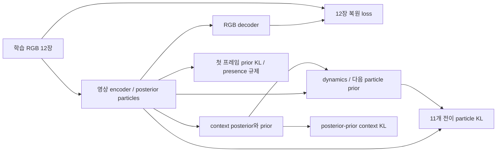

# LPWM 표현 학습과 플래너의 개발 PDMS 비교

## 2026-10-04 Planner 문제의식과 LPWM 연구 가설 재정리 — 설계 제안

사용자 요청: LPWM을 선택한 원래 연구 질문과 downstream planner의 문제의식을 연결하고,
DriveSuprim / DiffusionDrive / VAD / DrivoR 등의 선행연구를 근거로 방법론을 정교화한다.
**아래는 문헌을 검토한 설계 제안이다. 등록된 runtime/config/queue를 변경하거나 새 학습을 실행하지 않았다.**
Stage1 전체 개발평가의 객체 박스 대응 gate 실패와 Stage2 차단 상태는 그대로다.

### 중심 질문과 planner의 역할

**동일한 관측·주행 의도·후보 경로 집합에서, 어떤 객체의 어떤 시간대 미래 정보를 보존해야
좋은 후보와 위험한 후보를 구별할 수 있는가? 그 판단을 LPWM encoder와 dynamics 학습에
전달하면, 같은 표현/예측 예산으로 더 좋은 경로를 선택할 수 있는가?**

LPWM은 perception encoder뿐 아니라 context/dynamics를 포함하는 world model 기반이다.
Particle 구조는 이 질문을 조사하기 좋은 인터페이스지만, 공개 particle이 곧 차량/보행자/차선
instance이거나 planning에 적합하다는 증거는 아니다. 별도의 객체 대응과 미래 활용 검증이 필요하다.

Planner는 후보의 가치를 비교하여 어떤 표현이 필요한지 학습 신호를 제공한다.
연구 기여 후보는 **의사결정에 미치는 영향으로 미래 표현의 학습 대상·시간 범위를 정하는 방법**이다.
Planner의 모든 구성요소에 독립적인 새로움을 요구하지 않는다. 현재의 생성/채점/보정 혼합 구현은
연결 기반으로 활용할 수 있지만, 혼합 자체가 이 질문에 대한 방법론이나 실증은 아니다.

### 선행연구에서 확인한 문제와 가져올 범위

2026-10-04 원문 확인. 아래 방법들의 성능 수치는 sensor, backbone, 학습량, 평가 protocol이
다르므로 직접 순위로 비교하지 않는다. 공식 코드의 안전 gradient 비교는 아래 별도 감사절을 따른다.

| 연구 | 원문이 다루는 문제 / 방법 | 우리 설계에 대한 판단 |
|---|---|---|
| [DriveSuprim](https://arxiv.org/html/2506.06659v3) | 비슷하지만 위험도가 다른 hard negative를 구별하기 어려움. 후보 coarse-to-fine 채점, 회전 증강, soft-label self-distillation | **주 문제와 비교 기준**: 미래 표현이 후보 선택 오류를 줄이는가. Fine 단계는 점수 정교화이며 좌표 보정과 다름 |
| [DrivoR](https://arxiv.org/html/2601.05083v2) | 수많은 영상 token의 비용. 압축 register와 분리된 생성/채점 decoder | Particle memory를 읽는 작은 query decoder의 구현 참고. Register와 particle의 의미/학습은 다르며 단순 교체를 공식 재현으로 부르지 않음 |
| [DiffusionDrive](https://arxiv.org/abs/2411.15139) / [V2](https://arxiv.org/html/2512.07745v1) | Anchor 기반 truncated diffusion으로 다중 후보 생성. V2는 IL의 positive mode 편중에 따른 낮은 품질의 다른 mode를 RL로 학습 | 후보 coverage가 병목이면 후속 생성기로 고려. 처음부터 diffusion/RL까지 바꾸면 표현의 기여가 섞임 |
| [VAD](https://arxiv.org/abs/2303.12077) | Vectorized agent/map 표현과 planning 제약 | 객체·도로 정보가 경로 판단과 연결되는지 검증하고, 보정기를 도입할 때 명시적 기하 비용을 설계하는 근거 |
| [SafeDrive](https://arxiv.org/html/2602.18887v2) | Trajectory-conditioned sparse world, 객체별·시간별 안전 평가 | 가장 가까운 비교 대상. 객체 중심 미래와 안전 채점의 결합 자체는 이미 존재 |
| [WorldDrive](https://arxiv.org/html/2603.14948v1) | 미래 latent를 증류하는 Future-aware Rewarder와 후보 preference ranking | 미래 latent + ranking loss 자체도 기존 방법. World model은 planning 단계에서 고정하므로 우리 encoder 수정 가설과 학습 경로를 구별 |
| [ResWorld](https://arxiv.org/html/2602.10884v1) | Ego 좌표로 정렬한 temporal residual로 동적 성분을 예측하고 미래 BEV로 경로를 보정 | Ego motion과 객체 motion 분리, 현재 정적 정보의 재사용 참고. 단순 동적 영역 집중이나 경로 주변 미래 읽기도 단독 기여로 삼기 어려움 |
| [World4Drive](https://arxiv.org/html/2507.00603v1) / [EgoFSD](https://arxiv.org/html/2409.09777v6) | 각각 의도별 latent world/후보 평가, ego intention을 이용한 객체 선택과 joint planning | 의도 conditioning 또는 중요 객체 top-K만으로 새로움을 주장하지 않음 |
| [ForeDrive](https://arxiv.org/html/2609.26299v2) | Planning이 shared encoder를 학습하고 forecasting이 predictor를 학습하는 비대칭 경로. 미래 latent로 diffusion planning 조건화 | Planning loss의 encoder 전달도 기존 방법. Predictor까지 공동학습할 때의 이득과 world 성능 손상을 따로 검증 |
| [CAPO](https://arxiv.org/abs/2204.13319) | 미래 prediction을 교체했을 때 control 변화로 agent별 prediction 중요도를 계산. 비미분 planner도 사용 가능 | **학습 목적의 직접 선행연구**. 아래 utility 가중 감독은 이 원리를 참고한 확장 가설이며 새 원리라고 주장하지 않음 |

ResWorld는 [ICLR 2026 proceedings](https://proceedings.iclr.cc/paper_files/paper/2026/hash/0b6df1a973b82b3cf7fadca6c387ae5a-Abstract-Conference.html)에서도 확인했다.
WorldDrive/ForeDrive 등의 위 링크는 검토한 arXiv 버전이며 이 기록에서 학회 채택을 주장하지 않는다.
[Value-aware model learning](https://proceedings.mlr.press/v267/voelcker25a.html)도 모델의 목적을
downstream value와 맞추는 기존 흐름이다. 범용 원리의 최초 제안으로 포장하지 않는다.

### 추천 planner: 후보 선택을 통제하는 기준 모델

주축은 **DriveSuprim 계열의 선택형 planner**로 정한다는 제안이다. 첫 진단은 현재 train-only
512개 후보와 metric teacher를 재사용하여, 같은 후보를 LPWM 표현만 다르게 읽고 평가한다.
한 번에 전체 DriveSuprim 아키텍처를 이식하는 안과 구별하며, 정식 baseline 재현도 아니다.

1. 현재 영상/ego 상태/command로 particle 표현을 생성하고 causal future를 예측한다.
2. 각 후보 trajectory를 query로 만들고, 동일한 현재·미래 memory에서 후보별 근거를 읽는다.
3. 기존 공식 metric teacher를 고정 label로 사용해 NC/DAC/진행/TTC/comfort 등을 예측한다.
4. 등록한 score 조합으로 한 후보를 선택한다. 첫 대조에서는 좌표를 고정한다.
5. Hard negative pair를 추가하여, 유사한 경로의 안전도 차이를 구별하는지를 평가한다.

Coarse-to-fine shortlist는 이후 ablation이다. 현재 정보만으로 후보를 너무 일찍 제거하면 미래가
유용한 후보를 다시 살릴 수 없으므로 shortlist oracle coverage와 최종 ranking regret를 함께 측정한다.
Refiner/diffusion은 전체 후보의 oracle PDMS와 feasible coverage가 부족할 때 따로 추가한다.
후보를 생성/보정한다면 GT 회귀만의 효과와 안전 pseudo-target/명시적 좌표 비용의 효과를 분리한다.
채점 BCE가 직접 충돌 회피 좌표 objective를 대체한다고 설명하지 않는다.

### 최소 학습 설계와 gradient

기본 비교의 목적함수 제안은 다음과 같다. 가중치는 아직 등록하지 않았으며 dev에서 정한 뒤 고정한다.

\[
\mathcal L = \lambda_{\rm world}\mathcal L_{\rm LPWM}
 + \lambda_{\rm metric}\mathcal L_{\rm metric}
 + \lambda_{\rm imitate}\mathcal L_{\rm imitation}
 + \lambda_{\rm rank}\mathcal L_{\rm pair}.
\]

- `LPWM`: 복원·temporal ELBO 유지. Planning에 유리한 점수를 만들면서 실제 미래 정보가 손상되는지 함께 검사.
- `metric`: 고정 후보의 공식 metric 감독. Teacher/oracle label은 SG, learned scorer와 LPWM 경계는 SG 없음.
- `imitation`: 후보의 command/주행 의도 및 expert 선호 학습. 여러 안전 경로를 모두 오답으로 몰지 않도록 metric 목표와 구별.
- `pair`: 공식 점수 차이가 충분한 유사 후보 쌍의 순서 학습. 예를 들어
  `softplus(-(score_better - score_worse))`. 거의 동점인 경로의 임의 순서는 강제하지 않는다.

주 실험은 LPWM full low LR + planner full LR이다. Planning gradient는 encoder/intent conditioning/
context/dynamics에 전달하고 RGB decoder는 world objective로 학습한다. Frozen LPWM은 원인 구분용
대조군이며 사용자가 확정한 주 학습 방식을 freeze로 되돌리는 것이 아니다.
Command는 particle 생성 과정에 입력한다. 현재 구현의 command-FiLM 연결만으로 의도에 맞는
객체 정보가 개선됐다고 판단하지 않으며, planner에만 command를 넣는 대응 조건과 비교한다.

위 학습만으로 새로움이 확보되지는 않는다. 다음 제안이 **원래 선택적 미래 명제의 검증 대상**이다.

### 미래 정보의 중요도를 경로 선택의 손실로 정의하는 확장 가설

CAPO의 prediction 교체 실험을 출발점으로, 객체·시간 구간별 미래 정보가 사라졌을 때
선택한 경로의 실제 점수가 얼마나 낮아지는지 측정한다. 이는 먼저 **offline 진단**으로 검증한다.

고정 후보 집합을 \(\mathcal C\), 관측된 미래 상태를 \(Y\), 같은 protocol의 공식 점수를
\(R(\tau,Y)\)라 하자. 객체 \(e\)의 시간 구간 \(w\)를 persistence 등의 기준 예측으로
대체한 상태를 \(Y^{(-e,w)}\)라 하면:

\[
\tau^*=\arg\max_{\tau\in\mathcal C}R(\tau,Y),\qquad
\tau^{-e,w}=\arg\max_{\tau\in\mathcal C}R(\tau,Y^{(-e,w)}),
\]
\[
U_{e,w}=R(\tau^*,Y)-R(\tau^{-e,w},Y)\ \geq 0.
\]

`U`는 관측된 미래와 해당 후보/teacher 아래에서의 정보 손실 비용이다. 객체를 실제로 제거했을 때의
교통 참여자 반응이나 진정한 causal value를 뜻하지 않는다. 점수 계산의 reference/normalization/
command-compatible 후보 범위를 고정해야 위 비교가 유효하다. 모든 후보에 같은 큰 위험을 주는 객체,
객체 간 중복·상호작용은 singleton 중요도가 놓칠 수 있어 절대 위험 및 객체군 교체도 함께 검사한다.
교체 전후 argmax만 달라지고 실제 점수가 같으면 중요도로 과대평가하지 않는다.

1. Train에서 고정 teacher로 object×time utility를 생성하고 SG한다. Dev/test 중요도는 평가용으로만 사용.
2. 카메라 기하/visible mask로 이를 영상 target에 투영하고, 검증된 soft correspondence로 particle
   또는 spatial prediction 감독에 연결한다. Particle index를 GT 객체 ID로 간주하지 않는다.
3. `기본 가중치 + 정규화/상한 처리한 SG(utility)`로 미래 감독을 가중하고 encoder까지 학습한다.
   이 확장항은 과거4장만으로 rollout한 미래의 valid spatial RGB/latent target에 적용한다.
   기존 12장 posterior 복원의 재가중만으로 causal future 학습을 했다고 부르지 않는다.
   GT 미래는 target branch에만 있고, latent target을 사용한다면 고정/EMA+SG 및 correspondence를 명시한다.
   기본 식에 별도 `lambda_utility * loss_utility_future`를 추가해 효과를 분리한다.
   중요도가 낮아도 기본 world 감독은 남겨 collapse와 blind spot을 제한한다. Background를 전부 제거하지 않는다.
4. 이 단계에서는 particle 수/예측 horizon을 고정하여 **표현이 달라진 효과**부터 비교한다.
5. 효용이 확인된 뒤에만 현재 정보·intent에서 예산을 배분하는 선택적 rollout을 학습한다.
   미래 GT로 선택하는 oracle은 상한 대조군이며 추론에 사용하지 않는다.

손실 가중치 변경은 계산량 절감이 아니다. 모든 미래를 예측한 뒤 top-K를 읽는 방식도 prediction
연산 절감이 아니다. 실제 budget 주장은 rollout 전에 예측 대상을 정하고 full-stack FLOPs/latency로
검증한 경우에만 한다. 위치·시간·정보 종류·양을 동시에 학습하지 않고, 첫 확장은 객체/공간×시간으로 제한한다.
영상 복원 성능, correspondence, 중요 시점의 상태/latent 보존, 최종 선택 성능을 각각 측정한다.

### Geometry, intent, uncertainty의 검증 경계

- LPWM 화면 좌표와 compositing depth를 미터 단위 collision 좌표로 사용하지 않는다.
  Metric risk supervision에는 검증된 카메라 calibration/GT projection 또는 별도 metric grounding이 필요하다.
- 과거 ego motion/카메라 입력은 ego 회전과 객체 운동을 구별하는 후보 개선안이다.
  단일 homography로 모든 깊이의 parallax를 제거할 수 있다고 가정하지 않는다.
- 정지선/차선/정적 장애물도 중요한 현재 정보다. Dynamic-only 미래 예측은 현재 정적 맥락 보존과 함께 비교한다.
- 같은 장면의 command 변경은 representation/readout의 중요도 변경 실험이다. 주변차량의 실제 미래가
  ego 후보에 반응해 바뀌는 action-conditioned counterfactual world 검증과 구별한다.
- NAVSIM 로그의 관측된 한 미래만으로 가림 뒤 여러 가능성의 확률이나 반응성을 입증할 수 없다.
  후속 확률적 rollout은 calibration/tail risk로 평가하고, 상호 반응 주장은 별도 reactive simulation이 필요하다.
- Front128 영상에서 보이지 않는 객체·작은 객체 손실을 planner 구조로 해결했다고 주장하지 않는다.
  시야/해상도 통제, visible/occluded/밖으로 이탈한 target 분해가 선행한다.

### 비교와 기각 기준

모든 주 비교는 같은 recording split, 관측 카메라/해상도, 후보 집합, 학습량, planner 용량을 사용한다.
독립 navtest는 모델 선택 후 평가하고, 여러 seed 및 recording 단위 paired CI를 보고한다.
아래 조건은 **새 제안이며 현재 3조건 queue에 등록되어 있지 않다**.

| 비교 | 답할 질문 / 실패를 해석하는 기준 |
|---|---|
| 같은 후보의 oracle vs learned selection | Oracle 자체가 낮으면 candidate 문제, oracle은 높고 실제 선택이 낮으면 scorer/표현 문제 |
| Current-only vs persistence future vs causal predicted future | 미래 생성의 추가 효용. Current-only에도 대응 decoder 용량/계산을 부여해 단순 확장 효과를 통제 |
| Frozen LPWM vs low-LR joint LPWM | Encoder/world 표현 수정이 필요한가. 동일 world/metric 목표를 가진 학습 조건을 명확히 기록 |
| Planner-only command vs encoder+planner command | 의도에 맞는 표현 학습이 추가로 필요한가. 유효 command/route를 확인하며 바꾼 command에 원래 GT 경로를 정답으로 재사용하지 않음 |
| 균일 미래 감독 vs 거리/위험 규칙 vs CAPO형 utility 감독 | 어떤 미래를 보존할지 결정하는 목표가 중요한가. 단순 재가중이나 data rebalance 효과도 통제 |
| 같은 예산의 고정/random/학습 예측 대상 | 적응 배분의 필요성. 실제 prediction 연산과 전체 latency를 맞추고 trade-off 곡선을 보고 |
| Predicted / oracle future, 미래 교체·particle 개입 | 예측 오차와 미래 소비 오류를 분리. Oracle 학습·평가 대조도 포함해 test-time 교체 OOD를 구별 |

핵심 지표:

- **선택 regret** = 동일 후보의 최고 공식 PDMS − 선택 후보 공식 PDMS. Full bank와 shortlist별로 따로 보고.
- PDMS와 NC/DAC/TTC/진행/comfort, hard-negative 순위 정확도·calibration.
- 직진/회전/가림/교차 객체별 결과와 coverage. Baseline 성능으로 난이도 계층을 만들지 않음.
- 중요한 객체/시간의 prediction 및 probe 품질, geometry/presence/appearance/future를 분리한 개입.
- 같은 시각화 장면에서 선택 경로가 바뀐 이유와 해당 미래 정보의 사용 여부. Attention map만으로 인과성 주장 금지.

Future가 current/persistence 대조를 넘지 못하면 선택적 미래 예산 확장에 앞서 활용 경로와 benchmark
민감도를 검토한다. [Perfect Prediction or Plenty of Proposals?](https://arxiv.org/html/2510.15505v1)는
검토한 nuPlan/IPP 조건에서 perfect future도 planning 개선으로 이어지지 않는 사례를 보여준다.
이 결과를 모든 E2E/NAVSIM에 일반화하지 않고, 우리에서도 미래가 실제 사용되는지 반증 검사를 한다.
Oracle future를 넣어도 나쁜 경우는 후보 부족, 소비 구조, 분포 이동 등을 분리하여 진단한다.

### 실행 우선순위와 미결

1. Stage1 box recall 실패를 object type/scale/presence/visibility 기준으로 진단한다. Gate 임계값을 사후 완화하지 않는다.
2. 기존 teacher cache로 후보 oracle 품질·위험 후보 분포를 조사하여 selection 문제 설정이 데이터에서 성립하는지 확인한다.
3. Gate를 충족한 모델로 위 최소 planner의 current/persistence/future 및 frozen/joint 대조를 설계·등록한다.
4. Utility가 실제로 상황/intent/시간에 따라 달라지는지 검증한 후, utility 기반 encoder/future 감독을 비교한다.
5. 효용이 확인되면 선택적 rollout 예산과 다른 planner로의 transfer를 평가한다. Refiner/생성기는 후보 병목이 확인된 경우 별도 비교.

SafeDrive/WorldDrive/EgoFSD/CAPO/ForeDrive와의 중복을 고려하면 **LPWM 사용, future ranking,
intent conditioning, joint encoder 학습, importance weighting 각각만으로는 novelty가 확정되지 않는다.**
논문 기여 후보는 실제 영상에서 학습한 particle의 *보존/예측 대상과 시간 예산*을 결정 손실에 연결하고,
동일 예산·강한 비교군에서 planning 이득 및 원인을 보여주는 것이다. 현재는 제안이며 결과는 없다.

## 2026-10-03 Stage1 실제 목적함수·gradient·단계별 원인 진단

이 절은 실행 중인 `full_posttraining_v2.json` 및 `execution/batch4_accumulation2_workers0.json`,
공식 LPWM commit `4cf53c4`의 실제 forward/loss를 읽어 정리했다. 설명을 위해 실행 중인
Stage1 source·학습 목적·optimizer·가중치를 변경하지 않았다. 수치 원본은
`results/lpwm_navsim_full_posttraining_v2/stage1_diagnostic_snapshot_20261003.json`이다.

### 데이터와 학습 대상

- 공개 Sketchy checkpoint에서 영상 encoder 6.035M, context 39.389M, dynamics 59.869M,
  RGB decoder 4.251M, 합계 109.545M을 모두 직접 갱신한다. LoRA나 일부 block만의 학습이 아니다.
- 공식 navtrain log와 token 필터를 함께 적용하고 recording 단위로 train23,126 clip/122 recording,
  development7,745 clip/40 recording을 분리한다. 연속 RGB 12장, 전방128×128, 0.5초 간격이다.
- **학습은 12프레임 전체 posterior 복원과 11개 전이의 latent KL이다.** `4 observed + 8 future`는
  과거만 사용하는 평가/planner의 구분이다. 현재 목적에 8-step 자율 rollout RGB loss는 없다.
- Stage1 입력/감독에는 ego command, 행동, 경로 GT, 객체 class/box GT가 없다. 객체 주석은 평가용이다.
  카메라 움직임 분리·안정화 모듈도 추가하지 않았다. Stage2에서 command FiLM과 planning 감독을 추가한다.
- GPU당4 clip × 누적2 × GPU2 = 유효16. Adam LR8e-5, betas(0.9,0.999), eps1e-6,
  weight decay0, FP32, global gradient clip100, warmup0,20epoch/28,920update다.

### 실제 forward와 학습·추론 차이

각 영상의 posterior particle은 위치·scale·presence·compositing depth·appearance 및 배경을 담는다.
Context는 관측 전이를 설명하는 posterior latent와 과거만으로 다음 latent를 예측하는 prior를 만든다.
Dynamics는 particle 이력과 context로 다음 particle 분포를 출력한다.



훈련 시 dynamics에는 정답 영상에서 추론한 이전 particle과 다음 전이의 posterior context를 준다.
다음 particle posterior도 정답 영상에서 얻지만 고정 teacher/EMA target이 아니며 함께 학습된다.
반면 실제 미래 생성은 **과거4장만** `sample_from_x(...,num_steps=8,cond_steps=4,
use_all_ctx=False,deterministic=True,n_pred_eq_gt=False)`에 넣어 context prior와 dynamics를 반복한다.
미래 context posterior를 사용할 수 없고, 이전 예측 오차가 다음 예측으로 누적된다.
따라서 학습 loss 감소만으로 4초 미래 예측 성공을 판정할 수 없다.

### Loss의 정확한 구성

현재 설정의 최종 scalar는 다음과 같다. 각 항은 batch 평균을 포함하며 정규화 전 값을 로그에 쓴다.

\[
\mathcal L_{stage1}=\frac{0.01}{12}
\left[L_{rec}+0.08L_{static}+0.2L_{dyn}+0.2L_{context}+0.08L_{presence}\right].
\]

1. **복원**: 각 프레임의 `MSE + 0.1 × VGG-LPIPS`에 `3×128×128`을 곱하고 12프레임을 합한다.
   LPIPS network는 고정이며 생성 영상으로의 gradient는 유지된다. `beta_dyn_rec=1`과 시간 discount1을
   사용하지만 코드의 `loss_rec_future`도 **미래 정답 영상의 posterior 복원**이다.
2. **초기 particle prior KL**: `num_static=1`인 첫 프레임 위치·scale·presence·depth KL의 합에
   `0.01 × appearance/background KL`을 더한다. 위치에는 공식 Chamfer KL을 사용한다.
   여기서 `kl_balance=0.01`은 이 appearance 항의 가중치이며 stop-gradient 균형 계수가 아니다.
3. **Dynamics KL**: 나머지11프레임에서 영상 encoder posterior와 dynamics가 내놓은 다음 particle prior의
   분포 차이를 줄인다. 위치·scale·presence·depth·appearance·배경을 포함하고 appearance 가중치는1이다.
   활성도 mask를 일부 attribute KL에 적용한다. 정답 위치 L2만의 동역학 학습이 아니다.
4. **Context KL**: 다음 전이를 보고 추론한 posterior context와 과거에서 예측한 prior context를 맞춘다.
   현재 Gaussian KL의 gradient balance는 default0.5로 양쪽에 gradient가 흐른다.
5. **Presence 규제**: 첫 프레임 particle 활성도의 합을 제곱하여 평균한다.
   불필요한 particle 사용을 줄이는 규제이며 객체 수·class 정답은 아니다.

공식 코드의 `n_particles` 변수는 이 최종 loss 정규화에 실제 사용되지 않는다. 65로 나눈다고
해석하지 않는다. 원시 `loss_rec` 수만 단위와 전체 loss 수십 단위를 직접 비교하지 않는다.

2026-10-03 22:56KST/update2704의 가중치·정규화 적용 후 기여는 복원21.4026,
static KL0.05745, dynamics KL0.64128, context KL0.11839, presence0.08615였다.
복원이 scalar 합의 약95.95%였지만 **이 비율이 모듈별 gradient 지배 비율을 의미하지는 않는다**.
현재는 모듈별 총 gradient norm을 기록하며 loss별 gradient norm/방향 충돌은 별도 계측하지 않는다.

### Gradient 경로와 optimizer update

| Loss | 영상 encoder | Context | Dynamics | RGB decoder |
|---|---|---|---|---|
| Posterior RGB 복원 | 갱신 | 직접 경로 없음 | 직접 경로 없음 | 갱신 |
| 첫 프레임 KL / presence 규제 | 갱신 | 직접 경로 없음 | 직접 경로 없음 | 직접 경로 없음 |
| 다음 particle KL | posterior 및 예측 입력 경로로 갱신 | posterior context 경로로 갱신 | 갱신 | 직접 경로 없음 |
| Context KL | particle 입력 경로로 갱신 | posterior/prior 경로로 갱신 | 직접 경로 없음 | 직접 경로 없음 |

`decode_with_ctx=False`이므로 RGB 복원에서 context/dynamics까지 직접 gradient가 가는 구조가 아니다.
`detach_dyn_inputs=False`, context의 주요 particle attribute 입력도 연결돼 있다.
일부 보조 분산/score 입력의 공식 detach와 주 경로의 gradient 연결은 구분한다.
한 optimizer update에서 rank마다 microbatch2번의 `loss/2`를 backward하고, 마지막에 DDP로 두 rank의
gradient를 평균한다. 이후 global norm100 clipping과 Adam step을 수행한다.

최근 실제 감사 update2688의 norm은 encoder39.8964/context0.36360/dynamics0.88562/decoder12.9915다.
이는 연결·갱신이 존재한다는 증거이며 각 모듈이 올바른 정보를 학습했다는 증거는 아니다.
`parameters_with_nonzero_gradient`는 nonzero gradient가 있는 **tensor에 속한 parameter 수**이며
그 수만큼 모든 scalar gradient가 0이 아니라고 보장하지 않는다. 종료 시 weight 변화 검사는
parameter tensor의 앞16개 원소 sample로 하므로 전체 원소 비교가 아니다.

### Particle 시각화의 점·사각형·색상 의미

현재 `visualization/index.html`의 윗줄은 동일한 현재 영상에서 encoder가 추론한 particle이다.
`scripts/visualize_lpwm_posttraining_progress.py::draw_particles`와 저장된 그림을 대조했다.

| 표시 | 실제 의미 |
|---|---|
| 색깔 점64개 | 각 particle의 학습된2D 중심 `z`; 단순 점이 아니라 외형·scale·presence 등을 갖는 표현의 위치 |
| 점 주변 사각형16개 | presence 상위16 particle의 학습된 `z_scale`을 sigmoid한 폭/높이. 위치·크기로 decoder의 지역영상 배치를 나타냄 |
| 같은 점·테두리 색 | 같은 particle index/patch 기원. 객체 class·위험도·영속적 track ID가 아님 |
| 점의 크기와 투명도 | presence가 높을수록 점을 크고 진하게 그림. 점 크기는 실제 물체 크기를 뜻하지 않음 |
| `presence sum` |64개 연속 활성도의 합. 검출 객체 개수가 아님 |

사각형 중심은 점이고,128픽셀 영상에서 폭/높이는 `128 * sigmoid(z_scale)`이다.
이는 분산·신뢰구간을 표시한 uncertainty box나 attention heatmap, GT/검출기 객체 box가 아니다.
실제 decoder는 내부 alpha mask와 depth도 사용하므로 사각형 내부 전체가 동일하게 기여하지 않는다.
Presence 역시 정답 객체 존재에 대해 보정된 검출 확률이나 planning 중요도라고 보장하지 않는다.

사각형을16개만 그리는 것은 가독성을 위한 시각화 선택이며 모델이 나머지48개를 제거한다는 뜻이 아니다.
한 객체가 여러 particle로 표현되거나, particle이 도로·나무·건물 등 배경 일부를 담을 수 있다.
열/update와 GIF는 **같은 장면에서 학습 전후 가중치 변화**를 보여준다. 실제 시간이 흐르며 같은 객체를
추적하는 영상으로 해석하지 않는다. 가운데줄은 현재 복원, 아래줄은 과거4장만 사용한+4초 예측 RGB다.

### 배경 중심 particle과 Stage2에서의 재배치 가설

검증할 하위 질문: **planning 감독이 시각 복원에 유리한 particle 표현을, 해당 주행 판단에
필요한 객체·도로 구조 및 그 미래 정보를 보존하는 표현으로 바꾸는가?**

도로·나무·건물 쪽에 많은 particle이 보이는 것은 전역 RGB MSE/LPIPS, 화면 면적과 무늬,
patch 기원 proposal,128×128에서 작은 객체의 정보 손실로 설명 가능한 가설이다.
Stage1에는 차량/보행자/정지선의 중요도를 직접 높이는 supervision이 없다. 그러나 고정8장면의
점 분포만으로 reconstruction이 원인이라고 확정할 수는 없다. 도로와 배경도 주행 가능 영역,
자차 움직임, 도로 형태 추론에 유용할 수 있다. 대상 영역 면적과 장면 구성을 보정해 비교해야 한다.

현재 Stage2는 `particle_attributes`에 위치·sigmoid(scale)·presence·depth·외형·배경을
detach 없이 연결하고, 관측/예측 particle memory에서 planner loss를 역전파한다.
LPWM LR1e-6/새planner·command LR3e-4, 목적은 planning loss +0.02 world ELBO다.
따라서 위치·scale/활성도·특징을 바꿀 수 있는 구조지만, **중요 객체 쪽으로 중심이 이동하는 것을
직접 요구하는 loss는 없다**. Encoder의 aggregate planning gradient와 command에 따른
attribute 변화는 CPU 연결검사에서 확인했으나, 위치/scale/appearance별 실제 gradient 기여와
객체를 향한 의미 있는 이동까지 확인한 검사는 아니다.

- 차량/보행자: NC/TTC 및 경로 imitation을 통해 간접적으로 관련 정보를 학습할 수 있다.
- 도로/차선: DAC 등은 도로 영역과 주행 경로에 대한 간접 신호이며 차선 paint segmentation이 아니다.
- 정지선: 현재6개 candidate metric에 독립 정지선/신호등 준수 항은 없다. Human trajectory의
  간접 신호만으로 정지선에 particle이 모인다고 보장하지 않는다.
- Ego command FiLM은 같은 영상의 particle attribute를 바꿀 수 있지만, command별 올바른
  중요 대상 선택이 학습됐다는 증거는 별도로 필요하다.

중심 이동, scale/presence 변화, 외형·예측 특징 변화, planner의 기존 token 활용 변화는
서로 다른 결과다. 위치 이동만으로 성공/실패를 판단하지 않는다. 큰planner가고정표현만활용하거나
world loss/낮은LPWM LR 때문에 위치변화가 작을 수도 있으며, 이는 현재 미확정 가설이다.

이를 검증하려면 같은clip·같은command의 Stage1/Stage2 checkpoint를 비교하고,
객체/지도 투영 영역별 presence 및 중심·박스 coverage(면적/객체크기 보정), 외형/future probe,
matched control을 둔 particle 교체·제거 시 planner/PDMS 변화와 frozen-LPWM 대조를 함께 본다.
Attention이나 gradient 그림만으로 causal importance를 입증하지 않는다. 중요한 대상을
같은 class 전체로 묶지 않고 ego 경로/intent와 관련된 대상별로 나눠야 한다.
차선·정지선 투영을 쓰려면 지도-카메라 좌표·crop/resize·가시성을 먼저 검증해야 한다.

현재 자동 queue에는 world-retention 및 learned-future/persistence 비교가 있다.
**Stage2 객체 종류별 particle 재배치 시각화, 면적보정 점수, particle 개입, frozen-LPWM 대조는
아직 구현·등록되지 않은 추가 진단**이다. 기존 Stage1 gallery나 aggregate gradient 검사를
그 진단의 완료 증거로 사용하지 않는다. 이 해석을 이유로 실행 중 objective/source를 바꾸지 않았다.

### 현재 관측 결과와 검증 수준

| 고정 개발512개 clip | 학습 전 | 1epoch/update1446 |
|---|---:|---:|
| Temporal ELBO |64.8380|23.3991|
| 정규화 전 복원 loss |74927.44|26949.30|
| Dynamics KL |12153.41|4004.85|
| Context KL |1120.75|784.66|
| Posterior 복원 PSNR(dB) |13.1449|20.4611|

매 epoch의 위 지표는 고정512개 개발 표본의 stochastic posterior/teacher-forcing 평가다.
초기 동일값의 두 로그 행은 재개 과정에서 중복 기록됐으므로 두 독립 실험으로 집계하지 않는다.
별도 고정8장면 시각화의 과거만 사용하는 미래 MSE는0.053663→0.029535(1epoch),
같은 장면 last-frame persistence는0.040329다. 복원 MSE는0.044610→0.009260이다.
**8장면 기술 통계에는 CI가 없으며 전체 개발 적응 성공으로 일반화하지 않는다.**

학습 도중에는 finite loss/gradient·주기적 module gradient·checkpoint를 확인하고,
같은8장면의 64개 중심/top16 box/presence/복원/미래 예측을 update0/128/512 및
epoch1/5/10/15/20에 저장한다. `outputs/lpwm_navsim_full_posttraining_v2/visualization/index.html`을 본다.

완료 후 다음을 **전체7,745 clip/40 recording**에서 공개weight와 최종weight를 대응 비교한다.

- 복원 LPIPS: 공개weight보다 개선, recording bootstrap2000회/95% CI 상한<0.
- 과거4장→미래8장 LPIPS: 공개weight 및 last-frame persistence보다 각각 개선, CI 상한<0.
- 미래 객체 영역 MSE: persistence보다 개선, CI 상한<0.
- 현재 top16 particle box와 투영 객체 box의 recall(IoU≥0.1): 공개weight 대비 CI 하한≥-0.02.
- 위험층별 미래 LPIPS: 충분한5개 이상 recording에서 persistence 대비 열화 CI 상한이
  persistence 평균의10% 이내. 빠른자차/큰회전/작은객체/먼객체/큰영상변화/겹침·소실 proxy를 분해한다.
- 네 모듈 gradient와 weight 변화, 추가8장면 미래 교란 검사의 **모든** 장면 통과,
  particle feature 표준편차>1e-4 및 활성도합>1, 주요 scenario/risk coverage.

미래 LPIPS/MSE는0.5~4초 각 horizon도 저장한다. 작은/먼객체 ROI, 배경ROI,4초 particle-box 대응,
같은 patch ID 유지 proxy도 진단용으로 남긴다. **이들 모두가 별도의 통과 threshold를 갖는 것은 아니다.**
객체 box IoU0.1은 느슨한 대응 지표이고 겹침/소실은 실제 가림 GT가 아니다. Feature std 및 presence
검사만으로 모든 particle이 서로 다른 객체를 담거나 동일객체를 추적한다고 보장하지 않는다.
통과는 운영상 적응 기준이며 '완벽한 NAVSIM 이해' 또는 planning 유용성의 증명이 아니다.

### Stage1 / Stage2 실패 원인을 분리하는 순서

| 관측 | 우선 확인할 문제 | 진단/비교 |
|---|---|---|
| 복원부터 나쁨 | Stage1 영상 표현·decoder·해상도/도메인 적응 | 원본/적응 복원, 작은객체 ROI, particle 활성도와 배치 |
| 복원은 좋고 과거만의 미래는 나쁨 | Context prior / dynamics / teacher-forcing과 rollout의 차이 | 시간별 오차, persistence, posterior context를 쓰는 특권 상한 진단 |
| 전체영상은 좋지만 작은객체·회전·겹침이 나쁨 | Stage1 목적과 주행 중요 정보의 불일치 | 배경/객체 ROI 분리, 위험층별 지표; 전역 평균으로 통과 단정 금지 |
| Stage2 후 영상/미래 지표가 악화 | Planning 미세조정 중 표현 훼손 | Stage1 동일clip 기준 world-retention 및 module별 변화 |
| 후보 oracle PDMS부터 낮음 | 후보 사전/생성/보정의 한계 | 선택 network와 독립적으로 실제 후보 전체의 최선 score 확인 |
| 후보 oracle은 높고 선택 PDMS는 낮음 | 점수 예측·선택 또는 입력 표현의 정보 부족 | metric calibration, oracle 선택 gap, 고정표현 probe로 추가 분리 |
| 미래를 persistence로 바꿔도 PDMS 동일 | 미래 branch의 활용 약함 또는 잘못된 예측 | 현재 queue의 learned-future/persistence 대응 평가 |

현재 queue에는 Stage1 gate, teacher oracle coverage, 각 Stage2의 학습 전/후 PDMS·ADE·metric BCE,
Stage1 대비 world-retention, 예측future를 persistent particle로 바꾸는 검사가 구현돼 있다.
Gate 실패는 원인JSON을 남기고 다음 단계를 막는다. 낮은 성능을 이유로 문턱을 자동 완화하지 않는다.

**완전한 인과적 분리에 필요한 추가 통제는 현재 queue에 모두 들어 있지는 않다.**
문제가 나타나면 동일planner/학습량으로 (a) 공개LPWM 고정 vs 적응LPWM 고정,
(b) 적응LPWM 고정 vs 저LR 공동학습, (c) 예측future vs 평가전용 실제future posterior,
(d) loss별 module gradient/방향을 비교한다. (c)는 배포 입력이 될 수 없고 PDMS 본성능으로 보고하지 않는다.
고정표현 probe도 한 모델만으로 정보 부재를 증명하지 못하므로 optimization/용량 한계를 함께 점검한다.
현재3조건은 planner loss/보정 비교이며 위 모든 원인을 유일하게 식별하는 실험이라고 주장하지 않는다.

### 코드 진입점

- 설정: `configs/lpwm_navsim_adaptation/full_posttraining_v2.json`, execution override.
- 호출·실제평가: `scripts/run_lpwm_navsim_posttraining.py::official_loss/evaluate`.
- 누적/DDP/optimizer/epoch개발평가: `scripts/train_lpwm_navtrain_distributed.py::run`.
- 실제 ELBO: `reference_repositories/LPWM/models.py::DLP.calc_dyn_elbo`.
- Pixel/LPIPS: `reference_repositories/LPWM/utils/loss_functions.py::LossLPIPS`.
- 전체개발 gate: `scripts/summarize_lpwm_posttraining.py::summarize`.
- 추가 gate/Stage2 보존검사: `scripts/validate_lpwm_stage_transition.py`.

## 2026-10-03 최신: 미래 particle 기반 후보 평가·보정 planner

현재 설정은 `configs/lpwm_planning/metric_distillation_v2.json`이다. 아래 과거 소규모 및
encoder-only 실험과 구분한다. Stage1 본학습을 중단하지 않고 대기열을 새로 연결했다.
검증할 질문: **planning의 안전·진행·편안함 감독과 미래 particle 기반 후보 보정이,
LPWM 표현 자체와 실제 주행 성능을 개선하는가?** 객체별 선택 예산은 아직 학습하지 않는다.

### 참고한 연구와 적용 범위

| 근거 | 가져온 로직 | 이번 구현에서의 차이 |
|---|---|---|
| [DrivoR §3.3–3.5](https://arxiv.org/html/2601.05083v2) | scene token에 attention하는 경로/점수 decoder, oracle subscore BCE, 보정 좌표의 채점 입력 detach | ViT/register 대신 LPWM particle memory와 train-only 후보 사전. 우리 scorer에는 coarse candidate feature도 들어가므로 원 논문의 생성/채점 완전 분리와 다름 |
| [Hydra-MDP](https://arxiv.org/html/2406.06978v3) | 후보 trajectory vocabulary, imitation+여러 simulator 지표 증류 | 512개 train-only 실제 궤적 medoid, 현재 NAVSIM-v1 scorer 기준; 논문 로직을 구현하며 공식 미공개 코드를 재사용했다고 하지 않음 |
| [DriveSuprim](https://arxiv.org/html/2506.06659v3) | 많은 후보를 먼저 평가하고 일부를 상세 평가하는 구조 | 우리 후단은 점수 평가뿐 아니라 실제 좌표를 보정; EMA soft-label/다중카메라 ego augmentation은 미적용 |
| [Drive-JEPA](https://arxiv.org/html/2601.22032v2) | video representation과 다중 경로 감독 연결 검토 | 현재 full MTD 구현·안전 pseudo-GT 경로 회귀를 그대로 이식하지 않음. 공식 PF full checkpoint 결과는 보존된 비교 기준 |
| 보존된 로컬 SafeDrive | trajectory-guided refinement, 안전 subscore, 시점별 DAC, 보정 후 경로의 live rollout 채점 | BEV·객체 ID 대신 LPWM token cross-attention. 객체별 NC는 대응 검증 전 제외 |

DrivoR source `fc6e5aa144bbcb5a046e22c18f1bd5cf3af8634a`, DriveSuprim
`80fe792d7654a596d92e20d030d1650f6f605c02`, 두 저장소 Apache-2.0 확인.
원본은 `reference_repositories/`에 보존한다. 기존 SafeDrive 학습은 재개하지 않는다.
**로컬 SafeDrive의 future BEV semantic head는 보조 감독이며 그 출력이 planner 입력이라는
주장은 하지 않는다.** 우리 구현은 예측 미래 particle을 refiner의 입력으로 직접 사용한다.

### 입력과 전체 경로

1. 과거/현재 전방 RGB 4장(0.5초 간격,128×128) + 현재 command/속도/가속도 8D.
2. 현재 command 4D를 particle attribute CNN 내부 bounded FiLM에 입력한다.
3. 공개 구조의 encoder/context/dynamics로 관측 particle 4×64와 과거만의 미래 prior 8×64를 만든다.
   LPWM은 action-conditioned counterfactual simulator가 아니다. 각 후보 행동별 세계를 별도 예측하지 않는다.
4. 위치·scale·presence·compositing depth·appearance·배경의 14D attribute를 256D로 변환,
   시간 및 particle 위치 embedding과 함께 총768개 memory token을 구성한다.
5. train75,297개 궤적만으로 만든512개 실제 trajectory medoid를 candidate query로 변환한다.
   두 층 decoder가 memory를 읽고 imitation logit과 NC/DAC/EP/TTC/comfort/DDC를 예측한다.
6. refinement 조건은 imitation 상위16 + 나머지 중 예측점수 상위16의 **서로 다른32개**를 고른다.
   GT 경로를 shortlist 선정에 사용하지 않는다. 2층 refiner는 미래8×64 particle memory를 읽는다.
7. offset은 waypoint별 XY 각각±3m, heading±0.3rad로 제한한다. 이후 실제 보정 좌표를 다시 embedding하여
   2층 decoder로6개 subscore와8시점×2개 prefix 안전확률을 예측한다.
8. 최종 선택은 예측 PDMS × imitation 확률^0.1이다. NAVSIM-v1은
   `NC × DAC × (5 EP + 5 TTC + 2 comfort)/12`; DDC는 감독하지만 해당 scorer 가중치는0이다.

Particle의 depth는 실제 m 단위 거리, particle 번호는 객체 track ID로 사용하지 않는다.
카메라 pixel 좌표에서 직접 ego 충돌거리를 계산하지 않는다. 3D 객체 대응·좌표 grounding을
검증한 뒤에야 객체별 collision supervision을 추가할 수 있다.

### Loss와 gradient

기본 조건: `L_coarse_imitation + L_coarse_metrics + 0.02 L_world`.
- `L_coarse_imitation`: 후보와 human GT의 평균 XY L1 차이로 만든 soft distribution의 CE, temperature0.5m.
- `L_coarse_metrics`:6개 공식 simulator subscore의 BCE 합. 미래 객체·지도·ego GT는 teacher 정답 생성 전용.
- `L_world`: 현재 Stage1과 같은 공식 temporal ELBO(영상 MSE/LPIPS, particle/context/dynamics KL, opacity regularization).

보정 조건은 다음을 추가한다.
- `L_refine_imitation`: 가장 가까운 보정 후보의 SmoothL1 XY +0.5 circular heading loss.
- `L_refined_metrics`: **이번 forward에서 실제 보정한32개 경로**를 CPU 공식 simulator/scorer로 재평가한6개 지표 BCE.
- `0.5 L_temporal_safety`:0.5~4.0초 각시점까지 책임 충돌이 없었는지, 도로를 벗어나지 않았는지의 prefix BCE 합.
  이 감독은 미래 particle memory와 그 encoder까지 전달되며 객체 ID 대응은 요구하지 않는다.
- `0.01 L_comfort_proxy`: 선택한 회귀 후보의 가속도4m/s²·jerk8m/s³ 초과 페널티.
  공식 comfort score 자체의 미분은 아니다. 공식 comfort BCE 및 최종 PDMS로 별도 확인한다.

PDM simulator는 미분하지 않는다. Pose를 detach하여 teacher를 호출하고, 생성된 정답으로 score head와
LPWM을 학습한다. 채점 입력의 보정 좌표도 detach한다. Refiner 고유의 decoder/offset head는 경로 회귀와
미분 가능한 comfort 항으로 학습한다. Refined metric score는 최종 후보 선택에 사용하고,
temporal safety head는 학습용 보조 감독이다. Planning gradient는 encoder/context/dynamics까지,
world loss는 RGB decoder까지 전달한다. 미래 GT 영상은 별도의 world objective에서만 사용한다.

#### 2026-10-04 코드 기준: 세 조건의 실제 목적함수

`compute_candidate_losses`와 `compute_refinement_losses`, trainer의 최종 합산을 대조했다.
기존 단일 경로 `planning_loss()`는 후보 planner 설정의 실행 경로가 아니다.

| 조건 | 최종 objective |
|---|---|
| `imitation_plus_world` | coarse imitation CE + 0.02 world ELBO |
| `metric_plus_world` | coarse imitation CE + coarse 6-metric BCE + 0.02 world ELBO |
| `metric_refinement_plus_world` | 위 metric 조건 + refined WTA regression + refined 6-metric BCE + 0.5 temporal safety BCE + 0.01 comfort proxy |

- Coarse imitation 정답: 후보별 `d = mean(abs(candidate_xy - expert_xy))`,
  `q = softmax(-d / 0.5)`. 전체512개에 soft CE를 적용한다. Euclidean ADE와 구분한다.
- Coarse metric: 후보축 평균 후 6개 지표축 합. 각 지표의 가중치는1이며,
  정답은 실제 공식 PDM의0~1 subscore라서 연속 soft target도 BCE로 학습한다.
  Teacher가 없는 장면은 metric만 mask하고 imitation은 유지한다. 분모는 전체 batch 크기다.
- Refined WTA: 보정32개 중 평균 XY Euclidean 거리가 GT에 가장 가까운 하나를 고른다.
  `SmoothL1(XY) + 0.5 mean(1-cos(heading error))`를 그 후보에 적용한다.
  이 회귀 후보는 추론의 predicted-score argmax와 다를 수 있다.
- Refined metric: 현재 forward의 실제 보정32개를 재채점한다. 고정 사전의 과거 label을 재사용하지 않는다.
  후보축 평균·6지표 합. Temporal safety는 후보·8시점 평균 후2종 안전지표 합이다.
- Comfort: 현재 ego velocity/acceleration을 경계 조건으로0.5초 차분하고,
  `mean(relu(norm(acceleration)/4-1)^2) + mean(relu(norm(jerk)/8-1)^2)`.
  WTA에서 선택한 회귀 후보에만 적용하며 공식 comfort 판정함수의 미분이 아니다.
- World ELBO: Stage1과 같은 목적을 독립적으로 뽑은12프레임 학습clip에 적용한다.
  GPU당 planning microbatch4에 world clip1개를 사용한다. `.02`는 objective의 계수이며
  gradient 기여가2%라는 뜻은 아니다. 전체 합을 누적2회로 나눠 backward 후 clip5/AdamW update한다.

#### Stop-gradient와 가중치 갱신 경계

`SG(x)`는 forward 값은 유지하고 해당 입력으로의 backward를 끊는 `x.detach()`다.

```text
4 observed RGB + command -> LPWM encoder -> observed particles
                              |                 |
                              +-> context/dynamics -> 8 predicted particle frames
                                                |
                          observed + predicted memory (768 tokens)
                                                |
fixed 512 trajectories -> trainable embedding -> coarse decoder -> imitation/metric heads
                                                |
                              selected coarse features (gradient 유지)
                                                |
                              future-particle decoder -> offset head -> refined poses
                                                                         |       |
                                                          WTA regression/comfort SG
                                                                                 |
                           selected coarse features + embedding(SG(refined poses))
                                                |
                                 refined score decoder <- shared particle memory
                                                |
                                   refined metric / temporal safety BCE

SG(refined poses) -> CPU official PDM -> fixed metric/temporal labels
independent 12-frame clip -> same LPWM + RGB decoder -> world ELBO
```

| 경계/모듈 | 실제 gradient 동작 |
|---|---|
| LPWM 출력 → particle projection → planner | detach 없음. 관측 encoder와 미래 rollout의 context/dynamics까지 역전파 |
| 주행 명령 → encoder attribute CNN FiLM | 새 modulation module은 planner LR3e-4, CNN은 LPWM LR1e-6 |
| LPWM encoder/context/dynamics | 전체 parameter 학습 대상, LR1e-6. 일부 block/LoRA 학습이 아님 |
| RGB decoder | world ELBO로만 갱신. 세 등록 조건 모두 world objective 유지 |
| 고정512 trajectory vocabulary | buffer라 좌표는 고정. 좌표 embedding network는 학습 |
| Shortlist top-k, 최종 argmax, WTA argmin | 선택 index는 미분하지 않음. gather한 feature와 WTA 선택 pose의 gradient는 유지 |
| Refined poses → score embedding | 명시적 detach. Refined metric/temporal loss는 이 좌표 경로를 거쳐 offset head/refinement decoder를 갱신하지 않음 |
| Coarse candidate features → refined score decoder | detach 없음. Refined score loss가 coarse decoder와 공유 LPWM을 갱신 |
| Refined poses → CPU PDM teacher | detach 후 NumPy. Simulator/정답 생성 전체는 autograd 밖 |
| GT 경로·지도·미래 객체 상태 및 metric labels | 감독 정답, 학습 parameter 아님. 미래 GT는 planner 입력 아님 |
| LPIPS 특징망 | 가중치 고정, 생성 영상에 대한 gradient는 유지 |

**해석상 한계:** refined score loss가 offset head로 직접 전달되지 않아도 공유 LPWM/coarse feature가
바뀌면 다음 forward의 보정 경로가 간접적으로 달라질 수 있다. 생성·채점 optimizer 전체가 완전히
독립됐다고 해석하면 안 된다. DrivoR 원형은 채점기에 생성 latent를 다시 주지 않지만, 우리 구현은
`score_queries + candidate_features`를 사용한다. 또한 `-predicted_PDMS`를 직접 최소화하거나
미분 가능한 collision/도로경계 비용으로 좌표를 밀어내는 objective는 현재 없다.
Temporal safety 출력도 최종 선택식에 직접 추가하지 않는다.

현재 목적은 여러 후보의 안전·진행·편안함을 예측하게 하여 LPWM과 후보 선택을 학습하는 것이다.
Particle에 객체 종류별 정답 위치나 object ID를 직접 주는 손실은 없다. Safety loss로 particle이
실제로 유용해졌는지, 좌표 보정에 안전 감독을 더 직접 전달해야 하는지는 별도 성능/개입 검증 문제다.
기존 실제영상 CPU 역전파 검사는 합산 planning loss에 대한 모듈 연결 검사이며,
loss별 gradient 기여·충돌이나 particle별 개입 효과를 측정한 결과가 아니다.
이 절은 코드/논문 설명 보강이며 등록 runtime/config와 실행 중인 평가·queue는 변경하지 않았다.

#### 안전 점수 감독과 충돌 회피 좌표 감독의 차이

사용자의 후속 질문 기준으로 목적을 구분한다. 충돌 후보의 `safe_label=0`에 대한 BCE는
안전 확률을0으로 예측하면 작아진다. 따라서 위험 경로를 정확히 낮게 평가해 선택에서 제외하도록
학습하지만, 경로가 실제 안전하게 바뀌어야만 loss가 작아지는 목적은 아니다.
SG를 제거해도 정답이0인 BCE는 예측 안전 확률을 낮추도록 미분되므로 안전 좌표 최적화로 바뀌지 않는다.
공유 feature에 의한 간접 변화와 refiner 고유 parameter의 직접 안전 감독을 구분해야 한다.

후보에서 안전한 것을 선택하는 목적에는 현재 scorer 방식이 성립한다. 사용자가 요구한
충돌 후보 자체의 안전한 보정에는 별도의 좌표 목적이 필요하며 현재 구현에는 그 직접 항이 없다.
DrivoR§3.4도 채점/생성 gradient를 분리하지만, 그것이 우리 연구에서 직접 안전 감독을 제외해야
한다는 근거는 아니다.

보완 설계 후보(미구현):
- 학습용 미래 GT 객체의 ego 좌표계 footprint와 예측 ego footprint 사이의 미분 가능한
  signed clearance를 정의하고 `relu(safety_margin - clearance)^2`를 최소화한다.
  GT 객체는 고정 정답이며 예측 경로에는 SG를 두지 않는다. 좌표에서 refiner→LPWM까지 역전파한다.
  차체 크기·heading·동일 시각·중간 시점·정적 장애물/도로 경계를 다뤄야 한다.
  Particle의 영상 좌표/합성 depth를 실제 미터 단위 장애물 위치로 바로 사용하지 않는다.
- 도로 준수·주행 명령·진행·comfort와 함께 학습해 감속/정지/회피를 허용한다.
  거리 항 단독으로 도로 이탈이나 무조건 정지를 유도하지 않도록 비교한다.
- 공식 simulator로 검증된 다양한 안전 경로를 회귀 pseudo-target으로 추가하는 것도 가능하다.
  이는 Drive-JEPA§3.4 MTD에서 직접 참고할 수 있으며 binary 충돌 label보다 방향 정보를 준다.
- Learned scorer를 통한 안전 확률 최대화는 BCE label fitting과 별도 목적이다. Scorer parameter를
  고정해도 경로 입력 gradient는 유지할 수 있으나 scorer 오차를 이용한 허위 고득점 검증이 필요하다.

이번 턴은 의미 설명이며 새로운 loss/학습 조건을 구현하거나 실행하지 않았다.

#### 2026-10-04 12:29 KST 실행 상태 갱신

전체 개발7,745clip 평가와 추가 causal/noncollapse/coverage 검사가 완료됐다.
등록 Stage1 적응 gate의 `object_box_recall_noninferiority`가 실패해 Stage2 진입이 차단됐다.
관측 top16 box recall@IoU0.1은 공개0.3219947→적응0.2893251, paired 차이-0.0326696,
95% CI[-0.0415200,-0.0236445]; 등록 CI 하한 기준은-0.02다.
복원/미래 LPIPS·객체 ROI 및 나머지 위험·추가 causal 검사는 통과했다.
이는 해당 particle-box 대응 proxy의 실패이며 모든 적응 효과가 없다는 결론은 아니다.
`results/lpwm_navsim_full_posttraining_v2/summary.json`,
`outputs/lpwm_metric_planning_v2/queue_failed.json`에 원시 판정이 보존됐다.
기준 완화·Stage2 강제 실행·새 재학습은 수행하지 않았다.

### 2026-10-04 선행 E2E planner의 안전 감독·refinement 코드 감사

사용자 질문: 다른 E2E planner는 안전 loss를 경로 보정에 어떻게 연결하는가?
논문과 공식 공개 코드의 실행 설정을 구분하고, VAD/UniAD의 핵심 loss는 CPU autograd로 확인했다.
현재 LPWM runtime/config는 수정하지 않았으며 Stage1 gate 실패 상태와 Stage2 차단은 유지한다.

**해석 갱신:** 안전 비용이 좌표를 직접 밀어내는 방식은 여러 설계 중 하나다. Score 기반 선택도
성립하는 E2E 방식이다. 또한 **안전 BCE가 보정 decoder의 공유 feature를 학습하는 것**과
**출력 좌표에 충돌 거리 비용을 미분하는 것**은 서로 다르다. 이전 설명에서 이 두 경로를 충분히
구분하지 않았으며, 특히 SafeDrive와 우리 구현의 decoder 공유 범위 차이를 아래처럼 명확히 한다.

| 연구 | 좌표/경로 학습 | 안전 감독과 경계 | 확인 범위 |
|---|---|---|---|
| [VAD](https://arxiv.org/abs/2303.12077) | GT L1 + agent 거리 + map boundary 거리 + 방향 | 예측 ego 좌표에 직접 미분. 장면 예측에도 gradient가 흐르는 경로가 있음 | 공식 base E2E/stage2 config, loss kernel CPU 검사 |
| [UniAD](https://arxiv.org/html/2212.10156v2) | 논문/설정은 GT 경로+collision overlap; 추론 occupancy 최적화 별도 | 공개 버전의 CollisionLoss tensor 재생성으로 좌표 autograd 단절 확인. 추론 CasADi solve는 모델 역전파 밖 | 공식 main 특정commit kernel CPU 검사/추론코드 읽기 |
| [SafeDrive](https://arxiv.org/html/2602.18887v2) | 각 refinement layer의 expert L1+focal, 주변 agent motion 감독 | PwNC/TwDAC/scene BCE가 SWNet feature를 학습. Phase3 TwDAC 좌표 reference는 detach. 명시적 collision-distance/road-distance 최소화 항은 없음 | 공식 model/loss/Phase3 YAML 읽기 |
| [DrivoR](https://arxiv.org/html/2601.05083v2) | WTA trajectory regression | proposal 좌표 detach 후 재embedding, metric BCE는 scorer·scene encoder로; trajectory decoder의 좌표 경로 차단 | 논문§3.3–3.5/공식코드 |
| [Hydra-MDP](https://arxiv.org/html/2406.06978v3) | 고정 vocabulary의 soft imitation | 후보별 simulator metric BCE를 학습해 선택, 고정 좌표를 안전하게 이동시키는 학습은 아님 | 논문§2.2–2.4 |
| [DriveSuprim](https://arxiv.org/html/2506.06659v3) | 고정 후보의 coarse/fine scoring | Refinement decoder는 점수를 정교화. 함수명 `_trajectory_offset_head`만 보고 좌표회피로 해석하면 안 됨 | 논문/공식model·loss |
| [Drive-JEPA](https://arxiv.org/html/2601.22032v2) | Human GT+simulator가 선별한 다중 pseudo 경로 MTD | 안전한 pseudo-target 쪽으로 좌표를 회귀. Simulator label 생성은 비미분, 회귀 gradient는 proposal 생성으로 | 논문§3.4 확인; 이번 MTD full 모델 실행 없음 |
| [DiffusionDrive](https://github.com/hustvl/DiffusionDrive) | GT 최근접 anchor mode의 L1+focal classification, 반복 denoising | 공식 확인버전 planning loss에 직접 collision/road 비용 없음. Decoder 단계 사이 좌표 detach, 각 단계 회귀 감독 | 공식model·multimodal_loss 읽기 |

#### VAD: 좌표를 직접 안전 여유 쪽으로 미는 사례

공식 `VAD_base_e2e.py`와 stage2는 `loss_plan_reg=1`, `loss_plan_bound=1`,
`loss_plan_col=1`, `loss_plan_dir=0.5`를 사용한다. Stage1 설정에서는 이 항들이0이다.
`PlanCollisionLoss`는 예측 ego/agent future를 누적 좌표로 바꿔 x/y 거리 부족에 hinge penalty를 준다.
기본 x/y threshold는1.5/3m, 멀리 있는 agent와 낮은 confidence/일부 class는 제외한다.
`PlanMapBoundLoss`는 가까운 boundary 점에 대한 margin1m 손실이며, ego path와 boundary가 교차한
이후에는 masking하는 구현도 있다. 따라서 이를 완전한 footprint collision/SDF offroad loss라고 부르지 않는다.
좌표에 대한 비용이라는 원리를 가져오되 차량 크기·heading·보행자·경계 통과 후 동작은 우리 도메인에서 재설계해야 한다.

공식 함수를 AST로 읽고 등록/reduction decorator만 제거한 CPU 검사에서:
- collision loss1.300000→1.268750, coordinate gradient norm0.790569;
- boundary loss0.363616→0.302604, coordinate gradient norm1.104161.
각각 단일 coordinate gradient step 결과이며 실제 주행 평가나 학습 성능이 아니다.
충돌 kernel에 학습 가능한 주변 agent position/motion을 넣으면 그쪽 gradient도 양수였다.
우리의 직접 기하 감독은 학습용 GT/고정 teacher 환경을 사용해 환경을 바꿔 비용을 줄이는 경로를 분리하는 것이 적절하다.

공식근거: [loss](https://github.com/hustvl/VAD/blob/1688c4b1c3a9e2e7873ca9700ff8058170c0e3c8/projects/mmdet3d_plugin/VAD/utils/plan_loss.py),
[config](https://github.com/hustvl/VAD/blob/1688c4b1c3a9e2e7873ca9700ff8058170c0e3c8/projects/configs/VAD/VAD_base_e2e.py).

#### SafeDrive: 안전 BCE가 공유 보정 feature를 학습한다

공식 SWNet의 `motion_query`에서 ego `plan_query`와 agent query를 나눠 경로와 동작을 예측한다.
FRNet scene head는 이 `plan_query`를, PwNC는 agent/plan query 쌍을 detach 없이 사용한다.
따라서 safety BCE는 **SWNet decoder parameter까지** 전달되는 계산 경로를 갖는다.
공식 Phase3 YAML은 `twdac_reference_detach=True`, `stage1_reference_points_detach=True`다.
TwDAC의 BEV sampling에 쓰는 좌표 reference와 공유 feature의 gradient를 구별해야 한다.
이 BCE는 여전히 실제 위험 여부를 맞추는 감독이며, 모든 후보를 안전 확률1로 만드는 actor loss가 아니다.
TwDAC의 추가 ego box point drivable 확률 sampling은 inference ranking에 쓰인다.

현재 우리의 `refined_score_decoder`는 `SG(refined_poses)`와 **coarse** `candidate_features`를 읽는다.
`future_refinement_decoder`가 만든 `refined_features`는 score head에 들어가지 않는다.
그래서 우리 refiner 고유 decoder는 GT/comfort로만 직접 학습하며, 이 점은 SafeDrive식 공유 SWNet과 다르다.
후속비교안은 refined feature를 safety head에도 연결해 해당 decoder를 안전 판단과 공동학습하는 것이다.
이 연결만으로 collision-distance 좌표 최적화가 구현되는 것은 아니다.

공식근거: [FRNet 입력](https://github.com/SPA-junghokim/SafeDrive/blob/ea7791d6c2ebdeedfb6ed514f080cdfa1675b76f/navsim/agents/safedrive/safedrive_model.py#L958),
[Phase3](https://github.com/SPA-junghokim/SafeDrive/blob/ea7791d6c2ebdeedfb6ed514f080cdfa1675b76f/navsim/planning/script/config/common/agent/SafeDrive_Phase3_Planner_FullTrain.yaml).

#### UniAD: 논문의 collision 학습과 공개코드·추론 최적화 구분

확인한 commit `532fc330151758c5e345aef74d2a1bf1042e50ab`의 `CollisionLoss.to_corners`는
예측 중심을 `torch.tensor(bbox[:2])`로 재구성한다. 공식 클래스의 등록 decorator만 제거하고
CPU에서 실행한 결과, overlap loss2.85는 `requires_grad=False`였다. 같은 입력을 수치적으로
이동시키면 x 미분≈2.00009이므로 함수의 기하 의존성은 있으나 autograd가 끊긴다.
이는 **해당 공개 commit의 특정 loss 구현**에 대한 발견이며 원 논문의 저자 학습 전체가
같은 상태였다는 증거나 UniAD 전체가 학습되지 않는다는 결론은 아니다.

별도로 `use_col_optim=True and not training`일 때 occupancy와 reference trajectory를 NumPy로
넘겨 CasADi/IPOPT에서 경로 추종비용+occupancy Gaussian repulsion을 최소화한다.
이 추론 후처리는 실제 좌표를 이동시키지만 LPWM 같은 encoder에 학습 gradient를 주는 절차가 아니다.
직접 안전 감독을 이식할 때 함수 이름/설정 존재만 확인하는 것으로 충분하지 않다.

공식근거: [tensor 재생성](https://github.com/OpenDriveLab/UniAD/blob/532fc330151758c5e345aef74d2a1bf1042e50ab/projects/mmdet3d_plugin/losses/planning_loss.py#L67),
[추론 경계](https://github.com/OpenDriveLab/UniAD/blob/532fc330151758c5e345aef74d2a1bf1042e50ab/projects/mmdet3d_plugin/uniad/dense_heads/planning_head.py#L179).

#### 현재 연구에 적용할 때의 판단 — 구현/실행 미등록

1. 현재 분리 scorer 조건은 비교 기준으로 보존한다. 직접 collision loss가 없는 모든 E2E 설계를 결함으로 규정하지 않는다.
2. SafeDrive처럼 refined feature를 안전 head에 연결하는 조건으로 **안전 감독이 미래 particle refiner 표현을 학습하는 효과**를 분리한다.
3. Drive-JEPA처럼 공식 scorer를 통과한 intent-compatible 안전 경로를 다중 회귀 target으로 주는 조건을 비교한다.
4. 충돌/도로 이탈 좌표를 직접 개선하려면 VAD 원리에 착안한 footprint clearance·drivable signed-distance 비용을 별도로 비교한다.
   GT 미래객체·지도는 학습 전용 고정 target이고 좌표에는 detach를 두지 않는다. Particle pixel/depth를 실제 거리로 취급하지 않는다.
5. Loss별 refiner/LPWM gradient, 안전 target 유효율, 실제 보정 전후 collision/DAC·진행·comfort,
   best-candidate와 selected-candidate의 차이, particle 미래 개입, world retention으로 각 경로의 효과를 검증한다.

근거 보존: `results/e2e_planner_safety_audit_20261004/source_manifest.json`(공식commit/source hash),
`cpu_gradient_probes.json`(실측), `scripts/audit_official_planner_safety_gradients.py`(CPU 재현).
다운로드 source는 git 제외 참고폴더에 보존. Full model/새학습/GPU/PDMS 평가 미실행.

### 학습·검증·자동 대기열

- Stage1: train23,126/122recording, dev7,745/40recording, 공식109.55M 전체,20epoch/28,920update.
- Stage2: train75,297/dev27,076, 동일 recording 분리, 조건별20epoch/94,140update, seed47.
- LPWM LR1e-6, planner/command module LR3e-4, AdamW, clip5,1%warmup+cosine.
- 계획 batch4/GPU×누적2×GPU2=16, encoder FP32/dynamics·planner BF16, activation checkpointing.
  **Stage2 실제 GPU 메모리/속도는 아직 미측정**. 적응 gate 후 실제 누적조건3update profile을 먼저 한다.
- ①metric_plus_world →개발검증→②imitation_plus_world →개발검증→③metric_refinement_plus_world →개발검증.
  world-objective-off 비교는 최신 후보 보정 요청을 우선하여 후속으로 남겼다. 각조건은 같은Stage1 weight에서 시작한다.
- 모든 개발 gate 후 고정 최종weight의 full navtest12,146 평가. Test를 보고 loss/epoch를 선택하지 않는다.
- 각조건 개발집합에서 predicted-future→last-observed-particle persistence 개입을 비교한다.
  ADE뿐 아니라 PDMS, recording bootstrap CI, 위험별 분해를 보고한다.

Stage1 gate는 원래 등록된 전체 개발집합의 원본 대비 복원·미래 예측 개선, persistence 대비
미래 LPIPS/객체ROI 개선, 객체box대응 비열등성, 위험별 비열등성, 전체 모듈 update/gradient를 유지한다.
별도8장면 미래 GT 교란 **전부** 통과, 표현 비퇴화, 직진·회전·겹침 및 위험층의 recording coverage를 추가한다.
이는 운영상 적응 통과 기준이며 완벽한 적응·영속적 객체 identity·planning 향상 증명이 아니다.

Teacher gate: train/dev 각95% 이상5초 metric cache coverage, scorer parity, 후보oracle ADE≤1.5m,
p95≤4m, dev oracle PDMS≥85%. 미채점 장면도 imitation 학습에는 포함하고 metric loss만 mask한다.
실제 vocabulary dev oracle ADE0.34544m/p95 0.72152m; **학습된 planner 결과가 아니다**.
Stage2 gate: full epochs, 전체개발추론, 학습전 대비 PDMS·ADE의 paired recording CI 개선,
metric 조건의 calibration 개선, core gradient, world objective 유지조건의 복원·미래 LPIPS 열화상한10%.
Drive-JEPA를 이기는지는 통과 기준과 별개로 보고한다.

대기열: `scripts/queue_lpwm_validated_training.py`, 상태 `outputs/lpwm_metric_planning_v2/queue_state.json`.
기존 실행 중인 Stage1 supervisor는 그대로 둔다. 완료 후 기존 Stage2 호출은 `active_pipeline.json`에 따라
새 queue에 join하므로 과거 단일 궤적 planner가 중복 실행되지 않는다. Gate 실패 시 진단JSON과 실패 항목을
저장하고 후속단계 차단. 임의 gate 완화·무제한 재학습·실패 job 자동재시도 없음.
CPU teacher16worker(각1thread), host available64GiB reserve. 보정 중 oracle4worker/rank, 총8.
DDP 시작 전 GPU0·1 각각44GiB free 입장조건, 실행중6GiB reserve/allocated38GiB 상한.

### 구현·검증 상태

코드: `lpwm_candidate_planner.py`, `prepare_lpwm_candidate_teacher.py`, `lpwm_refinement_oracle.py`,
`train_lpwm_full_planning.py`, `validate_lpwm_stage_transition.py`, `queue_lpwm_validated_training.py`.
CPU6개 loss/gate 검사 통과, 공식512후보 vs 개별채점 오차≤2.14e-8 확인.
공개weight+실제navtrain 영상1개로 후보/보정 planner의 역전파·미래GT비의존·intent변화를 검사했다.
검사용1update weight는 폐기했고 본학습으로 집계하지 않는다. Stage2 GPU/DDP와 planning 성능은 아직 미검증이다.
연결 검사의 source hash·수치는 `results/lpwm_metric_planning_v2/implementation_readiness.json` 및 개별audit에 있다.

---

## 보존 이력: 이전 소규모 stage1 적응 및 통합stage2 초안

아래 encoder-only 실험은 완료7run만 보존하고 중단됐다. 새 현재 경로는
`configs/lpwm_navsim_adaptation/posttraining_v1.json` 및 `scripts/launch_lpwm_posttraining.py`다.

1. 공개 Sketchy LPWM에서 공식 전체 모델과 temporal ELBO로 NAVSIM post-training.
   학습8,192 clip/82 recording, 검증512 clip/40 recording, 12프레임, 4 epoch, 유효batch8.
   모든 입력은 RGB이고 경로/객체 GT 감독은 넣지 않는다. Decoder도 유지한다.
2. 미래 예측·객체 영역·표현 퇴화·주행 위험별 평가로 적응 gate를 확인한 후,
   **LPWM 낮은 학습률 미세조정 + planner 전체 학습**을 함께 진행한다.
   Planning gradient가 LPWM encoder/context/dynamics까지 전달되어 planning에 유용한 particle을 학습하는지가 핵심이다.
   복원·동역학 손실 유지 여부, particle 생성의 현재 주행 명령 입력 여부는 분리 비교한다.

이전 frozen-planner 단계와 별도stage3 제안은 사용자 지시로 통합됐다. 완전동결이 최종 학습 방식은 아니다.
현재는 stage1을 먼저 수행한다. Stage2 학습률·예산은 stage1 실측 후 고정하며 성능 향상을 미리 가정하지 않는다.
기존 LPWM도 미래 동역학을 학습한다. 추가하려는 것은 planning 목적 감독이다.

시각화는 고정8장면에서 update0/128/512/1024/2048/3072/4096의 64개 particle 중심,
활성도 상위16개 box, 복원, 과거4프레임만 이용한 미래8프레임 예측을 함께 보여준다.
`outputs/lpwm_navsim_posttraining_v1/visualization/index.html`, 장면별 PNG/GIF/원시NPZ를 저장한다.
Particle ID는 patch 기원이며 영속적인 객체 ID가 아니다. 겹침은 가림 proxy다.

## 아래는 중단·보존된 encoder-only 등록 설계

## 검증할 하위 질문

Ego intent를 encoder 내부에 넣고 planning과 관련 객체의 미래 위치를 공동 감독하면,
planning만으로 encoder를 학습할 때보다 유용한 미래 정보를 보존하고 PDMS가 개선되는가?

사용자의 2026-10-03 명시적 학습·플래너 연결·PDMS 평가 요청에 따른 새 실험이다.
완료된 LPWM 영상 복원 파일럿과 별개이며, 기존 WA/encoder 실험을 재개하지 않는다.

## 구현과 통제

- 시작점: 이전 raw seed29 LPWM checkpoint를 모든 조건/seed에 공통 사용한다.
- 입력: 현재와 0.5초 전 전방 RGB 두 장(128×128), 현재 command/속도/가속도 8차원.
- LPWM의 공식 particle encoder에서 64개 입자의 위치·크기·transparency·appearance·배경 정보를 추출한다.
- Ego FiLM을 encoder의 particle attribute CNN 내부에 삽입해 encoder 출력 자체가 조건화되도록 한다.
- 관측 입자 attention → 현재 객체 상태/4초 미래 위치 → trajectory decoder → 8개 ego waypoint.
- 기존 RGB decoder와 latent-action context/dynamics는 제거한다. 공식 LPWM 전체 알고리즘 재현이 아닌
  **LPWM 사전학습 encoder 기반 supervised task model**이다. 현재 입자 번호는 객체 track ID가 아니다.
- GT 투영 박스와 입자의 현재 geometry를 Hungarian 대응한다. 현재 geometry·metric 위치·class와
  동일 GT track의 미래 위치를 감독한다. 미래 위치는 현재 ego 좌표로 변환해 camera motion과 분리한다.
- 위험 가중치는 정답 ego 경로와 객체 미래 경로의 최소 거리로 정의한 bounded proxy다.
  학습 목표의 가중치에만 쓰며 실제 causal importance/safety 정답이라고 주장하지 않는다.
- GT 객체·track·미래 영상·미래 ego pose는 모델 입력에 없다. 미래 head 출력은 planner 입력에 있다.
- LoRA 없이 encoder 가중치를 직접 갱신한다. Planning loss와 객체 미래 loss의 encoder gradient를 검사한다.

| 조건 | LPWM encoder 갱신 | 내부 intent | 객체 미래 감독 |
|---|---|---|---|
| frozen_particles | 아니오 | 아니오 | 없음 |
| planning_joint | 예 | 예 | 없음 |
| object_future_uniform | 예 | 예 | 균일 |
| object_future_risk | 예 | 예 | 경로 근접도 가중 |
| object_future_risk_no_intent | 예 | 아니오 | 경로 근접도 가중 |
| ego_only | 사용하지 않음 | 해당 없음 | 없음 |

모든 LPWM 조건은 같은 planner/future head 구조이며, planning-only에서도 future head는 planning
gradient로 학습된다. Frozen과 joint 차이는 encoder 갱신과 내부 intent의 묶음 효과다.
위험 가중/균일 비교 및 내부 intent 유무 비교로 추가 효과를 분리한다.

## 사전 등록 범위

`configs/lpwm_planning/controlled_v1.json`: 6조건 ×3seed(29/47/71) ×1,000update, batch8.
512 train /192 development, recording 분리, 기존 공식 개발 metric cache 재사용.
모든 704개 window에서 두 관측 영상이 존재함을 확인했다. 미래 영상 가용성으로 표본을 고르지 않는다.
전체 train 22직진/65회전/390가림후보/35기타, 개발 12/25/147/8이다.
가림후보는 투영 겹침 proxy이고 motion 유형과 독립적인 label이 아니다.
Primary condition은 결과를 보기 전에 `object_future_risk`로 고정한다. 마지막 checkpoint만 평가한다.
개발 점수로 조건/학습량을 재선정하지 않으며 독립 test 결과로 부르지 않는다.

공식 Drive-JEPA는 같은192장면의 보존된 궤적/점수를 참조한다. 사전학습량/해상도가 다르므로
LPWM의 엄격한 matched baseline은 frozen/planning-only이며 Drive 비교로 architecture 우월성을 분리할 수 없다.

GPU0·1 한 worker씩, 여유6GiB/allocated20GiB/각run60분/worker6시간 상한.
학습 완료된 모델부터 별도 CPU 프로세스가 공식 PDM을 평가한다. 공용 원본은 읽기만 한다.

## 평가

PDMS와 collision/drivable/progress/TTC/comfort, ADE, 현재 객체 박스 대응, 미래 객체 위치 오차,
동일 선형 probe, scene/미래 branch 교란을 보고한다. Recording cluster bootstrap은 paired seed 평균 차이에
적용하며 전체 seed 불확실성/다중 비교를 해결하지 않는 탐색적 구간이다.
직진·회전·가림후보 외 command/현재 speed 분해도 보고해 단일 상황 정의에 의존하지 않는다.

## 근거와 범위

[LPWM](https://arxiv.org/html/2603.04553v1)은 particle 표현을 imitation learning에 연결하는 기반을 제공한다.
이번 구현은 사전학습된 encoder를 task supervision에 맞게 바꾸는 후속 변형이다.
[SAVi++](https://arxiv.org/abs/2206.07764)는 실제 주행 영상의 객체 표현 학습에서 감독 신호 설계의
필요성을 뒷받침하는 선행연구다. 기하/객체 감독 추가만으로 novelty를 주장하지 않는다.


## 2026-10-03 전체 navtrain 실행으로 갱신

**현재 진행: 전체 navtrain 가용 영상으로 공개 LPWM의 Stage 1 post-training.**
공식 encoder·context·dynamics·RGB decoder 전체 109.55M parameter와 temporal ELBO를 유지한다.
학습 23,126 clip/122 recording, development 7,745 clip/40 recording; 12프레임(4 observed+8 future).
20 epoch / 28,920 update. GPU0·1 DDP, GPU당 batch4×누적2, 유효batch16, FP32, 데이터 worker0.
실측 batch2 1.73s → batch4 1.61s/update; worker0·2·4·8은 1.61~1.63s로 추가 이득 미확인.
현재 `kjs-lpwm-stage1` 이름으로 본 학습 중; 추가 속도 실험을 위해 중단하지 않는다.
설정 `configs/lpwm_navsim_adaptation/full_posttraining_v2.json` + `execution/batch4_accumulation2_workers0.json`.
시각화 `outputs/lpwm_navsim_full_posttraining_v2/visualization/index.html` (같은 개발 장면 학습 전·중·후).
Stage1 적응 gate 통과 후 LPWM 낮은LR + planner 전체 학습의 통합Stage2, planning-only/영상목표유지 비교.
Stage2 train75,297/dev27,076; GPU 실행은 적응 gate 후. 현재 성능 개선이나 학습 완료를 주장하지 않는다.
이전 cap8,192/4epoch 실행안은 대체됐고, v1 파일과 과거 결과는 그대로 보존한다.


Stage2 진입점은 `scripts/launch_lpwm_full_planning.py`, 저LR full-LPWM+planner 두조건 설정은 `configs/lpwm_planning/full_joint_training_v1.json`이다. CPU planning-gradient/intent/미래교란 audit은 통과했다. Stage2 GPU/DDP 검증과 공식 PDM 실행은 Stage1 적응 gate 이후이며 아직 결과가 없다.
